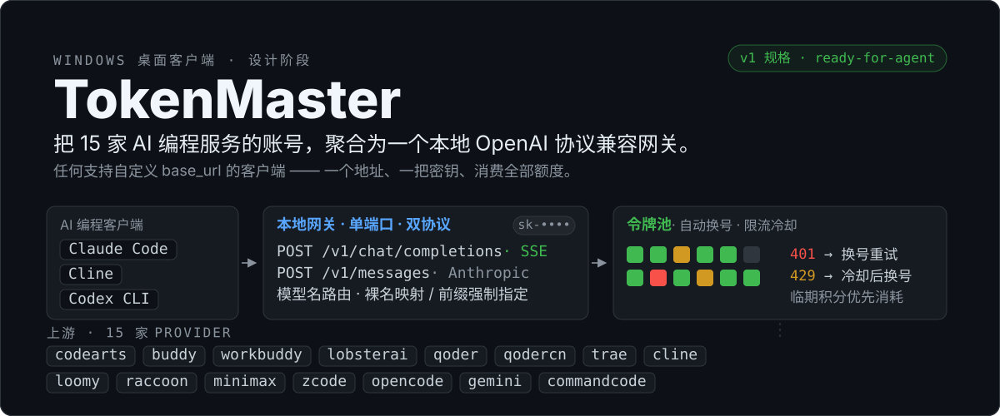

  

  
  
  
  

## 这是什么

如果你在多家 AI 编程服务上都有账号和订阅额度，就会遇到同样的麻烦：每家额度只能锁在它自家的客户端或 IDE 插件里用，协议互不兼容；多账号要手动切换；额度分散在各家后台，临期作废无人提醒。

TokenMaster 把这些问题收敛进一个 Windows 桌面应用：在本机回环地址运行一个 **OpenAI 协议兼容网关**（附 Anthropic 协议扩展面），把 15 家 Provider 的账号聚合成**令牌池**。任何支持自定义 `base_url` 的 AI 编程客户端——Claude Code、Cline、Codex CLI 等——只需把地址指向网关、配上一把 `sk-` 网关密钥，就能用统一的模型名消费全部额度。

## 工作原理

一次请求的生命周期：

1. **路由**：客户端按 OpenAI 或 Anthropic 协议把请求发给本地网关；模型名决定去向——裸模型名按映射表走默认 Provider，`provider/model` 前缀强制指定。
2. **选号**：网关从目标 Provider 的令牌池选一个账号（先到期优先 / 剩余额度最多，可切换；有积分有效期的 Provider 叠加余额临期分档），把请求翻译成该家上游的私有协议。
3. **兜底**：401/402/403 自动换号重试；429 解析 `Retry-After` 冷却该账号再换号；限流按「Provider × 模型 × 账号」粒度记录，一个模型的限流不拖累整个账号。
4. **记账**：每次请求记入本地账本（token 用量、缓存命中、耗时、TTFB），在 GUI 里按天 / Provider / 账号 / 模型聚合查看。

## v1 核心能力

- **15 家 Provider 全量接入**：codearts、buddy、workbuddy、lobsterai、qoder、qodercn、trae、cline、loomy、raccoon、minimax、zcode、opencode、gemini（Antigravity 反代）、commandcode
- **双协议网关**：OpenAI `/v1/chat/completions`（SSE 流式）+ `/v1/models`，Anthropic `/v1/messages`；单端口、模型名路由、`sk-` 网关密钥防局域网误用
- **完整令牌池**：多账号轮询、失效切换、按模型限流冷却、双选号策略、额度/用量账本
- **多方式登录**：浏览器 OAuth 本地回环回调 / 设备码轮询 / 扫码短信 / 手动粘贴，凭据到期前自动刷新
- **额度运营**：zcode 套餐领取（上游要求验证码时自动拉起 WebView 过码）、各 Provider 每日签到积分
- **数据导入**：本机 zcode-pool 账号目录一键导入（加密格式兼容）+ 手动粘贴 token/key
- **出站代理**：全局默认 → 按 Provider → 按账号三级覆盖（http/socks5）
- **桌面体验**：中英双语、暗色主题、系统托盘常驻、开机自启、单实例、NSIS 安装包

## v1 明确不做

边界依据 [ADR-0007](./docs/adr/0007-v1-scope-boundaries.md)：auto 跨池智能路由、邮箱池/批量注册、Web 管理台、无头/CLI/docker 运行、多虚拟 key、客户端配置一键写入、自动更新、数据导出备份、`/v1/responses` 对外面、非 Windows 平台承诺。

## 当前状态与实现路线

**设计阶段已完成，实现待启动。** 领域术语见 [CONTEXT.md](./CONTEXT.md)，实施规格 [docs/spec/v1.md](./docs/spec/v1.md) 已达 ready-for-agent（含 35 条用户故事、协议转换决策与测试缝设计）。

建议实现顺序：

1. Tauri 2 + React 脚手架，纯 Rust 网关核心骨架（OpenAI 面 + 一个 mock Provider 打通契约测试缝）
2. 池化 / 换号 / 限流 / 账本
3. 逐家 Provider 适配（先做有直接参考的 zcode、gemini、commandcode、trae、qoder，再做其余）
4. 验证码载体、领取/签到、数据导入
5. GUI 打磨、i18n、托盘、NSIS 打包

开发前置：Rust 工具链（rustup + `x86_64-pc-windows-msvc` target，*当前机器尚未安装*）、Node.js ≥ 22 + pnpm（已就绪）、WebView2（Windows 10/11 自带）。构建安装包：`pnpm tauri build`。

## 文档地图

| 文档 | 内容 |
|---|---|
| [CONTEXT.md](./CONTEXT.md) | 领域术语表：Provider、账号、令牌池、网关、模型路由、领取、签到…… |
| [docs/spec/v1.md](./docs/spec/v1.md) | v1 实施规格：35 条用户故事、协议转换决策、选号管道、测试缝设计（ready-for-agent） |
| [docs/adr/0001](./docs/adr/0001-tauri-rust-full-rewrite.md) | 技术栈：Tauri 2 + Rust 全量实现，不做 TS sidecar |
| [docs/adr/0002](./docs/adr/0002-reuse-antigravity-manager-code.md) | 直接拷贝 Antigravity-Manager 代码及其许可影响 |
| [docs/adr/0003](./docs/adr/0003-gateway-contract.md) | 网关对外契约：单端口、模型名路由、OpenAI+Anthropic 双协议、可配置密钥 |
| [docs/adr/0004](./docs/adr/0004-desktop-embedded-gateway.md) | 网关仅桌面内嵌运行，不提供无头模式 |
| [docs/adr/0005](./docs/adr/0005-frontend-react-antd.md) | 前端采用 React + antd |
| [docs/adr/0006](./docs/adr/0006-zcode-captcha-webview-carrier.md) | zcode 验证码链：Tauri WebView 子窗口作过码载体 |
| [docs/adr/0007](./docs/adr/0007-v1-scope-boundaries.md) | v1 功能边界：明确不做的事 |
| [docs/reference/](./docs/reference/) | 4 份参考项目解读手册（code graph + 复用映射） |

## 参考项目与许可

| 项目 | 用途 | 许可 |
|---|---|---|
| `deepseek-harness-codearts` | 14 家 Provider 的协议/OAuth/池化逻辑参考（TS） | MIT |
| `commandcode-proxy-master` | commandcode 协议参考（Node） | MIT |
| `zcode-pool` | GUI 信息架构、ZCode 凭据加密兼容、i18n 方案参考 | MIT |
| `Antigravity-Manager-main` | **Rust 代码直接复用**（令牌池/OAuth/重试换号等模块） | CC-BY-NC-SA-4.0 |

因直接复用了 Antigravity-Manager 的代码，本项目含其衍生代码的部分遵循 **CC-BY-NC-SA-4.0**（详见 [LICENSE](./LICENSE) 与 [ADR-0002](./docs/adr/0002-reuse-antigravity-manager-code.md)）。
