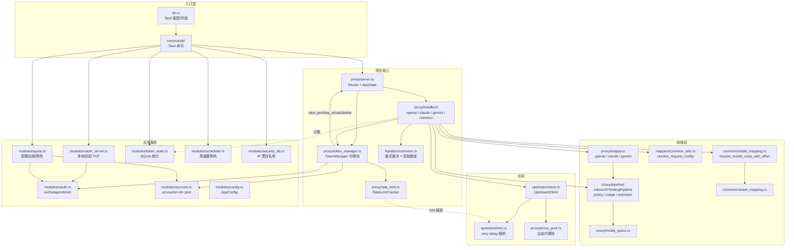
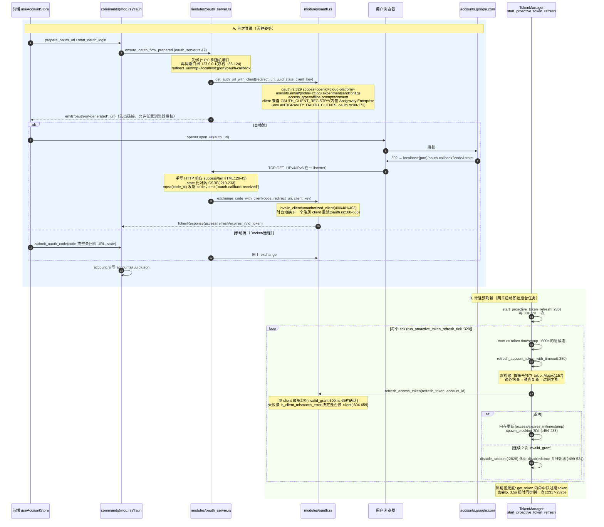

# Antigravity-Manager（Antigravity Tools）代码考古报告

> 本文档是 TokenMaster 拷贝复用 Antigravity-Manager（下称 AM）Rust 代码时的**施工地图**。
> 所有结论均来自对 `E:\Project\TokenHub\Antigravity-Manager-main`（v4.9.6）的实际读码，标注了文件路径与关键行号。
> 生成日期：2026-10-06。

---

## 目录

1. [项目概览](#1-项目概览)
2. [代码结构解读](#2-代码结构解读)
3. [Code Graph](#3-code-graph)
4. [可拷贝模块详解](#4-可拷贝模块详解)
5. [协议转换层](#5-协议转换层)
6. [前端参考](#6-前端参考)
7. [对 TokenMaster 的复用映射](#7-对-tokenmaster-的复用映射)
8. [已知坑与注意事项](#8-已知坑与注意事项)

---

## 1. 项目概览

- **定位**：桌面端「多账号令牌池 + 本地 AI 协议网关」。把 Google（Antigravity/CloudCode）的 Web OAuth Session 转成标准 API 对外服务，同时管理账号池、配额、限流熔断与 CLI 配置同步。README_ZH.md 自述为「专业级 AI 账号管理与协议代理系统」。
- **技术栈**：Tauri 2 + Rust(axum 0.7 / tokio / reqwest / rquest / rusqlite / dashmap) + React 19 + antd 5 + zustand + i18next（`src-tauri/Cargo.toml`、`package.json`）。
- **规模**：`src-tauri/src` 约 **12.3 万行 Rust**（`wc -l` 实测 123230），前端 `src/` 约 **3.2 万行 TS/TSX**（实测 31995 行，102 个文件），12 种语言包。
- **许可**：**CC-BY-NC-SA-4.0**（LICENSE）。TokenMaster 复用其代码须遵守：署名（BY）、非商业（NC）、相同方式共享（SA）。**任何直接拷贝的源文件需保留原版权声明并在分发时以同许可提供**。
- **四协议进、单协议出**（AM 官方架构定义见 `AGENTS.md` 第 3 行："aggregates four AI protocols — OpenAI Responses, OpenAI Chat Completions, Anthropic Claude, and Google Gemini — and outputs Antigravity-style Gemini protocol format"）：
  - 进：OpenAI Chat Completions（`/v1/chat/completions`）、OpenAI Responses（`/v1/responses`，兼容 Codex CLI）、Anthropic（`/v1/messages`，兼容 Claude Code CLI）、Gemini 原生（`/v1beta/models/:model:streamGenerateContent` 等）。
  - 出：统一转成 Google CloudCode `v1internal` 的 Gemini 协议（`streamGenerateContent`/`generateContent`），上游端点为 `daily-cloudcode-pa.googleapis.com` → sandbox → prod 三级回退（`src-tauri/src/proxy/upstream/client.rs:79-86`）。
- **附带能力**（与网关解耦，可整体不拷）：CLI 配置同步（Claude Code/Codex/Opencode/Hermes/OpenClaw/Droid 五套，`proxy/cli_sync.rs` 1725 行、`proxy/opencode_sync.rs` 4439 行等）、设备指纹管理、IP 黑白名单（`modules/security_db.rs`）、用量统计（`modules/token_stats.rs`）、代理池（`proxy/proxy_pool.rs`）、Cloudflare Tunnel。

---

## 2. 代码结构解读

### 2.1 Rust 侧（`src-tauri/src/`）

```
src-tauri/src/
├── main.rs                 # 入口，仅调 antigravity_tools_lib::run()
├── lib.rs                  # Tauri App 装配：invoke_handler 注册所有命令（lib.rs:655 起）、托盘、窗口
├── constants.rs            # USER_AGENT / NATIVE_OAUTH_USER_AGENT 等指纹常量
├── error.rs                # AppError/AppResult 统一错误
├── commands/               # Tauri 命令层（前端 invoke 入口）
│   ├── mod.rs              # 账号/配置/配额/导入导出命令（1582 行）
│   ├── proxy.rs            # 网关启停状态管理（ProxyServiceState）
│   ├── security.rs / user_token.rs / proxy_pool.rs / cloudflared.rs / patch.rs / autostart.rs
├── models/                 # 纯数据模型
│   ├── account.rs          # Account/AccountIndex/LiveLimitStatus（账号 JSON 文件 schema）
│   ├── config.rs           # AppConfig（gui_config.json）
│   ├── quota.rs            # QuotaData/QuotaGroup/QuotaBucket；tier_priority()（quota.rs:206）
│   ├── token.rs / official_model.rs
├── modules/                # 与网关解耦的"应用服务层"
│   ├── account.rs          # 账号存储：data_dir 指针文件、accounts/<id>.json 读写、全局文件锁
│   ├── config.rs           # load_app_config/save
│   ├── oauth.rs            # Google OAuth：URL 生成/code 换 token/refresh（761 行）
│   ├── oauth_server.rs     # 本地回环 TCP 回调服务器（IPv4+IPv6 双栈）（554 行）
│   ├── quota.rs            # 配额拉取（loadCodeAssist/retrieveUserQuotaSummary 等三端点回退）+ 预热（1009 行）
│   ├── scheduler.rs        # 每周配额窗口重置预热定时器（5 分钟扫描）
│   ├── proxy_db.rs         # 网关 SQLite（请求日志/会话/统计）
│   ├── token_stats.rs      # 按小时/天/账号/模型的用量统计（rusqlite）
│   ├── security_db.rs      # IP 访问日志/黑白名单（rusqlite，767 行）
│   ├── integration.rs      # 系统集成：写各 CLI 的凭证文件（切换账号）
│   ├── process.rs / tray.rs / logger.rs / migration.rs / device.rs / user_token_db.rs / ...
└── proxy/                  # ★ 网关本体（TokenMaster 主要拷贝目标）
    ├── server.rs           # axum 路由表 + AppState + 管理后台 admin_routes（4846 行）
    ├── token_manager.rs    # ★ 令牌池：选号/预刷新/限流/熔断/粘性会话（6609 行）
    ├── config.rs           # ProxyConfig（端口/鉴权/映射表/超时/调试日志...）
    ├── upstream/
    │   ├── client.rs       # UpstreamClient：v1internal 出站请求、三端点回退、头净化（766 行）
    │   └── retry.rs        # quotaResetDelay/Retry-After 解析（ParsedRetryDelay）
    ├── handlers/           # 协议入站处理器（每协议一个 + 公共）
    │   ├── openai.rs       # chat/completions + responses + images（7604 行，最大）
    │   ├── claude.rs       # /v1/messages（3966 行）
    │   ├── gemini.rs       # /v1beta 原生（1505 行）
    │   ├── common.rs       # ★ 统一重试裁决 determine_retry_strategy_adaptive + 双轨错误构造（1043 行）
    │   ├── audio.rs / thinking.rs / warmup.rs
    ├── pipeline/           # ★ 协议无关的统一流水线（Canonical IR）
    │   ├── inbound.rs      # InboundThinkingPipeline：contents 归一/思维预算/前缀拓扑对齐（3563 行）
    │   ├── policy.rs       # UpstreamClassification：错误→是否锁号/解绑的统一分类
    │   ├── usage.rs        # CanonicalUsage：Gemini usage ↔ Claude usage 换算
    │   ├── estimator.rs    # 本地 token 估算
    │   └── auto_heal.rs    # 纯思考空回复的流式自愈重发
    ├── mappers/            # 协议 ↔ Gemini 报文转换器（pipeline 的"适配器层"）
    │   ├── openai/         # request.rs(3424)/streaming.rs(2175)/response.rs/models.rs/collector.rs...
    │   ├── claude/         # request.rs(3731)/streaming.rs(1547)/response.rs/models.rs...
    │   ├── gemini/         # wrapper.rs：原生 Gemini 信封 wrap/unwrap（1993 行）
    │   ├── common_utils.rs # resolve_request_config：判定 agent/web_search/image_gen（2433 行）
    │   ├── context_manager.rs / prompt_sanitizer.rs / model_limits.rs / error_classifier.rs / ...
    ├── common/             # 与 HTTP 无关的纯工具
    │   ├── model_mapping.rs    # ★ 模型路由：resolve_model_route_with_effort（1417 行）
    │   ├── variant_mapping.rs  # ★ 规格家族→物理模型（tier: low/medium/high，1254 行）
    │   ├── rate_limiter.rs     # 简单 min_interval 限速器（几十行）
    │   ├── json_schema.rs / schema_cache.rs / session.rs / error.rs / utils.rs
    ├── middleware/         # axum 中间件：auth/cors/ip_filter/logging/monitor/service_status
    ├── rate_limit.rs       # ★ RateLimitTracker：账号×模型级限流锁定（1305 行）
    ├── sticky_config.rs    # SchedulingMode: CacheFirst/Balance/PerformanceFirst
    ├── session_manager.rs / thinking_store.rs(5402 行) / signature_cache.rs / cache_manager.rs
    ├── monitor.rs / middleware/monitor.rs  # 请求级监控与报文捕获
    ├── payload_audit.rs    # 报文审计：头脱敏、简要存储
    ├── proxy_pool.rs       # 出站代理池（账号↔代理绑定）
    ├── cli_sync.rs / opencode_sync.rs / hermes_sync.rs / openclaw_sync.rs / droid_sync.rs
    ├── model_specs.rs      # 模型规格（是否 v3+/v5+、思考预算、裸模型档位路由）
    ├── adapters/           # apply_patch_preflight / artifact_store（工具调用预处理）
    ├── audio/ video/ tests/ common/client_adapters/
```

### 2.2 模块职责速查表（TokenMaster 重点）

| 文件 | 行数 | 职责 | 与 TokenMaster 关系 |
|---|---|---|---|
| `proxy/server.rs` | 4846 | axum Router 组装（proxy_routes/admin_routes）、AppState、ImageScheduler（绘图并发闸门） | 路由骨架可参考；AppState 需重造 |
| `proxy/token_manager.rs` | 6609 | 令牌池全部逻辑：加载/选号(P2C+粘性)/OAuth 预刷新/限流标记/模型熔断/健康分 | **核心拷贝目标** |
| `proxy/handlers/common.rs` | 1043 | 自适应重试裁决器、should_rotate_account、双轨错误报文 | **核心拷贝目标** |
| `proxy/handlers/openai.rs` | 7604 | OpenAI Chat/Responses 入站主流程（含重试环、SSE 转发、图片拦截） | 流程模板参考 |
| `proxy/handlers/claude.rs` | 3966 | Anthropic /v1/messages 主流程 | 流程模板参考 |
| `proxy/handlers/gemini.rs` | 1505 | Gemini 原生直通（wrap→upstream→unwrap） | TokenMaster 不需要 |
| `proxy/pipeline/*` | ~5400 | 协议无关中间表示（thinking/usage/policy/estimator/auto_heal） | 分层思想可借，内容强绑 Gemini |
| `proxy/mappers/openai/*` | ~9000 | OpenAI→Gemini 报文转换（请求/流式/响应） | TokenMaster 按 15 provider 重写 |
| `proxy/mappers/claude/*` | ~6100 | Anthropic→Gemini 报文转换 | 同上 |
| `proxy/common/model_mapping.rs` | 1417 | 静态模型路由（自定义精确/通配/官方淘汰转发/内置默认） | **核心拷贝目标**（裁剪内置表） |
| `proxy/common/variant_mapping.rs` | 1254 | 规格家族（canonical+tier）→ 物理上游模型 | 按需参考 |
| `proxy/rate_limit.rs` | 1305 | RateLimitTracker：账号级/模型级冷却，错误报文解析锁定 | **核心拷贝目标** |
| `proxy/upstream/client.rs` | 766 | 出站 HTTP：端点回退、头净化、客户端缓存 | 结构参考（URL/头全部要换） |
| `proxy/upstream/retry.rs` | ~260 | quotaResetDelay/Retry-After 结构化解析 | **直接拷贝** |
| `modules/oauth.rs` | 761 | Google OAuth client 注册表 + URL/exchange/refresh | **核心拷贝目标** |
| `modules/oauth_server.rs` | 554 | 本地回环 OAuth 回调（双栈 TCP + state 校验 + 手动 code 提交） | **核心拷贝目标** |
| `modules/quota.rs` | 1009 | 配额三端点拉取 + 全量预热 | 仅 Google provider 需要（裁剪后可用） |
| `modules/scheduler.rs` | ~600 | 周配额重置预热定时任务 | 可选 |
| `modules/security_db.rs` | 767 | IP 日志/黑白名单（rusqlite） | 评估：TokenMaster 单机自用可先不要 |
| `proxy/cli_sync.rs` 等 5 个 | ~11000 | 五种 CLI 工具的配置文件同步/恢复 | **不拷**（已决策） |

### 2.3 前端（`src/`）

```
src/
├── pages/                  # 9 个页面：Dashboard/Accounts/ApiProxy/Monitor/Settings/Security/TokenStats/UserToken/ApiKeyFun
├── components/
│   ├── accounts/           # AccountCard/AccountGrid/AccountTable/AccountRow/AddAccountDialog/QuotaItem...（双视图）
│   ├── proxy/              # ProxyMonitor(请求监控)/CliSyncCard/各 CLI SyncModal/VirtualizedPayloadViewer
│   ├── dashboard/          # BestAccounts/CurrentAccount/StatsCard
│   ├── settings/           # CircuitBreaker/QuotaProtection/ThinkingBudget/SmartWarmup/ProxyPoolSettings/proxy/*
│   ├── common/ navbar/ layout/ debug/ security/
├── stores/                 # zustand：useAccountStore/useConfigStore/useViewStore/useDebugConsole/networkMonitorStore
├── services/               # accountService/configService：所有 Tauri invoke 调用的唯一封装层
├── utils/request.ts        # ★ Tauri invoke 与 Web fetch 的双模适配器（COMMAND_MAPPING 表）
├── i18n.ts + locales/      # i18next，12 语言（zh.json 1864 行）
├── types/ hooks/ config/ assets/
```

关键模式（详见第 6 节）：**services 层集中 invoke → zustand store 缓存 → 页面组件消费**；`utils/request.ts` 把 Tauri 命令名映射到 admin HTTP API，实现同一前端同时跑在桌面与纯 Web（Docker headless）模式。

---

## 3. Code Graph

### 3.1 Rust 模块依赖图（仅画网关核心链路）



要点：
- `token_manager.rs` 与 `server.rs` 有**双向依赖**：server.rs 用 OnceLock 全局队列（`PENDING_RELOAD_ACCOUNTS`/`PENDING_DELETE_ACCOUNTS`，server.rs:21-25）+ `take_pending_*` 接口（server.rs:55-84）让 TokenManager 在 `get_token_filtered` 里反向消费配额更新/删除信号（token_manager.rs:1993-2013）。拷贝时这套全局静态要一起搬或改成显式 channel。
- `handlers/*` 不直接摸 OAuth，全部经 TokenManager；TokenManager 刷新调 `modules::oauth::refresh_access_token`（token_manager.rs:438）。

### 3.2 一次 `/v1/chat/completions` 请求的完整调用链

```mermaid
sequenceDiagram
    autonumber
    participant C as 客户端(Claude Code/Codex/任意)
    participant MW as 中间件链<br/>ip_filter→auth→monitor
    participant H as handlers/openai.rs<br/>handle_chat_completions (openai.rs:1731)
    participant MM as common/model_mapping.rs<br/>resolve_model_route_with_effort
    participant TM as token_manager.rs<br/>get_token_internal
    participant TF as mappers/openai/request.rs<br/>transform_openai_request_with_session
    participant UP as upstream/client.rs<br/>call_v1_internal_with_headers
    participant G as Google v1internal
    participant ST as token_stats/monitor

    C->>MW: POST /v1/chat/completions (JSON)
    Note over MW: server.rs:600-717 注册<br/>洋葱序: ip_filter→auth→monitor
    MW->>H: State(AppState)+Headers+Body
    H->>H: 图片别名拦截→intercept_chat_to_image(openai.rs:1763)
    H->>H: Responses 格式嗅探转 Chat(openai.rs:1784)
    H->>H: 反序列化 OpenAIRequest, 空 messages 兜底
    H->>MM: resolve_model_route_with_effort(model, custom_mapping, effort)
    Note over MM: 官方淘汰转发>自定义精确>大小写/规范化>通配符<br/>>variant 物理ID停住>裸模型档位路由>内置默认表
    H->>H: calculate_max_retry_attempts(pool_size)<br/>(common.rs:148: 单号3次/多号min(pool*2,4..12))
    loop 重试环 next_rotation_attempt (openai.rs:2084)
        H->>TM: get_token(request_type, force_rotate, affinity_key, mapped_model)
        Note over TM: ① 消费 pending reload/delete 队列<br/>② 能力过滤(Claude≥5 需 PRO/ULTRA+model_limits)<br/>③ model_quotas 必须含该模型<br/>④ 排序: priority→tier→quota→health→reset_time<br/>⑤ 固定账号(#820)→粘性会话→P2C(select_with_p2c:1778)
        TM-->>H: (access_token, project_id, email, account_id, wait_ms)
        H->>TM: resolve_dynamic_model_for_account(账号级二次改写)
        H->>TF: transform_openai_request_with_session(req, project, model, token, session)
        TF-->>H: gemini_body(含约17.5K稳定前缀+Antigravity身份)
        H->>H: ContextManager 裁剪 + PromptSanitizer + ensure_ends_with_user
        H->>UP: call_v1_internal_with_headers("streamGenerateContent", token, body, alt=sse, headers)
        Note over UP: 出站前再次 sanitize + align_official_envelope<br/>头净化(去 x-session-id 等指纹头, client.rs:393)<br/>Claude 模型注入 anthropic-beta
        UP->>G: 三端点回退 Daily→Sandbox→Prod(client.rs:84-86)
        alt 上游非 2xx
            G-->>UP: 429/5xx/401...
            UP-->>H: UpstreamCallResult
            H->>H: retry_state.determine_strategy_adaptive(common.rs:183)<br/>+ UpstreamClassification::classify(policy.rs:20)
            H->>TM: mark_rate_limited / mark_model_unsupported / abandon_session
            Note over H: GraceRetry→不换号原地等;<br/>FixedDelay→should_rotate_account 换号
        else 2xx
            G-->>UP: SSE stream
            UP-->>H: response.bytes_stream()
            H->>H: commit_session + mark_account_success(openai.rs:2388-2390)
            H->>H: peek 首块(跳心跳,300s超时)失败则换号重试(openai.rs:2453-2505)
            H->>H: create_openai_sse_stream_with_anchor<br/>Gemini SSE→OpenAI chunk 实时转换
            H-->>C: SSE 回传(含 auto_heal 纯思考空回复自愈)
            H->>ST: 记账(usage/model/account/耗时)
        end
    end
```

补充事实（含行号）：
- 非流式请求会被**强制转流式**（`force_stream_internally`，openai.rs:2286-2290），聚合后返回。
- `anthropic-beta: claude-code-20250219` 在 OpenAI 路径命中 Claude 模型时也会注入（openai.rs:2305-2311）。
- 图片类请求走 `get_image_token` + `ImageScheduler` 并发闸门（token_manager.rs:1914，server.rs:124-254）。

### 3.3 OAuth 登录 + Token 预刷新时序



---

## 4. 可拷贝模块详解

以下每个模块给出：职责 / 对外接口 / 内部依赖 / 剥离指南（拷到 TokenMaster 新工程要改什么）。

### 4.1 `proxy/token_manager.rs`（令牌池核心，最高优先级拷贝）

**职责**：内存态账号池（`DashMap<account_id, ProxyToken>`）+ 选号调度 + OAuth 刷新 + 限流/熔断记账 + 粘性会话。

**关键公开接口**（行号为 token_manager.rs 实测）：

```rust
pub fn new(data_dir: PathBuf) -> Self                                      // :191
pub async fn start_auto_cleanup(self: &Arc<Self>)                          // :314 启动限流清理+预刷新两个后台任务
pub async fn refresh_account_token_with_timeout(&self, account_id: &str,
    buffer_secs: i64, timeout: Duration) -> Result<ProxyToken, String>     // :380 双检锁刷新
pub async fn load_accounts(&self) -> Result<usize, String>                 // :665 扫描 accounts/*.json
pub async fn reload_account / reload_all_accounts / remove_account         // :718/:745/:750
pub async fn get_token(&self, quota_group: &str, force_rotate: bool,
    session_id: Option<&str>, target_model: &str)
    -> Result<(String,String,String,String,u64), String>                   // :1896 返回(access_token,project_id,email,account_id,wait_ms)
pub async fn get_image_token(...) -> Result<(..., ImagePermit), (StatusCode,String)>  // :1914
pub async fn mark_rate_limited(&self, email: &str, status: u16,
    retry_after: Option<&str>, error_body: &str)                           // :2992
pub async fn is_rate_limited(&self, account_id: &str, model: Option<&str>) -> bool     // :3021
pub fn mark_model_unsupported(&self, account_id: &str, model: &str, cooldown: Option<i64>) // :3047 单模型熔断900s
pub fn is_model_unsupported(&self, account_id: &str, model: &str) -> bool  // :3079
pub fn mark_account_success(&self, account_id: &str)                       // :3174 重置连续失败计数
pub fn record_success / record_failure                                     // :4022/:4031 健康分 ±0.05/−0.2
pub async fn commit_session / abandon_session / clear_session_binding      // :3905/:3890/:3885 粘性会话提交/废弃
pub async fn get_scheduling_mode / set_preferred_account                   // :3926/:3939
pub async fn add_account(&self, email: &str, refresh_token: &str)          // :3983
```

**选号算法**（`get_token_internal` :2038-2900）固定顺序：
1. 消费 server 的 pending reload/delete 全局队列；
2. 能力过滤：Claude≥5.0 先按订阅 tier（PRO/ULTRA）过滤，再用 `model_limits`/`model_quotas` 精准收敛（:2060-2119）；
3. 硬过滤：`model_quotas.contains_key(normalized_target)`（:2133）——**注意：这要求配额数据完整，TokenMaster 的 15 家 provider 若无配额接口需把此步改为可选**；
4. 排序链：`priority`(用户手动) → 订阅 tier(`models::quota::tier_priority`, quota.rs:206) → 目标模型配额 → health_score → reset_time → account_id 决胜（:2150-2210）；
5. 固定账号模式（#820, :2246-2374）→ 粘性会话（:2400 起，`session_accounts` DashMap，绑定时先查限流，限流即解绑换号）→ `select_with_p2c`（:1778：排序后前 5 随机取 2，配额高者胜，避免热点）；
6. 出栈前热路径刷新（buffer 300s、超时 3.5s，:2317-2326）与 project_id 探测（3.5s 超时+负缓存 5min，:546-560）。

**内部依赖（拷贝时必须处理）**：
- `crate::proxy::server::{take_pending_reload_accounts, take_pending_delete_accounts}`（:1993/:2006）——server.rs 的 OnceLock 全局队列，建议改为 TokenManager 自身持有的 channel；
- `crate::proxy::rate_limit::RateLimitTracker`（整文件一起拷）；
- `crate::proxy::sticky_config::StickySessionConfig` + `crate::models::CircuitBreakerConfig`；
- `crate::modules::oauth::refresh_access_token`、`crate::modules::account::{get_data_dir, lock_account_file_updates}`（账号 JSON 落盘格式）；
- `crate::proxy::common::model_mapping::normalize_to_standard_id`、`crate::proxy::model_specs::is_claude_v5_or_above`；
- `crate::modules::config::load_app_config`（读 `quota_protection.enabled`，:2241）；
- Google 专属字段：`project_id`、`subscription_tier`、`LiveLimitStatus` 持久化限流（`live_limited_models` 落盘）。

**剥离指南**：
- 保留：双检锁刷新、invalid_grant 两次确认停用、P2C、粘性会话、排序链骨架、健康分、模型级熔断、后台任务 CancellationToken 管理（:1843-1889 graceful_shutdown）。
- 泛化：`ProxyToken` 去掉 `project_id/subscription_tier` 或改为 `serde_json::Value provider_meta`；`model_quotas` 过滤改为「有配额数据才过滤」；刷新函数改为按 provider 分派（AM 只有一种 Google OAuth，TokenMaster 需 15 家，建议抽 `TokenRefresher` trait）。
- 删除：ImageScheduler 整段（:1914-1982 与 server.rs:113-254，绘图专用）、`resolve_dynamic_model_for_account` 的 Google 特有逻辑、quota_group="image_gen"。

### 4.2 `modules/oauth.rs`（Google OAuth 客户端）

**职责**：OAuth client 注册表（内置 `antigravity_enterprise` 的 CLIENT_ID/SECRET 硬编码于 :4-5，支持环境变量 `ANTIGRAVITY_OAUTH_CLIENTS` 扩展/覆盖 :99-153）、授权 URL 生成、code 换 token、refresh token、userinfo。

**对外接口**：
```rust
pub fn get_auth_url_with_client(redirect_uri:&str, state:&str, client_key:Option<&str>) -> Result<(String,String),String>  // :329
pub async fn exchange_code_with_client(code:&str, redirect_uri:&str, preferred_client_key:Option<&str>) -> Result<TokenResponse,String> // :456
pub async fn refresh_access_token_with_client(refresh_token:&str, account_id:Option<&str>, preferred:Option<&str>) -> Result<TokenResponse,String> // :588
pub async fn get_user_info(access_token:&str, account_id:Option<&str>) -> Result<UserInfo,String> // :677
pub async fn ensure_fresh_token(current:&TokenData, account_id:Option<&str>) -> Result<TokenData,String> // :707 提前900s刷新
```

**内部依赖**：`crate::proxy::proxy_pool::get_global_proxy_pool()`（出站走代理池，:681、:392）、`crate::utils::http::get_client`、`crate::constants::NATIVE_OAUTH_USER_AGENT`、`crate::modules::logger`。

**剥离指南**：这是 AM 里最接近「纯库」的模块，仅三处环境耦合：全局代理池、logger、rquest 的 UA 指纹。TokenMaster 若仅 Google 系 provider 需要 OAuth，可近乎整文件拷贝，把 proxy_pool/logger 换成本工程的桩即可。多 OAuth provider（如 GitHub、微软）建议以其 `OAuthClientConfig` 结构为模板做 per-provider 实例。**注意硬编码 client_secret 属 AM 逆向产物，商业使用有合规风险，建议换成自己的 GCP OAuth 应用**。

### 4.3 `modules/oauth_server.rs`（本地回调服务器）

**职责**：不依赖 axum 的裸 `TcpListener` 回调服务器；一次 OAuth 流程的状态机（`OAuthFlowState` 全局单例 :20）。

**对外接口**：
```rust
pub async fn prepare_oauth_url(app_handle, oauth_client_key) -> Result<String,String>  // :370 预生成链接+启动监听（不开浏览器）
pub async fn start_oauth_flow(app_handle, oauth_client_key) -> Result<TokenResponse,String> // :388 开浏览器+等code+换token
pub async fn complete_oauth_flow(app_handle) -> Result<TokenResponse,String>            // :437 不开浏览器只等回调（"我已授权，继续"按钮）
pub async fn submit_oauth_code(code_input:String, state:Option<String>) -> Result<(),String> // :474 手动粘贴 code/整条URL
pub fn cancel_oauth_flow()                                                               // :378
pub fn prepare_oauth_flow_manually(redirect_uri, state, client_key) -> (String, mpsc::Receiver<...>) // :518 Web/无头模式
```

**实现细节值得照抄**：
- IPv6/IPv4 双栈同端口绑定策略（:76-124）：先 `[::1]:0` 拿随机端口再绑 `127.0.0.1:同端口`，都成功用 `http://localhost:port`，单栈则显式 IP——解决浏览器把 localhost 解析成 ::1 导致连接拒绝的经典问题；
- state 随机 UUID + 回调比对防 CSRF（:210-233）；
- `mpsc` 而非 oneshot：监听器与手动提交是两个发送端（:147）；
- 监听器在用户点「开始登录」前就已启动（:149-151 注释：先授权也不丢）；
- 直接手写 HTTP 响应 HTML（:26-45），成功页 2 秒后 `window.close()`。

**内部依赖**：仅 `tauri::AppHandle`（emit 事件、opener 开浏览器）、`modules::oauth`、logger。**剥离极轻**：把 `app_handle: Option<tauri::AppHandle>` 改为回调/Tauri 泛型即可复用于任何 provider 的 loopback OAuth。

### 4.4 重试策略：`proxy/handlers/common.rs` 的 `determine_retry_strategy_adaptive`

**职责**：把「上游错误 → 是否重试/等待多久/是否换号」集中成一个纯函数裁决器（common.rs:183-361），配套 `RequestRetryState`（记录每账号 GraceRetry 已用，:30-99）、`next_rotation_attempt`（重试预算扣减，GraceRetry 不扣，:102-117）、`should_rotate_account`（:487-499）、`FailureStatusTracker`（最终状态码选择：优先非 429，:119-142）。

**核心判定表**（status_code → 策略）：
| 状态 | 单账号池(pool≤1) | 多账号池 |
|---|---|---|
| 模型不存在关键字 | NoRetry（防御性短路，:193） | 同左 |
| 400 thinking 签名类 | FixedDelay(200ms)（仅一次，`retried_without_thinking` 控制） | 同左 |
| 429 | 解析 `quotaResetDelay/Retry-After`：≤30s 且未用过 Grace→GraceRetry 原地等；否则 FixedDelay(min(delay,30s))；无 delay→3s×attempt 线性（上限 10s） | 第一轮（attempt<pool）50ms 闪电快切；请求级 429 连续 2 号即 NoRetry 防全池锁死（#3506，:267-280）；第二轮 delay≤5s GraceRetry，delay>5s 且 pool>2 继续快切，否则等 min(delay,12s)；无 delay 线性 2-5s |
| 503/529 | 指数退避 5s→30s | 第一轮 50ms 快切，之后指数退避 |
| 500 | LinearBackoff(3s) | 同左 |
| 401/403 | FixedDelay(200ms)+换号 | 同左 |
| 404 | FixedDelay(300ms)+换号（Google 灰度/权限不同步的间歇问题，:354-356） | 同左 |

`calculate_max_retry_attempts(pool_size)`（:148-154）：单号 3 次，多号 `(pool*2).clamp(4,12)`。

**内部依赖**：仅 `upstream::retry::parse_retry_delay_with_source`。**剥离指南**：与协议/上游完全解耦，**可整文件拷贝**；TokenMaster 的 15 家 provider 错误文本各异，需保留其「结构化 delay 解析 + 关键字分类」框架并按 provider 增补错误分类器（AM 同位置的 `pipeline/policy.rs::UpstreamClassification` 也是同一思想的错误分类，可一起参考）。

### 4.5 `proxy/common/model_mapping.rs` + `variant_mapping.rs`（模型映射）

**model_mapping.rs 职责**：静态模型路由。`resolve_model_route_with_effort(original, custom_mapping, client_effort)`（:758-810）优先级：`DYNAMIC_MODEL_FORWARDING_RULES`（API 热更新淘汰转发，:10）→ 自定义精确 → 大小写不敏感 → `canonicalize_claude_client_model_id` 规范化对齐（:99）→ 通配符（`*`，specificity=非星号字符数最多者胜，:721-744）→ variant 物理上游 ID 停住（:769）→ 裸模型按思考档位路由（`model_specs::resolve_bare_tiered_model_route`，:776）→ 内置 `map_claude_model_to_gemini` 默认表（:205）。另有 `normalize_to_standard_id`（:829）把任意模型名归到 5 个配额保护标准 ID。

**variant_mapping.rs 职责**：把「规范家族名 + 思考档位（low/medium/high，由 `infer_tier(budget_tokens)` :73 或 `tier_from_effort` :84 推断）」解析为真实上游物理模型与参数（`resolve(canonical, budget_tokens)` :393；`GEMINI_FAMILIES` 静态表）。

**内部依赖**：model_mapping 依赖 logger、variant_mapping、model_specs；均为纯函数 + 一张 `OnceLock<DashMap>` 热更新表。

**剥离指南**：路由框架（优先级链、通配符 specificity、自定义映射读写）**整段可拷**；但内置映射表、canonicalize 规则、`DYNAMIC_MODEL_FORWARDING_RULES` 全是 Google/Claude 花名册，TokenMaster 要按 15 家 provider 重造数据表。variant_mapping 的「家族+tier→物理模型」思想适合 TokenMaster 的「请求模型 → provider 可用模型」解析，但数据层重写。

### 4.6 限流器：`proxy/rate_limit.rs`（RateLimitTracker）

**职责**：账号级/模型级限流状态机。核心结构 `DashMap<account_id, RateLimitInfo>`（含 per-model 明细）：
- `parse_from_error / parse_from_error_baseline`（:404/:424）：从错误体+Retry-After 解析 `RateLimitReason`（QuotaExhausted/RateLimitExceeded/ModelCapacityExhausted/ServerError/Unknown，分类函数在 token_manager.rs:41-54）与锁定截止时间，上限 `MAX_LOCKOUT_SECONDS=300`（:5），带指数退避阶梯（`backoff_steps` 由 CircuitBreakerConfig 传入）；
- 连续失败计数 + `mark_success` 归零（:214）实现智能限流；
- `get_remaining_wait/get_quota_wait`（:125/:163）、`is_rate_limited`（:860）、`restore_persisted_long_limit`（:309，从账号 JSON 的 `live_limited_models` 恢复长周期锁定）、`cleanup_expired`（:879，15s 后台清理）。

**内部依赖**：`crate::models::account::LiveLimitStatus`（持久化 schema）、`crate::proxy::upstream::retry::parse_retry_delay`、`crate::proxy::common::model_mapping::normalize_to_standard_id`。

**剥离指南**：**可整文件拷贝**（与 Google 的耦合只在错误关键字，TokenMaster 按 provider 扩展关键字即可）。注意它与 `CircuitBreakerConfig`（models/config.rs）联动：enabled=false 时 mark_rate_limited 直接返回（token_manager.rs:2999-3003）。

### 4.7 `modules/security_db.rs`（评估项）

**职责**：rusqlite 表：`ip_access_logs`（每次请求的 IP/路径/状态）、黑名单/白名单，配 `middleware/ip_filter.rs` 做 IP 准入；提供统计（get_ip_stats/get_top_ips）与保留期清理。

**评估结论**：TokenMaster 定位是「本地网关 + 15 provider 令牌池」，首发若只监听 127.0.0.1 则**可以不要**；若后续提供 LAN 共享（AM 的 `allow_lan_access` 模式）再拷——它自身无 AM 业务耦合，仅依赖 logger/db 路径工具，拷贝成本低。middleware/ip_filter.rs 同理。

### 4.8 `proxy/cli_sync.rs` 等五套 CLI 同步（仅记录，不拷）

`cli_sync.rs`（1725 行，Claude Code/Codex 的 `settings.json`/`auth.json` 改写）、`opencode_sync.rs`（4439 行，`~/.config/opencode/opencode.json` 注入 provider）、`hermes_sync.rs`（1432 行，YAML 保留格式改写，依赖 `yaml_rt`）、`openclaw_sync.rs`（795 行）、`droid_sync.rs`。共同模式：备份 `.antigravity-manager.bak` → 写入指向本网关的 base_url/api_key → 恢复。**TokenMaster 已决策不做**，此处仅记录其存在与行数，避免误拷（它们被 server.rs 的 admin_routes 大量引用，抄 server.rs 时要摘掉这些路由）。

---

## 5. 协议转换层

### 5.1 AM 的三层分工（AGENTS.md 明文的「Pipeline First」原则）

1. **handlers**（`proxy/handlers/*.rs`）：协议入口。做鉴权后解析、重试环编排、SSE 回传格式化、记账。不含转换逻辑。
2. **mappers**（`proxy/mappers/<protocol>/`）：协议线缆适配。`openai/request.rs::transform_openai_request_with_session`（:177）把 `OpenAIRequest` 变成 Gemini `v1internal` 信封：instructions/messages → `systemInstruction`+`contents`，tools 展平排序转 `functionDeclarations`，`thinking` → `generationConfig.thinkingConfig`，`max_tokens/temperature/top_p` → `generationConfig`（根目录 `request_transform.md` 有完整 ASCII 字段映射图，可作 TokenMaster 文档范本）。`claude/request.rs::transform_claude_request_in`（:378）同理，并有两条硬规则值得注意：
   - 只把**开头的连续 system** 提升为 `systemInstruction`，中途 system 一律转 synthetic user——否则上游顶层前缀字节级突变引发 KV Cache 崩溃（:407-413 注释，JEIKCODE 冻结系统原则）；
   - 预先剥掉历史消息里的 `cache_control`（:401-403，修复 VS Code 插件回传导致的 "Extra inputs are not permitted"）。
   - 流式方向 `openai/streaming.rs::create_openai_sse_stream_with_anchor`（2175 行）做 Gemini SSE→OpenAI chunk 的实时转换与思考块回填。
3. **pipeline**（`proxy/pipeline/`）：协议无关的统一处理。`InboundThinkingPipeline`（inbound.rs:77）处理 contents 归一、工具调用 ID 规范化（:702）、连续 functionCall 轮合并（:742）、多模态滑窗（:527）、`align_official_envelope`（:1703）对齐官方信封与前缀拓扑；`policy.rs` 错误统一分类；`usage.rs` 用量字段换算（含 `scale_claude_tokens` 按 context_limit 折算，:170）；`auto_heal.rs` 纯思考空回复时自动构造 continuation 请求重发。**出站不设统一流水线**（mod.rs:7-8 注释），由各 mapper 自行散开——这是为了保证流式稳定性。

### 5.2 三个 handler 的转换要点速记

| handler | 入口行 | 要点 |
|---|---|---|
| `handlers/openai.rs::handle_chat_completions` | :1731 | 图片别名(dall-e/midjourney/含 image 且非 gemini)拦截转发 ：1763；Responses 格式自动嗅探降级为 Chat :1784；空 messages 兜底；重试环与 3.2 节图一致 |
| `handlers/openai.rs::handle_completions`（/v1/responses） | :3098 | Codex CLI 主入口，`instructions/input[]` 数组展开（`responses_content_parts` :415 等），interaction_ledger 维护 |
| `handlers/claude.rs::handle_messages` | :768 | 客户端适配器嗅探（opencode 等，:803）；自定义映射**最优先拦截**防 variant 抹平（:833-846）；重试裁决同样走 common.rs（:2530），但签名错误场景绕过 `retried_without_thinking` 短路（:2461 注释） |
| `handlers/gemini.rs::handle_generate` | :71 | 原生 Gemini：`mappers/gemini/wrapper.rs::wrap_request`（:1285）包信封 → upstream → `unwrap_response`（:1017）→ `inject_ids_to_response`（:1025），最薄的一层 |

### 5.3 对 TokenMaster 的取舍

AM 是「4 协议 → Gemini 单上游」的**漏斗形**架构：pipeline 可以假定输出永远是 Gemini 报文。
TokenMaster 是「OpenAI/Anthropic 两协议 → 15 家异构上游」的**扇形**架构，**不可照抄 pipeline 的 Gemini 假设**，可借的是分层思想与具体机制：

- **可借**：handlers/common.rs 重试裁决（上游无关）；「出站前最后统一 sanitize + envelope 对齐」的防御位（upstream/client.rs:339-352）；错误双轨制报文（gateway_error 诊断 + upstream_error 原文，common.rs:708）；peek 首块防黑洞；粘性会话 + thinking 签名存储解决「签名跨请求丢失」这类 provider 状态问题。
- **要重写**：所有 mapper（openai→X、anthropic→X 按 provider 各一份或参数化）；pipeline/inbound 的 Gemini contents 假设；upstream/client.rs 的三端点回退表（TokenMaster 是 per-provider base_url + key，反而更简单——Bearer 换 API key、URL 模板化即可）。
- 建议目标形态：`trait ProviderUpstream { fn send(...) }` + 每 provider 一个 adapter，AM 的 `UpstreamClient::call_v1_internal_with_headers`（client.rs:336）的「净化→头组装→端点回退→错误归一」骨架可作为该 trait 默认实现模板。

---

## 6. 前端参考（TokenMaster 同栈：React + antd + zustand + i18next）

AM 前端约 3.2 万行，组织方式与 TokenMaster 需求高度对口，推荐直接借鉴以下五点（均为 AM 实测模式）：

1. **「services 层唯一封装 invoke」**：`src/services/accountService.ts` 把每个 Tauri 命令包成具名 async 函数（`listAccounts()`→`invoke('list_accounts')`），组件/store 永不直接 invoke。TokenMaster 的 15-provider 配置 CRUD 照此模式建 `providerService.ts`。
2. **双模 request 适配器**：`src/utils/request.ts` 用 `window.__TAURI_INTERNALS__` 探测环境，Tauri 下走 `invoke`，Web 下查 `COMMAND_MAPPING`（约 60 条「命令→admin REST 路由」映射）走 fetch——这就是 AM 桌面版与 Docker headless 版共用一套前端的原因。TokenMaster 若只做桌面可简化，但该表同时是**前后端契约文档**（与 server.rs admin_routes 一一对应），值得仿造。
3. **zustand store 按领域切分**：`src/stores/useAccountStore.ts`（accounts/currentAccount/loading/error + 全部 actions，含 OAuth 三段式 startOAuthLogin/completeOAuthLogin/cancelOAuthLogin 直接映射 oauth_server.rs 的三个入口）、`useConfigStore`、`useViewStore`。AM 不用 persist 中间件，配置持久化全部走后端 AppConfig——建议 TokenMaster 沿用（避免前后端双份配置源）。
4. **账号管理界面**（`src/pages/Accounts.tsx` + `src/components/accounts/`）：列表/网格双视图（AccountTable/AccountGrid 同数据源）、AccountCard 含配额环（QuotaItem）、AddAccountDialog 承载「授权链接先展示可复制 → 监听 `oauth-url-generated`/`oauth-callback-received` 事件 → 手动 code 提交框」的三态 OAuth UI（对应 4.3 节后端能力）。TokenMaster 的 provider 账号页可直接套此骨架。
5. **网关设置与监控**：`src/pages/ApiProxy.tsx`（auth_mode 四态、模型映射排序表 dnd-kit + 通配符规则）、`src/components/settings/CircuitBreaker.tsx/QuotaProtection.tsx`（对应后端 CircuitBreakerConfig/quota_protection 配置节）、`src/components/proxy/ProxyMonitor.tsx`（虚拟滚动请求报文查看器 VirtualizedPayloadViewer，@tanstack/react-virtual）。用量面板 `src/pages/TokenStats.tsx` 按小时/天/账号/模型四个维度消费 admin `/stats/*` 路由。
6. **i18n**：`src/i18n.ts` 静态 import 12 个 JSON（zh.json 1864 行），命名空间扁平 `accounts.xxx`。TokenMaster 初期两语言（zh/en）可照搬初始化代码。

不建议照搬的部分：`@lobehub/ui`、daisyui、tailwind 与 antd 混用（AM 历史包袱，视觉栈有四套）；web_site/ 目录（官网）与 ApiKeyFun.tsx（赞助页）。

---

## 7. 对 TokenMaster 的复用映射

> 拷贝方式说明：**整文件**=原样/近原样拷贝；**抽函数**=只搬特定函数与类型；**仅参考**=读设计不搬代码。工作量：S(≤0.5天)/M(1-3天)/L(≥1周)。

| # | 模块 | 来源路径（src-tauri/src/ 下） | 拷贝方式 | 工作量 | 说明与许可注意 |
|---|---|---|---|---|---|
| 1 | 重试裁决器 | `proxy/handlers/common.rs`（:15-499 重试部分 + :708-877 双轨错误） | 整文件 | S | 上游无关；错误关键字按 15 provider 增补；保留原许可声明 |
| 2 | retry delay 解析 | `proxy/upstream/retry.rs` | 整文件 | S | 纯函数，零依赖 |
| 3 | 限流跟踪器 | `proxy/rate_limit.rs` + `models/account.rs` 的 LiveLimitStatus | 整文件 | S-M | 连同持久化 schema（live_limited_models）一起搬 |
| 4 | TokenManager 骨架 | `proxy/token_manager.rs` | 抽函数+大改 | L | 保留：双检锁刷新/P2C/粘性会话/健康分/模型熔断/后台任务管理；剥离：ImageScheduler、Google 配额强过滤、pending 队列全局静态改 channel；OAuth 刷新抽 trait |
| 5 | OAuth(Google) | `modules/oauth.rs` | 整文件 | S | 换 logger/proxy 桩；建议替换硬编码 client_secret 为自有 GCP 应用 |
| 6 | OAuth 本地回调 | `modules/oauth_server.rs` | 整文件 | S | 双栈绑定/CSRF/mpsc 设计直接用；AppHandle 参数化 |
| 7 | 模型路由框架 | `proxy/common/model_mapping.rs` | 抽函数 | M | 优先级链+通配符 specificity 保留；内置映射表/淘汰规则重写为 TokenMaster provider 模型目录 |
| 8 | variant→物理模型 | `proxy/common/variant_mapping.rs` | 仅参考 | M | 家族+tier 思想用于「请求模型→provider 实际模型」 |
| 9 | 账号存储 | `modules/account.rs`（accounts/<id>.json + 全局文件锁 + data_dir 指针） | 整文件+改 schema | M | 单文件一账号、损坏隔离、索引可重建的设计值得保留 |
| 10 | 出站客户端骨架 | `proxy/upstream/client.rs` | 仅参考 | M-L | 「净化→头→回退→归一」流程仿成 ProviderUpstream trait；URL/头/UA 全换 |
| 11 | axum 路由骨架 | `proxy/server.rs`（:600-717 proxy_routes 段） | 仅参考 | M | 中间件洋葱序注释(:701-705)、AppState 组装方式；admin 路由按需裁 |
| 12 | 协议 handler 流程 | `proxy/handlers/openai.rs` `claude.rs` | 仅参考 | L | 重试环/peek/SSE 编排模式；TokenMaster 每 provider 重写 |
| 13 | mappers | `proxy/mappers/**` | 仅参考 | L | 字段映射表参考（尤其 anthropic→openai 方向可从其 claude/gemini 代码反推）；request_transform.md 文档范式 |
| 14 | pipeline | `proxy/pipeline/**` | 仅参考 | - | Gemini 单上游假设不成立；只借「统一中间处理 + 出站发散」分层 |
| 15 | 配额拉取/预热 | `modules/quota.rs` + `scheduler.rs` | 抽函数 | M | 仅 Google 系 provider 保留；其他 provider 用各自的 usage/balance 接口 |
| 16 | 用量统计 | `modules/token_stats.rs` + `proxy_db.rs` | 整文件 | M | rusqlite 表结构通用，改字段即可 |
| 17 | security_db(IP 黑白名单) | `modules/security_db.rs` + `middleware/ip_filter.rs` | 暂缓 | S | 单机自用首发不需要；LAN 模式再拷 |
| 18 | CLI 同步五件套 | `proxy/{cli,opencode,hermes,openclaw,droid}_sync.rs` | 不拷 | - | 已决策不做；抄 server.rs 时摘掉其 admin 路由 |
| 19 | thinking_store/signature_cache | `proxy/thinking_store.rs`(5402行) `signature_cache.rs` | 暂缓 | - | 解决 Gemini 思考签名的 provider 特有机制；仅当某 provider 有同类签名校验时再评估 |
| 20 | 前端骨架 | `src/services/*` `src/utils/request.ts` `src/stores/*` `src/components/accounts/*` | 抄组织方式 | M | 见第 6 节 |

**许可总注意**：AM 为 CC-BY-NC-SA-4.0。TokenMaster 若开源须同许可（SA）且非商用（NC）；每个拷贝文件头部保留上游版权与来源注释，根 README/NOTICE 列明衍生关系与原作者（lbjlaq/Antigravity-Manager）。硬编码的 Google client_secret、Antigravity 身份 system prompt、UA 指纹属逆向产物，建议替换。

---

## 8. 已知坑与注意事项

从代码注释、`docs/proxy/*.md`、AGENTS.md 与测试文件中挖出的实战坑（括号内为证据位置）：

**令牌/选号类**
1. **DashMap 分片锁自死锁**：invalid_grant 计数时若持着 entry 写锁再去 `disable_account()`（内部访问同分片）会自死锁——必须先拷贝计数再释放（token_manager.rs:496-506 注释原文"持锁跨越将导致自死锁"）。
2. **同步锁阻塞 tokio worker**：账号 JSON 写盘必须 `spawn_blocking`，否则 std::sync::Mutex 争抢会饿死整个 runtime（token_manager.rs:86-90）。
3. **单账号 429 严禁 50ms 闪电空转**：重试裁决器把「单账号判定」放在一切快切逻辑之前，否则重试预算被毫秒级耗尽（common.rs:222 注释【核心防线】）。
4. **请求级 429 会级联锁死全池**（#3506）：无明确 reset delay 的 429 若不限制，全池轮换会把健康账号全部打入 RateLimitExceeded 锁 30s——所以最多快切 2 个账号即终止（common.rs:267-280）。
5. **粘性会话绑定账号限流时要立即解绑换号，不要阻塞等待**：等待会并发超时客户端 socket（UND_ERR_SOCKET，Issue #284，token_manager.rs:2422-2428）。
6. **`get_token` 必须 15s 超时兜底**（token_manager.rs:2015-2033）——多账号热路径刷新可能长时间持锁。
7. **invalid_grant 首次出现不要立即停用**：可能是网络抖动，AM 连续 2 次确认才 disable（token_manager.rs:507-523）；停用后账号文件写 `disabled/disabled_at/disabled_reason`，加载器跳过（docs/proxy/accounts.md）。
8. **refresh_token 缺失**：Google 对「 previously authorized」的 app 不再下发 refresh_token，需 revoke 后重试（oauth.rs:437-446 的三行排查提示）。
9. **配额数据不完整会误杀**：`model_quotas.contains_key` 硬过滤的注释自认"可能误杀"（token_manager.rs:2131-2132）——TokenMaster 无配额接口的 provider 必须跳过此过滤。
10. **错误返回不泄露账号 email**（docs/proxy/accounts.md 第 5 节）。

**协议转换类**
11. **上游顶层 system 前缀必须字节级稳定**：中途 system 消息提升到 systemInstruction 会击穿上游 KV Cache（claude/request.rs:407-413，冻结系统原则）。
12. **历史消息回带的 `cache_control` 必须剥离**：否则 "Extra inputs are not permitted"（claude/request.rs:401-403）。
13. **模型不存在错误绝不重试**：`is_model_not_found_error` 关键字表（common.rs:599-612）是第一道短路，否则白白轮完全池（common.rs:192-195）。
14. **非流式请求内部转流式**以换取更好配额行为，再聚合（openai.rs:2286-2290）——注意响应格式仍需完全仿真非流式。
15. **SSE peek 要跳过心跳注释行**（`:` 开头）并设 300s 首块超时（openai.rs:2453-2505），空首块/错误首块要触发换号重试而非把坏流透传给客户端。
16. **出站头净化**：客户端特征头（x-session-id/x-client-name/x-machine-id 等）必须过滤，否则上游 WAF/风控差异行为（upstream/client.rs:393-407）；Claude 模型统一注入 `anthropic-beta: claude-code-20250219`（client.rs:432-442）。
17. **端点回退顺序是 Daily→Sandbox→Prod**（client.rs:84-86 注释：Daily 是官方 IDE 主力端点；Prod 反而更易 429）——TokenMaster 15 provider 各自的 regional/备用端点可仿此数组化。
18. **Google 通用 429 "resource has been exhausted" 不是硬配额**，严禁归入硬配额类（会触发全池快切，common.rs:253-255）。

**存储/配置类**
19. **账号一账号一 JSON 文件 + 全局文件锁 `lock_account_file_updates`**（modules/account.rs）；索引文件丢失可从 accounts/ 目录重建（account.rs:320-339 测试覆盖）。
20. **`loadCodeAssist` 必须每次调用**：曾经的"已有 tier 就跳过"优化导致免费账号被错标成 Pro 后永远无法自愈（quota.rs:253-266 长注释）——配额/订阅等级类数据要始终以最新上游为准，旧值只做兜底。
21. **auth_mode 四态 + 热更新**（docs/proxy/auth.md）：配置保存后调 `axum_server.update_security()` 热生效，不重启网关；`OPTIONS` 预检必须放行。
22. **账号增删与 TokenManager 内存缓存的一致性**用「待重载/待删队列」异步解耦（server.rs:18-25，Issue #1477：删除账号后必须从所有内存缓存清理，否则幽灵账号继续被调度）。

**工程类**
23. AM 的 CI 纪律（AGENTS.md）：`cargo fmt --check` + `clippy --all-targets --all-features` + `npm run build`；测试有大量针对性单测（如 `proxy/tests/retry_strategy_tests.rs` 覆盖重试全分支）——拷贝模块时把对应测试文件一起拷，是行为契约的最好文档。
24. axum 中间件洋葱序：请求 ip_filter→auth→monitor，响应反向；monitor 必须在 auth 之后才能拿到用户身份（server.rs:701-705 注释）。

---

## 附：快速验证路径（拷代码时的对照入口）

- 网关启动：`lib.rs` → `commands/proxy.rs` → `proxy/server.rs::AxumServer::start`（:504）
- 请求全链：`handlers/openai.rs::handle_chat_completions`（:1731）单函数即可读完整个生命周期
- 选号：`token_manager.rs::get_token_internal`（:2038）+ `select_with_p2c`（:1778）
- 刷新：`refresh_account_token_with_timeout`（:380）+ `run_proactive_token_refresh_tick`（:320）
- 重试：`handlers/common.rs::determine_retry_strategy_adaptive`（:183）
- OAuth：`modules/oauth_server.rs::start_oauth_flow`（:388）→ `modules/oauth.rs::exchange_code_with_client`（:456）
- 协议文档范本：根目录 `request_transform.md`、`docs/model-remapping-logic.md`、`docs/proxy/accounts.md`、`docs/proxy/auth.md`
