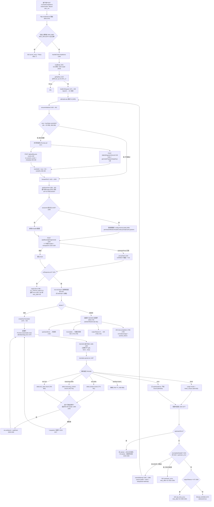
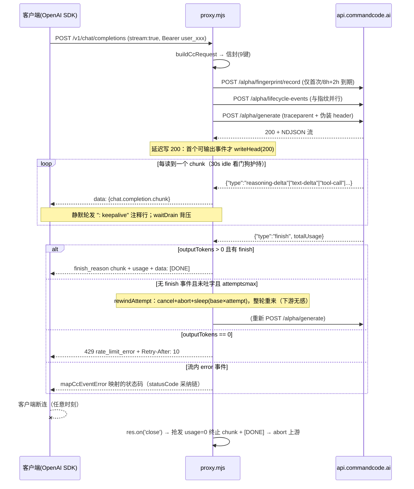

# commandcode-proxy 源码解读（Rust 移植对照手册）

> 解读对象：`E:\Project\TokenHub\commandcode-proxy-master\proxy.mjs`（3770 行，单文件、零外部依赖、Node ≥ 18、MIT 许可）。
> 用途：TokenMaster（Tauri 2 + Rust/axum，15 家 provider 的 OpenAI 协议本地网关）中 commandcode 这家 provider 的协议实现，**完全以本项目为基准移植到 Rust**。
> 所有行号均指 `proxy.mjs`（除非注明 README / test）。

---

## 1. 项目概览

### 1.1 定位

commandcode-proxy 是一个把 `api.commandcode.ai` 的**私有 CLI 协议**（信封 `POST /alpha/generate` + NDJSON 事件流）反向代理为三种公开协议的本地网关：

| 下游端点 | 协议 | 处理函数 | 行号 |
|---|---|---|---|
| `POST /v1/chat/completions` | OpenAI Chat Completions（流式/非流式） | `handleChatCompletions` | 1346–1856 |
| `POST /v1/messages` | Anthropic Messages（流式/非流式） | `handleMessages` | 2355–2704 |
| `POST /v1/responses` | OpenAI Responses（Codex，流式/非流式） | `handleResponses` | 3299–3621 |
| `GET /v1/models` | 模型列表（动态拉取 + 硬编码回退） | `handleModels` | 3623–3636 |
| `GET /health`、`GET /` | 探活（免鉴权、不计在途上限） | `handleHealth` | 3638–3641, 3660 |

上游端点共 4 个：`/alpha/generate`（生成，1304）、`/alpha/fingerprint/record`（指纹上报，418）、`/alpha/lifecycle-events`（生命周期声明，428）、`/provider/v1/models`（模型目录，2720）。

协议实现逐条对齐官方 npm 包 `command-code@1.53.1`（README_zh 第 7 行；`CC_PROTOCOL_VERSION` 见 196）。版本号**只报实际实现过的协议版本**，npm 上出现新版本时仅打漂移告警（`checkProtocolDrift`，203–222，启动时 + 每 24h 查一次 npm registry）。

### 1.2 零依赖架构

只 import Node 内建模块（5–13）：`http`、`https`、`tls`、`stream.Readable`、`crypto`（含 `randomUUID`）、`fs`（`readFileSync`/`existsSync`/`appendFileSync`）、`path`、`url`。运行时用到的"看似需要依赖"的能力全部手写：

- HTTP CONNECT 代理隧道：`http.request({method:'CONNECT'})` + `tls.connect` 复用同一 socket（1224–1294）；
- fetch 兼容层：隧道结果包装成标准 `Response`（1283–1287）；
- SSE/NDJSON 解析：手工 buffer + split（1489–1493）。

### 1.3 配置项全表

`loadConfig`（18–63）：defaults ← `config.json`（`Object.assign` 覆盖）← 环境变量。`config.json` 与 `proxy.mjs` 同目录（37）。

**config.json 字段（defaults 见 19–35）**

| 字段 | 默认值 | 说明 | 行号 |
|---|---|---|---|
| `port` | `3000`（仓库自带 config.json 为 `3050`） | 监听端口，`PORT` 覆盖 | 20, 48 |
| `host` | `0.0.0.0` | 监听地址，`HOST` 覆盖 | 21, 49 |
| `apiBase` | `https://api.commandcode.ai` | CC 上游地址，`CC_API_BASE` 覆盖 | 22, 50 |
| `projectSlug` | `cc-proxy` | 注意：**该默认值实际未被使用**，信封里的 `x-project-slug` 是 `slugifyProjectPath(DEVICE_PROFILE.projectDir)` 现算的（1323），见 §7 | 23, 51 |
| `apiKey` | `""` | README 称"可选兜底"，但**代码中除启动横幅判断（3767）外从未使用**，见 §7 | config.json:4 |
| `logFile` | `""` | 日志文件（同步写 `appendFileSync`，311），`LOG_FILE` 覆盖 | 24, 52 |
| `logLevel` | `info` | **定义了但 `log()` 不检查级别**，所有日志无条件输出（307–313），见 §7 | 25 |
| `useProviderModels` | `true` | 从 `/provider/v1/models` 动态拉取模型，`CC_USE_PROVIDER_MODELS` 覆盖 | 26, 53 |
| `modelRefreshIntervalMs` | `300000`（5min） | 模型缓存刷新间隔（2713） | 27 |
| `zdr` | `false` | ZDR-only 路由（附加 `x-cmd-zdr: 1`），`CMD_ZDR=1` 覆盖 | 28, 54 |
| `cliMode` | `agent` | 信封顶层 `mode`。上游枚举（真机 400 得出）：`agent`/`learning`/`custom-agent`/`custom-agent-create`/`title-gen`/`tool-desc`/`compact`/`vision` | 29, 57, 660 |
| `cliSessionMode` | `interactive` | lifecycle metadata 里的 `mode`，**另一个枚举**：`interactive`/`non-interactive` | 30, 58, 435 |
| `fingerprintSalt` | `""` | 指纹派生盐，成批换设备身份 | 31, 55, 112–116 |
| `deviceProjectDir` | `""`（空则用 `C:\Users\dev\projects\app`） | 伪装项目目录，`workingDir`/`x-project-slug` 同源 | 32, 56, 105 |
| `emptySystemPlaceholder` | `true` | 无 system 时发一个空格占位，阻止上游注入 ~7.5K token 默认提示词（issue #17） | 33, 59, 673–681 |
| `upstreamProxy` | `""` | 上游 HTTP 代理（仅 `http://` CONNECT），`CC_UPSTREAM_PROXY` 覆盖 | 34, 60, 1166 |

**纯环境变量（无 config.json 对应键）**

| 变量 | 默认 | 说明 | 行号 |
|---|---|---|---|
| `CC_MAX_BODY_MB` | `100` | 请求体上限（MB），超限 413 | 230–233 |
| `CC_MAX_TOOL_IMAGE_MB` | `6` | 单请求工具截图 base64 总预算（从新到旧保留，至少一张）；`0` 关闭 | 2822–2825 |
| `CC_STREAM_IDLE_MS` | `30000` | 流式上游读空闲超时 → 429 | 239–242 |
| `CC_NONSTREAM_IDLE_MS` | `90000` | 非流式上游读空闲超时 → 429 | 243–246 |
| `CC_UPSTREAM_RETRY_MAX` | `2` | 首字节前闪断内部重试次数（共 3 次尝试）；`0` 关闭 | 255–258 |
| `CC_UPSTREAM_RETRY_BASE_MS` | `400` | 退避基数，实际退避 = base × 尝试序号（1400） | 259–262 |
| `CC_MAX_INFLIGHT` | `0`（不限） | 进程内在途上限，超限 503 + `server_busy` | 290–293, 3661–3683 |
| `CC_CLIENT_DRAIN_TIMEOUT_MS` | `0`（禁用） | 下游背压阻塞超时即断开该客户端 | 297–300, 1104–1114 |
| `CC_KEEPALIVE_TIMEOUT_MS` | `65000` | 后端 keep-alive 时长；`headersTimeout` 自动 +1s（3734） | 3729–3734 |

---

## 2. 代码结构解读（单文件逻辑分区图）

```text
proxy.mjs (3770 行)
│
├─ [1–13]        文件头 + 内建模块 import
├─ [15–65]       配置：loadConfig（defaults → config.json → 环境变量）→ CFG
├─ [67–190]      设备指纹域
│   ├─ [69–108]    候选池常量（CPU/内存/时区/MAC 数/用户名/邮箱域）、FP_SALT、DEVICE_PROFILE
│   ├─ [112–116]   fpDigest：sha256(salt \0 apiKey \0 field) —— 伪造信号派生源
│   ├─ [119–127]   fpPickIndex：候选池打分取最大（避免池扩容导致全员换设备）
│   ├─ [129–133]   fingerprintHash：CLI 的 hashSignal = sha256(FP_SALT \0 lower(value))
│   └─ [139–190]   generateFingerprint：machineId(8-4-4-4-12)/MAC×2~5/DESKTOP-主机名/gitEmail
│                   + thumbmark = sha256(FP_SALT \0 machine \0 join('|', seed))
├─ [192–222]     协议版本与漂移检测：CC_PROTOCOL_VERSION='1.53.1'、checkProtocolDrift（npm registry，24h）
├─ [224–304]     运行时限量常量：MAX_BODY_SIZE / 双 idle 超时 / 重试参数 /
│                isRetryableUpstreamError(266–271) / MAX_INFLIGHT / CLIENT_DRAIN_TIMEOUT /
│                consecutiveTimeouts（连续 3 次超时才提示压缩上下文）
├─ [306–322]     日志：log（307）/ summarizeUpstreamError（318，截 500 字符压成单行）
├─ [324–395]     会话与 Key 状态
│   ├─ [327–346]   sessionStore：apiKey → {sessionId, expiresAt=12h+1h 抖动}
│   ├─ [349–360]   每小时清理过期 session + 对应 keyState
│   ├─ [362–375]   getSessionId：客户端 header（x-session-id / x-claude-code-session-id /
│   │               session_id / prompt_cache_key，≥8 字符）优先，否则 ensureSession
│   ├─ [378]       newThreadId（定义未用，见 §7）
│   └─ [382–395]   keyStateStore：apiKey → {fingerprint, nextInitAt}
├─ [397–454]     初始化预请求 ensureInitialized：并行 POST fingerprint/record +
│                lifecycle-events，成功后 nextInitAt = 8h + 2h 抖动
├─ [456–494]     硬编码模型列表 MODELS（26 个）
├─ [496–521]     工具函数：slugifyProjectPath(500) / generateTraceparent(508) / nowUnix / getDateStr
├─ [523–734]     CC 信封构建域
│   ├─ [525–712]   buildCcRequest：OpenAI 请求 → CC 私有信封（§4.2 详解）
│   └─ [715–734]   toWireToolName 别名表 / toWireToolOutputValue / tryParseJSON
├─ [736–918]     NDJSON→OpenAI 转译域
│   ├─ [738–877]   createSseTranslator：CC 事件 → OpenAI chunk（§4.4）
│   ├─ [879–889]   makeChunk
│   ├─ [893–900]   normalizeUsage：outputTokens=0 → input/cached 全归零（反误计费）
│   └─ [910–918]   anthropicInputTokens：inputTokens 是总数（含缓存），Anthropic 只计非缓存
├─ [920–970]     finishReason 规范化：mapFinishReason(930) / incompleteUpstreamDetail(950) /
│                incompleteUpstreamError(956)
├─ [972–1047]    错误映射域：CC_STATUS_MAP(973) / mapCcError(986) / mapCcEventError(1018)
├─ [1049–1156]   HTTP 基础设施
│   ├─ [1051–1087]  readBody：413 排空（DRAIN_LIMIT=32MB 后强制断）
│   ├─ [1094–1116]  waitDrain：下游背压 + 可选客户端僵死看门狗
│   ├─ [1122–1131]  createIdleWatchdog：上游读空闲看门狗（单定时器 refresh 复用）
│   ├─ [1133–1140]  sendJSON（retry_after 自动转 Retry-After header）
│   └─ [1142–1156]  getApiKey：Bearer / x-api-key 中正则提取 user_ 前缀 key
├─ [1158–1299]   上游代理隧道域：redactProxyUrl / parseProxyUrl（启动即校验，1199–1211）/
│                headersToInit / proxyFetch（CONNECT + tls.connect + 复用 socket）/
│                upstreamFetch（1297：有代理走隧道，否则原生 fetch）
├─ [1301–1342]   forwardToCC：/alpha/generate 请求头组装 + threadId 注入与信封键重排
├─ [1344–1856]   handleChatCompletions（唯一带重试循环的端点）
│   ├─ [1405–1855]  attemptLoop：首字节前闪断重试循环
│   ├─ [1433–1466]  res.on('close')：客户端断连 → 抢发 usage=0 终止 chunk + abort 上游
│   ├─ [1468–1647]  流式路径：延迟写 200 header（未吐字前可回 JSON 429/502）
│   └─ [1648–1792]  非流式路径：缓冲完整 NDJSON 后一次性组 JSON
├─ [1858–1927]   Anthropic 响应域：mapAnthropicStopReason / toOpenAIFinishReason /
│                fakeThinkingSignature(1888) / buildAnthropicResponse
├─ [1929–2099]   convertAnthropicToOpenAI：Anthropic 请求 → 内部 OpenAI 形态
├─ [2101–2342]   createAnthropicSseTranslator：CC 事件 → Anthropic SSE（async generator）
├─ [2344–2353]   sendAnthropicError
├─ [2355–2704]   handleMessages（无重试循环）
├─ [2706–2748]   动态模型列表：fetchModels（10s 超时，失败回退 MODELS）
├─ [2750–2992]   Responses 请求域：extractInlineImages / splitToolOutput / trimToolImages /
│                convertResponsesToChat（含工具截图预算与图片提升）
├─ [2994–3078]   Responses 响应构建：buildResponsesUsage / buildResponsesOutput /
│                buildResponsesObject / sendResponsesError
├─ [3080–3297]   createResponsesSseTranslator：CC 事件 → Responses 具名 SSE（sequence_number 递增）
├─ [3299–3621]   handleResponses（无重试循环）
├─ [3623–3641]   handleModels / handleHealth
├─ [3643–3702]   HTTP server：CORS → 在途上限准入（/health、/ 豁免）→ 路由分发
├─ [3704–3715]   process.on('unhandledRejection') 兜底（AbortError / 可重试闪断静默）
├─ [3717–3734]   keep-alive 时序：keepAliveTimeout=65s，headersTimeout=+1s
└─ [3736–3770]   server.listen + 启动横幅（回显全部生效配置 + 内存告警 ≥500MB）
```

---

## 3. Code Graph：一次 `/v1/chat/completions` 请求的完整路径

### 3.1 调用链（含 initialize 预请求与指纹上报分支）



### 3.2 时序图（流式 happy path + 异常分支）



---

## 4. 协议详解（Rust 移植对照核心）

### 4.1 上游 endpoint 与鉴权

| 项 | 值 | 行号 |
|---|---|---|
| 生成 | `POST {apiBase}/alpha/generate`，请求体 = CC 信封，响应 = `200 + NDJSON`（每行一个 JSON 事件） | 1304 |
| 指纹上报 | `POST {apiBase}/alpha/fingerprint/record`，body = `{thumbmark, components:{...}}` | 418, 170–189 |
| 生命周期 | `POST {apiBase}/alpha/lifecycle-events`，body = `{eventType:'cli_session_exists', metadata:{sessionId:'sess_'+16hex, cliVersion, mode, os:'win32-x64'}}` | 428–438 |
| 模型目录 | `GET {apiBase}/provider/v1/models`，回退硬编码 MODELS | 2720 |

**鉴权（`getApiKey`，1142–1156）**：key 必须匹配 `user_[a-zA-Z0-9_-]+`。取值顺序：

1. `Authorization: Bearer <...>` —— 在 Bearer 之后**用正则扫**，因此任意前缀（`Bearer token_user_xxx` 等）都能提出 `user_xxx`；
2. 回退 `x-api-key`（Anthropic SDK 风格），同样正则。

提取出的 key 以 `Authorization: Bearer ${apiKey}` **原样透传**给上游全部 4 个 endpoint（411, 1326, 2722）。`sk-` 等非 `user_` 格式直接 401（1361, 2370, 3317）。

**`/alpha/generate` 的请求头（`forwardToCC`，1318–1328）**：

```
Content-Type: application/json
User-Agent: cli                        ← 固定字面量，不是真实 UA（1317 注释：对齐 buildCommandAuthHeaders，无 x-co-flag）
x-command-code-version: 1.53.1        ← CC_VERSION（196）
x-cli-environment: production
x-project-slug: slugify(DEVICE_PROFILE.projectDir)   ← 1323，不是 config.projectSlug
x-taste-learning: "false"
x-session-id: <sessionId>             ← 1325
Authorization: Bearer user_xxx
traceparent: 00-<32hex>-<16hex>-01    ← W3C Trace Context（508–512）
[x-cmd-zdr: 1]                        ← CFG.zdr 或请求头 x-cmd-zdr:1（1330–1332）
```

初始化预请求头（408–414）是上表的子集：只有 `Content-Type` / `x-cli-environment` / `Authorization` / `x-command-code-version`（+zdr），**没有** UA/slug/session/traceparent。`/provider/v1/models` 也不带 zdr（README_zh 97–99）。

### 4.2 私有信封 `buildCcRequest`（525–712）

信封固定 9 键，键序（`forwardToCC` 1311–1313 重排后）：`config, memory, taste, skills, permissionMode, threadId, mode, promptCache, params`。`promptCache` 在本代理中从不生成（排序代码只是兼容占位）；`threadId` 仅当 sessionId 是合法 UUID 时注入，否则整键省略（1307–1315）。

```json
{
  "config": {
    "workingDir": "C:\\Users\\dev\\projects\\app",   // DEVICE_PROFILE.projectDir，非宿主 cwd（646）
    "date": "<YYYY-MM-DD>",                          // getDateStr 518
    "environment": "win32",                          // DEVICE_PROFILE.platform（648）
    "structure": [], "isGitRepo": false,
    "currentBranch": "", "mainBranch": "", "gitStatus": "", "recentCommits": []
  },
  "memory": null, "taste": null, "skills": null,     // 656-658：skills 发 null，不是空串
  "permissionMode": "standard",
  "mode": "agent",                                   // CFG.cliMode（660）
  "params": { "model": ..., "messages": [...], "max_tokens": ..., "stream": true }
}
```

**`params` 字段映射表**（643–709）：

| CC `params` 字段 | 来源（OpenAI 请求） | 规则 | 行号 |
|---|---|---|---|
| `model` | `model` | 缺省 `deepseek/deepseek-v4-flash` | 663 |
| `messages` | `messages`（非 system/developer） | 见下方消息映射 | 566–632 |
| `max_tokens` | `max_tokens` | `Math.min(max_tokens ‖ 64000, 200000)` | 665 |
| `stream` | —（常量） | **恒为 `true`**：CC API 只有流式，非流式是代理自己缓冲 | 666 |
| `system` | system/developer 消息 | **块数组** `[{type:'text', text, [cache_control]}]`；非最后一块 `text += '\n'`；客户端没给 system 且 `emptySystemPlaceholder=true` 时发 `[{type:'text',text:' '}]` 占位 | 533–550, 671–681 |
| `temperature` | `temperature` | 仅 presence 时下发 | 682–684 |
| `reasoning_effort` | `reasoning_effort` | 原样透传（low/medium/high/max） | 685–687 |
| `tools` | `tools` | **总是下发**（无工具时 `[]`，688 注释：空数组与缺键在 wire 上可观测）；映射为 `{name, description, input_schema}`，**没有 `type` 字段**；name 先过 `toWireToolName` 别名表（715–721：`bash_output→shell_output` 等 4 条） | 690–694 |
| `tool_choice` | `tool_choice` | string：`auto/none→auto/none、required→any`；object `{type:'function'}` → `{type:'tool', name}`；其它原样 | 695–706 |
| `parallel_tool_calls` | `parallel_tool_calls` | presence 时透传 | 707–709 |
| `top_p` / `stop` / `user` | （仅 Anthropic 入口） | `convertAnthropicToOpenAI` 填充后走同一路径 | 2079–2081 |

**消息映射（566–632）**：

- `user`：字符串 → `[{type:'text',text}]`；数组原样透传，`image_url` 块转 **CC 图片线格** `{type:'image', image:'data:<mime>;base64,...', mimeType:'<mime>'}`（574–581，mimeType 从 data URL 前缀正则提取）；未知 role 兜底归一为 user（630–631）。
- `assistant`：内容块次序**必须**是 `[reasoning, text, tool-call]`（590–593 注释：CC thinking 模式校验 reasoning 是否随历史带回，丢弃会被上游拒绝）：
  - `msg.reasoning_content` → `{type:'reasoning', text}`（593–595）；
  - 文本 → `{type:'text'}`；content 数组里自带的 `reasoning` 块在无 `reasoning_content` 字段时透传（604）；
  - `tool_calls[]` → `{type:'tool-call', toolCallId, toolName, input}`，`arguments` 字符串先 `tryParseJSON`（607–616）。
- `tool` → `{role:'tool', content:[{type:'tool-result', toolCallId, toolName, output:{type:'text', value}}]}`；`toolName` 从 assistant 的 tool_calls 建 id→name 反查表（553–563），查不到回退 `msg.name`（可为空，见 §7 issue #15）；`value` 由 `toWireToolOutputValue` 取文本块以 `\n` join（724–730）。

**缓存断点（634–641）**：客户端已在任意块打过 `cache_control` 则保留；否则若给了 `prompt_cache_key` 且 system 非空，把 `{type:'ephemeral'}` 落在 **system 最后一块**（缓存按前缀计算，system 是最前缀）。

### 4.3 设备指纹方案（69–190, 397–454）

两级结构：**派生**（确定伪造一台机器）→ **哈希**（逐字对齐 CLI 算法上报哈希值）。

派生层（`fpDigest`/`fpPickIndex`，112–127）：

- `fpDigest(apiKey, field) = sha256( fingerprintSalt ‖ "\0" ‖ apiKey ‖ "\0" ‖ field )`。salt 只影响"伪造出哪台机器"，不影响哈希层。
- 候选池选择不用取模，而是对每个候选算 `fpDigest(apiKey, field ‖ "\0" ‖ label)`，`Buffer.compare` 取最大（119–127）——往池里加候选只影响"新候选恰好胜出"的 key，不会让全体 key 一起换设备。
- 池子：15 款 CPU（12th~13th Gen Intel / Ultra / AMD Ryzen，带核数，69–85）、内存 `[8,16,24,32,48,64]`（86）、15 个时区（87–92）、MAC 数 `[2,3,4,5]`（93）、用户名 6 个（107）、邮箱域 4 个（108）。
- 伪值生成：machineId = 16 字节 hex 排成 `8-4-4-4-12`（Windows MachineGuid 形状，147–149）；每 MAC 取 6 字节 hex 冒号连接后**排序去重序**（151–155）；hostname = `DESKTOP-` + 4 字节 hex 大写（156）；gitEmail = `{osUser}.{3字节hex}@{mailDomain}`（157）。

哈希层（CLI 逐字对齐，129–133, 165–168）：

- 单信号：`fingerprintHash(v) = sha256_hex( FP_SALT ‖ "\0" ‖ lower(trim(v)) )`，`FP_SALT = 'command-code:device-fingerprint:v1'`（96）。空值返回 `undefined`（JSON 序列化时被丢掉）。
- thumbmark：`sha256_hex( FP_SALT ‖ "\0machine\0" ‖ join('|', [machineId, macs.join(','), machineId?'' : hostname, machineId?'' : cpuModel].filter(Boolean)) ‖ 'unknown'兜底 )`（165–168）。

`DEVICE_PROFILE`（99–106）是**单一真源**：指纹 platform/arch/osRelease、`config.environment`、`config.workingDir`、`x-project-slug`（`slugifyProjectPath`，500–506：lowercase → 非字母数字折叠为 `-` → 去首尾 `-`，空则 `root`）、lifecycle 的 `os` 全部从它取值，避免"指纹说 win32、环境说 linux"式自相矛盾。

上报节奏（`ensureInitialized`，397–454）：per-key `keyStateStore`（382）记录 `nextInitAt`；首次请求前并行发 fingerprint + lifecycle（`Promise.all`，417），两者各自 catch（失败仅 warn，不阻塞主请求），成功后 `nextInitAt = now + 8h + rand(0..2h)`（398–399, 447–449）。session/keyState 随每小时定时清理（349–360）。

Session（324–375）：`ensureSession` = `randomUUID()`，过期 `12h + rand(0..1h)`；`getSessionId` 优先采信客户端 `x-session-id` / `x-claude-code-session-id` / `session_id` / `prompt_cache_key`（≥8 字符）。

### 4.4 上游事件流 → 下游协议的双向转译

#### 4.4.1 CC NDJSON 事件全集（三个翻译器共用一套）

| CC 事件 | 载荷 | 处理 | 行号 |
|---|---|---|---|
| `start` / `start-step` / `text-start` / `reasoning-start` / `text-end` / `reasoning-end` | — | 静默（信号事件） | 766–771, 856–858 |
| `text-delta` | `text` 或 `delta` | 输出正文 | 773–781 |
| `reasoning-delta` | `text` | 思考链 | 783–791 |
| `tool-call` | `toolCallId` / `toolName` / `input`（对象或字符串） | 工具调用 | 794–805 |
| `tool-input-start/delta/end` / `tool-error` / `provider-metadata` | — | 静默 | 856–858 |
| `finish-step` | `finishReason` / `usage` | 置 `sawFinish`，记 usage | 808–818 |
| `finish` | `finishReason` / `totalUsage` | 终态：发 finish chunk + usage | 820–836 |
| `error` | `error.{message, code, statusCode, isRetryable}` | 记 `upstreamError`，**不发 finish chunk**（避免下游 agent loop 停在第一个 finish_reason 而忽略后续事件，850–853） | 838–854 |

#### 4.4.2 → OpenAI chunk（`createSseTranslator`，738–877）

- 首个输出 chunk 的 delta 携带 `role:'assistant'`（776, 787, 800），之后省略；
- `text-delta` → `delta.content`；`reasoning-delta` → `delta.reasoning_content`；`tool-call` → `delta.tool_calls[{index, id, type:'function', function:{name, arguments:string}}]`（arguments 统一 stringify，797）；
- `finish` → 空 delta + `finish_reason` + `usage{prompt_tokens, completion_tokens, total_tokens, prompt_tokens_details.cached_tokens}`（820–835）；
- 结束标记 `data: [DONE]`（873–875）。

#### 4.4.3 → Anthropic SSE（`createAnthropicSseTranslator`，2105–2342）

- 固定先发 `message_start`（2166–2176）；text 与 thinking 各自开 `content_block_start`，切换类型时先 `content_block_stop`（2126–2163）；
- `reasoning-delta` → `thinking` 块 + `thinking_delta`，块关闭前补 **`signature_delta`**（伪签名，1888–1892：`base64(0x12 ‖ len ‖ sha256(thinking)[0..64])`，首字节恰为 0x12、base64 以 'E' 开头，满足 Claude Code 的浅校验）；
- `tool-call` → `tool_use` 块三连：`content_block_start` + 单条 `input_json_delta`（全量 partial_json）+ `content_block_stop`（2242–2244）；
- 收尾 `message_delta`（stop_reason + usage）+ `message_stop`；**usage 的 `input_tokens` 只计非缓存部分**：优先 `inputTokenDetails.noCacheTokens`，缺失回退 `inputTokens − cacheRead − cacheWrite`（902–918, 2320–2332；issue #25：直接转发会让下游把总数与缓存当成互不重叠的两部分，相加翻倍）；
- 无 finish / 零输出 → 发 `event: error` 且**不发** `message_stop`（2305–2318，测试 stream-end.test.mjs 154–175 守护）。

#### 4.4.4 → Responses SSE（`createResponsesSseTranslator`，3081–3297）

- 每个 SSE 事件带自增 `sequence_number`（3082–3083）；
- 上游 200 后**立刻**发 `response.created` + `response.in_progress`（3394–3399），不等首字；
- `text-delta` → `response.output_text.delta`（message item）；`reasoning-delta` → `response.reasoning_summary_text.delta`（reasoning item）；`tool-call` → `response.function_call_arguments.delta`（function_call item）；item 生命周期 = `output_item.added` →（content_part.added）→ deltas → done 系列（3108–3155, 3168–3255）；
- 收尾：`finishReason ∈ {length, pause_turn}` → `response.incomplete`（`incomplete_details.reason` 分别 `max_output_tokens` / `pause_turn`），否则 `response.completed`；无 finish → `response.failed`（3256–3284）；
- Responses 的 `input_tokens` 是总数语义，**不做** Anthropic 式减法（2994–3014）。

#### 4.4.5 finishReason 规范化（`mapFinishReason`，930–938）与 stop_reason 出向映射

| 上游 finishReason | 内部规范 | OpenAI `finish_reason` | Anthropic `stop_reason` | Responses `status` |
|---|---|---|---|---|
| `tool-calls` / `tool_calls` / `tool_use` | `tool_calls` | `tool_calls` | `tool_use` | completed |
| `length` / `max_tokens` / `max_output_tokens` / `model_context_window_exceeded` | `length` | `length` | `max_tokens` | incomplete |
| `network-error` / `connection_error` / `upstream-error`（正则 `^(?:network|connection|upstream)[-_\s]?error$`） | `upstream_error` | → 502 可重试 | → 502 | response.failed |
| `pause_turn` | `pause_turn`（原样保留） | **折成 `length`**（1877–1879：OpenAI 无对应枚举，折 stop 是谎报完成） | **原样透出**（1868） | incomplete |
| 其它未知值 | 原样返回 | 同值 | default → `end_turn` | completed |
| （无 finish 事件） | `incompleteDetail()='no finish event'`（950–954） | 502 upstream_error + retry_after=10（956–970） | 同 | response.failed |

#### 4.4.6 错误映射（972–1047）

`CC_STATUS_MAP`（973–984）：`400→400 invalid_request_error`、`401→401 authentication_error`、`402→429 rate_limit_error`（付费失败按限流）、`403→401`、`404→404`、`422→400`、`429→429`（+`retry_after:30`）、`500/502→502 upstream_error`、`503→503 temporarily_unavailable`、未列出 → `502`。

`mapCcError`（986–1016，HTTP 层）与 `mapCcEventError`（1018–1047，流内 error 事件）都解析上游 body 的 `error.code`（`BAD_REQUEST` / `USAGE_EXCEEDED` 等机器可读分类）透传到下游。流内事件的 status 采纳链（1027–1031，对齐 CLI `readStreamErrorEvent`）：**message 里的 `<NNN>` 前缀 > `error.statusCode` > 502**。

#### 4.4.7 `normalizeUsage`（893–900）与零输出判定

`outputTokens` 为 0/null/NaN 时把 `inputTokens`、`cachedInputTokens` 一并归零（反误计费）。零输出 → `429 rate_limit_error + retry_after:10`（流式 1558–1564，非流式 1759–1762）；Anthropic 非流式改按**实际内容**判空（`!fullText && !thinkingText && !toolCalls`，2660–2666，避免上游偶发不回 usage 时误杀有内容的响应）；Responses 流式零输出判定附加 `!translator.started` 条件（3450）。

### 4.5 `/v1/models` 动态拉取（2706–2748, 3623–3636）

`fetchModels`：`GET /provider/v1/models`（带 `Authorization` / `x-cli-environment` / `x-command-code-version`，10s 超时，**不带 zdr**），`data.data[]` 映射为 `{id, name:id}`，缓存 `modelRefreshIntervalMs`（默认 5min）；无 key / 关闭 / 失败 → 回退硬编码 MODELS。响应 `owned_by: 'command-code'`、`object: 'model'`、`created: now`（3627–3635）。

---

## 5. 健壮性机制

| 机制 | 实现 | 行号 |
|---|---|---|
| **上游读空闲看门狗** | `createIdleWatchdog`：单 `setTimeout` + `refresh()` 复用（注释：每 chunk 新建定时器滞留 225B，50rps×2000chunk×30s ≈ 644MB）；读循环 `Promise.race([reader.read(), idle.arm()])`，每 chunk 重置窗口。语义是"单次 read 等待"，不是请求总时长。流式 30s / 非流式 90s，超时 → `429 rate_limit_error`（连续 3 次后文案改为提示压缩上下文，303–304, 1601–1603） | 1118–1131, 1479, 1724, 2185, 2631, 3414, 3569 |
| **首字节前重试** | `attemptLoop`（仅 `/v1/chat/completions`）。四条件同时满足才重试：① 传输层闪断（`isRetryableUpstreamError` 266–271 正则：terminated/ECONNRESET/ECONNREFUSED/EPIPE/ETIMEDOUT/UND_ERR_SOCKET/socket hang up/other side closed/fetch failed）或干净 FIN 但无 finish 事件；② 尚未向下游写出任何字节（流式看 `started`，非流式看 `headersSent`）；③ 客户端未断连（退避中被 abort 则放弃，1407–1412）；④ `attempt ≤ UPSTREAM_RETRY_MAX`。退避 `base × attempt`（1400）。已解析到语义 error 事件时**不重试**（1617, 1832）；`STREAM_IDLE_TIMEOUT` 是刻意下发的信号，**不重试**（269）。默认 2 次重试 = 共 3 次尝试 | 1403–1412, 1544–1551, 1616–1624, 1744–1750, 1831–1839 |
| **零输出 → 429** | `outputTokens === 0` → 429 + `Retry-After: 10`，SDK 自动退避重试（反异常计费） | 1558–1564, 1759–1762, 2317–2318, 3599–3603 |
| **下游背压** | `waitDrain`：`res.writableNeedDrain` 时等 `drain`/`close`/`error`（1094–1103）；实测 200MB 上游流 + 不读的客户端从 +586MB 降到 +4MB（README_zh 664–673）。可选 `CLIENT_DRAIN_TIMEOUT_MS`：持续阻塞超时 `res.destroy()` → 触发 close → abort 上游（1104–1114） | 1089–1116 |
| **客户端断连 → abort 上游** | 三个端点都挂 `res.on('close')`：`writableEnded` 为真视为正常完成；断连时（chat 路径）**抢发 usage=0 终止 chunk + [DONE]**（防下游自行估算 token）再 `abortController.abort()`（1443–1465, 2403–2425, 3353–3361）。退避期间断连不发起下一次尝试 | 1433–1466 |
| **CONNECT 代理隧道** | `proxyFetch`（1224–1294）：① `http.request({method:'CONNECT', path:'host:port', timeout:15s})`，非 200 即失败，支持 `Proxy-Authorization: Basic`（1192–1195）；② `tls.connect({socket, servername})` 在隧道上做端到端 TLS，证书按目标主机名校验；③ `createConnection: () => socket` 让 `https.request` 复用该 socket；204/205/304 传 null body。启动即校验代理 URL 合法性，非法 `process.exit(1)`（1199–1211）；日志只打 `host:port` 不打口令（1171–1179）。`upstreamFetch`（1297–1299）统一入口：有代理走隧道，否则原生 fetch。Node 原生 fetch 不读 `HTTPS_PROXY`（1164–1165 注释） | 1158–1299 |
| **413 优雅排空** | 超限后继续读丢剩余 body（保 keep-alive），累计排空超 32MB 强制断（1057–1064） | 1051–1087 |
| **在途上限** | `MAX_INFLIGHT > 0` 时超限 `503 + retry_after:5 + server_busy`；`/health` 与 `/` 豁免；`finish`/`close` 双事件幂等释放槽位（3661–3683） | 3661–3683 |
| **SSE 保活** | chat：静默轮发注释行 `: keepalive`（1515–1517）；Anthropic：空闲 >15s 发 `event: ping`（标准事件，SDK 忽略；2451–2461）；Responses：每 5s 注释行（Responses 无 ping 事件，塞未知 event 有被严格解析器判错的风险，3401–3410）；三者都在背压时跳过心跳 | 同左 |
| **keep-alive 时序** | `server.keepAliveTimeout = 65s`、`headersTimeout = +1s`，刻意大于反代侧 keepalive，防反代复用已 FIN 连接吃 EPIPE（3717–3734） | 3729–3734 |
| **unhandledRejection 兜底** | AbortError / 可重试闪断静默记录，其余记一行（3704–3715） | 3704–3715 |
| **流超时收尾用 end() 不用 destroy()** | `res.write(err)` 后紧跟 `destroy()` 会丢未刷出缓冲并发 RST，反代侧表现 502/connection error；`end()` 把错误事件送进 SSE 流再发 FIN（1608–1615 及三处同款注释） | 1608–1615, 2536–2537, 3474–3476 |
| **首字节静默对抗** | Responses：上游 200 后立刻下发 `response.created`/`in_progress`，防 reasoning 模型 15~40s 首字静默被中间层（EdgeOne ~15s）掐断（3163–3166, 3394–3399） | 3394–3399 |

---

## 6. 对 TokenMaster 的移植映射（JS → Rust 对照表）

TokenMaster 侧假定为 axum + reqwest + tokio。逐机制对照：

| 机制 | proxy.mjs 位置 | Rust 侧建议实现（axum/reqwest 等价物） | 备注 |
|---|---|---|---|
| 配置加载（defaults→json→env） | 18–63 | `serde` struct + `figment`/`config` crate，或手写 `Default` + `serde_json` + 逐字段 `env::var` 覆写 | 保持覆写优先级：env > config.json > defaults |
| 鉴权 `getApiKey` | 1142–1156 | axum 提取器：`HeaderMap` 取 `authorization`/`x-api-key`，`regex::Regex::new(r"user_[a-zA-Z0-9_-]+")` 捕获 | Bearer 后任意前缀都要能提出 key（不是严格 `Bearer <key>`） |
| 请求体读取 + 413 排空 | 1051–1087 | `axum::extract::DefaultBodyLimit` + `http_body_util::BodyExt::collect`；axum 超限自动 413，但不会替你排空——用 `Body::into_data_stream` 手动 drain 或直接放弃连接 | 32MB 排空上限可复刻；Rust 内存放大远小于 JS（无多份字符串副本），预算可放宽 |
| CC 信封构建 `buildCcRequest` | 525–712 | `serde_json::json!` 宏 + 强类型 struct；**键序敏感**：开 `serde_json` 的 `preserve_order` feature（IndexMap），或按 `forwardToCC` 的键序手工插入 | system 块数组、非末块补 `\n`、skills=null、tools 恒下发等细节见 §4.2 |
| threadId UUID 校验 + 键序重排 | 1307–1315 | `uuid::Uuid::parse_str` 判定；serde_json preserve_order 下用 `serde_json::Map::insert` 依序重建 | 非法 UUID 省略整键 |
| 指纹派生 | 112–127 | `sha2::Sha256` 对 `format!("{salt}\0{api_key}\0{field}")`；候选打分用字典序比较 32 字节 digest（`cmp::max_by`） | `\0` 是字节 0x00，注意 Rust 字符串拼接要用 `\0` 转义 |
| 指纹哈希/thumbmark | 129–133, 165–168 | `sha2` + `hex::encode`；空值用 `Option<String>`（serde 跳过 None），对齐 JS 的 undefined 丢键 | FP_SALT 常量原样移植 |
| per-key 状态（session/keyState） | 330, 382 | `tokio::sync::Mutex<HashMap<String, KeyState>>` 或 `dashmap::DashMap`；清理用 `tokio::spawn` + `interval(1h)` | 桌面单进程场景恰好规避了原项目多实例的指纹分裂问题（§7） |
| initialize 预请求 | 401–454 | `tokio::join!` 并行两请求；失败只 warn 不阻塞；成功后 `nextInitAt = now + 8h + rand(0..2h)`（`rand` crate） | 两个请求的 header 集合不同（§4.1） |
| session 12h+1h 抖动 | 327–346 | `uuid::Uuid::new_v4()` + `Instant/Duration`；客户端 header 优先级链照抄 362–375 | ≥8 字符才采信 |
| 上游请求 `forwardToCC` | 1303–1342 | `reqwest::Client`（复用连接池）+ `HeaderMap` 组装；`traceparent` 用 `rand` 生成 16+8 字节 hex | UA 固定字面量 "cli" |
| CONNECT 代理隧道 | 1224–1299 | **不必手写**：`reqwest::Proxy::http(url)` + `.basic_auth(user, pass)` 原生支持 CONNECT；或 `Proxy::all` | 若仍要端到端 TLS 按目标主机名校验——reqwest 默认如此，无降级风险 |
| NDJSON 行切分（O(n) 优化） | 1485–1493 | `futures::StreamExt` 逐 chunk + 手工 buffer，`memchr::memchr(b'\n', …)` 找到换行才切 | 保持"无换行不 split"的语义，避免超长单行 O(n²) |
| `createSseTranslator` | 738–877 | 状态机 struct（`sawFinish/chunkIndex/toolCallIndex` 等字段）+ `fn parse_line(&mut self, line) -> Vec<String>` | 三个翻译器（OpenAI/Anthropic/Responses）可共用 CC 事件 enum 分发 |
| SSE 回传 + 背压 | 1499–1518 | `axum::response::Sse<ReceiverStream<Result<Event, Infallible>>>` + **有界** `tokio::sync::mpsc::channel(n)`：上游读协程 send（await 即天然背压），下游 body 消费协程 receive；不需要 JS 的 `waitDrain` 等价物 | 有界 channel 就是 waitDrain 的等价物；容量即 highWaterMark |
| 空闲看门狗 | 1118–1131, 1479 | `tokio::time::timeout(idle_ms, read_next())` 包住每次 read——语义完全一致（每次 read 的等待窗口），且无需手动 dispose | 不要用整个请求级 `timeout`（那是总时长语义） |
| 首字节前重试 attemptLoop | 1403–1855 | `loop { attempt += 1; … }` + 判定函数：`!started && !aborted && attempt <= max && is_retryable(err)`；退避 `tokio::time::sleep(base * attempt)` | reqwest 错误分类：`e.is_connect() / e.is_timeout()` + `hyper_util` 错误串匹配，可对照 266–271 的正则族 |
| 客户端断连检测 | 1433–1466 | `tokio::select!` 中监听 `axum::extract::ws` 不适用——HTTP 场景用 `hyper::rt::Watch` 不可得；axum 0.7+ 用 `Drop` guard 或 `tokio::sync::watch` + `reqwest` 的 `Response::abort()`；实践：把下游 body 的 poll 关联到一个 `CancellationToken`（`tokio_util`），下游断开触发 cancel → `drop(upstream_resp)` 即断上游 | 抢发 usage=0 终止 chunk 在 select 分支里补 |
| `AbortController` 语义 | 1375, 1414 | `tokio_util::sync::CancellationToken`；每次重试尝试新建（对齐"已 abort 的 signal 不可复用"1374 注释） | reqwest 带 `.request_builder.timeout` 或 cancel token 二选一 |
| 零输出→429 / 连续超时文案 | 1558–1564, 303–304 | 全局（或 per-key）`AtomicU8` 计数，成功请求清零，≥3 换文案 | 文案原样移植（客户端 SDK 有识别） |
| 错误映射 `CC_STATUS_MAP` | 973–1047 | `match status { … }` + serde 解析 `error.code`；`<NNN>` 前缀正则优先于 `error.statusCode` | 402→429 这类非直觉映射要原样保留 |
| finishReason 规范化 | 930–938, 950–970 | enum `FinishReason { ToolCalls, Length, UpstreamError, PauseTurn, Other(String) }` + match；`incomplete_detail()` 返回 `Option<&'static str>` | 'length' 家族四个值、pause_turn 保留、未知值不折叠 |
| Anthropic usage 减法 | 902–918 | `no_cache_tokens.unwrap_or(input - cache_read - cache_write).max(0)` | issue #25 的核心 |
| `normalizeUsage` | 893–900 | output 为 0 时 input/cached 置 0 | |
| /v1/models 拉取缓存 | 2711–2748 | `tokio::sync::RwLock<Option<(Instant, Vec<Model>)>>`，5min TTL，失败回退硬编码 | 10s 超时 |
| 在途上限 | 3661–3683 | `tokio::sync::Semaphore`（`try_acquire` 失败即 503），middleware 层实现；/health 路由不套该 middleware | Semaphore 的 permit drop 自动对应 finish/close 双释放 |
| keep-alive 65s | 3729–3734 | 桌面本地网关无反代，可用默认；若保留则 `hyper_util::server::conn::auto::Builder::timer(TokioTimer).keep_alive_timeout(Duration::from_millis(65000))` | TokenMaster 直连本地客户端，时序问题基本不存在 |
| keepalive 注释行 / event: ping | 1516, 2459, 3409 | `Event::default().comment("keepalive")`（axum 的 `sse::Event` 支持 comment）；Anthropic 用 `Event::default().event("ping")` | 三端点的保活形态各自不同，照抄 |
| CORS 全开 | 3647–3653 | `tower_http::cors::CorsLayer::permissive()` | |
| 假 thinking 签名 | 1888–1892 | `base64::encode([0x12, 64, …sha256(text)[0..64]])` | 首字节 0x12、以 'E' 开头的浅校验约束 |
| unhandledRejection 兜底 | 3704–3715 | 无直接等价（Rust 无未捕获 rejection）；确保所有 `spawn` 的 JoinHandle 有处理或 `tokio::panic::AssertUnwindSafe` | |
| 漂移检测 | 203–222 | `reqwest` GET npm registry `/command-code/latest`，24h 一次，仅日志告警 | 移植时保留"只告警不改版本号"原则 |

---

## 7. 已知坑与注意事项

以下条目来自代码注释、README（issue 编号）与测试断言，移植 Rust 时必须逐条核对：

1. **协议漂移只告警**（192–222）：`x-command-code-version` 永远报 `1.53.1`（实际实现的形状）。若版本号跟 npm 走而形状没变，会变成"自称最新版却说旧方言"，比版本过期更容易被行为分析识破。npm 最新版 ≠ 可直接改用，需重新读包对齐。

2. **`cliMode` 与 `cliSessionMode` 是两个不同枚举**（29–30）：信封顶层 `mode` ∈ {agent, learning, custom-agent, custom-agent-create, title-gen, tool-desc, compact, vision}（真机 400 报出，660）；lifecycle metadata 的 `mode` ∈ {interactive, non-interactive}（435）。不能混用。

3. **zdr 覆盖范围**（97–99 README；413, 1330–1332）：`x-cmd-zdr: 1` 只加在 generate / fingerprint / lifecycle；`/provider/v1/models` 与 npm 版本检查**不加**。generate 侧还接受客户端透传的 `x-cmd-zdr: 1`。

4. **`emptySystemPlaceholder`**（673–681，issue #17）：`params.system` 缺省时 CC 上游会注入自身 ~7.5K token 默认提示词（既产生 cached tokens 又污染对话——模型会以为自己在 CC 的可执行目录里）。发一个空格 `[{type:'text',text:' '}]` 即绕过，真机 prompt_tokens 从 7653 降到 85。

5. **`skills` 发 `null` 不是空串**（658）；`tools` **恒下发**（空时 `[]`，空数组与缺键在 wire 上可观测，688）；工具线格只有 `name/description/input_schema`，**无 `type` 字段**（690–694）。

6. **assistant 内容块次序强制 `[reasoning, text, tool-call]`**（590–593）：CC thinking 模式校验 reasoning 是否随历史带回，丢弃或乱序会被上游直接拒绝。

7. **tool 消息查不到名字时不要硬塞空 name**（2027–2031，issue #15）：会话恢复等场景 `tool_use_id` 找不到对应 assistant tool_use 时，省略 `name` 字段，否则上游报 "Tool result is missing"。

8. **usage 语义差异（issue #25）**（902–918）：CC 的 `inputTokens` 是**总数**（含缓存命中）；Anthropic 的 `input_tokens` 只计非缓存部分，直接转发会让下游相加得到约两倍。优先用 `inputTokenDetails.noCacheTokens`（实测 `noCache + cacheRead === input`），缺失回退减法。**Responses 侧相反**：input_tokens 就是总数，不做减法（2994–2997）。

9. **finishReason 的 'length' 家族有四个值**（930–938）：`max_output_tokens`、`model_context_window_exceeded` 都是"输出被截断"，折成 stop/end_turn 等于把半截回答谎报成完整回答（issue #38，stream-end.test.mjs 45–70）。`pause_turn` 在 OpenAI 侧折成 `length`（1877–1879）、Anthropic 侧原样透出（1860–1871）、Responses 侧 `status=incomplete`。未知值原样返回，宁可露出来也不静默折成 stop。

10. **上游 finishReason 用连字符 `tool-calls`**（2251–2253 注释）：必须先过 `mapFinishReason` 规范化为 `tool_calls`，否则掉进 Anthropic 映射的 default 变成 `end_turn`——真机踩过"工具调用成功但 stop_reason 报 end_turn"。

11. **无 finish 事件 = 截断**（940–970）：CLI 对"流里没有 finish"与 "provider 报 network/connection/upstream-error" 都按可重试 502 处理。绝不补一个 finish_reason/[DONE]/message_stop 谎报正常结束（测试 stream-end.test.mjs 125–175 明确守护：无 [DONE]、无 message_stop）。

12. **error 事件的 statusCode 采纳链**（1018–1047，connection-lifecycle.test.mjs 14–65）：`message` 的 `<NNN>` 前缀 > `error.statusCode` > 502。原实现丢 statusCode 导致 429/503 全塌成 502，客户端不再按限流退避。

13. **idle 看门狗会误杀长思考**（issue #19，234–238 注释）：官方 CLI 对上游**没有任何** idle timeout（反编译 1.50.0 验证，`createApiClient` 均未传 timeout，实测 700+s 停顿可完成）。默认 30s 是"兜住真死连接"的取舍；且被 abort 后返回 429 会触发 SDK 重试 = **完整重发整个上下文、重付全量 prefill**。Rust 侧建议默认值更大（如 120–300s）或做成 per-provider 配置。

14. **重试的边界**（README_zh 615–652 + upstream-retry.test.mjs 全量用例）：已向下游写过任何字节绝不重试（否则重复文本）；idle 超时不重试（是刻意下发的减上下文信号）；已解析语义错误后闪断不重试且回语义状态码（429 优先于 502）；退避期间客户端断连放弃重试。**只有 `/v1/chat/completions` 有重试循环**，`/v1/messages` 与 `/v1/responses` 未覆盖（README_zh 651–652 明示）。

15. **流超时收尾必须 end() 不能 destroy()**（1608–1615, 2536–2537, 3474–3476；connection-lifecycle.test.mjs 91–133）：write 是异步的，紧跟 destroy 会丢缓冲并发 RST——这是"吐字慢 + 间歇性 502"的成因之一。Rust 对应：正常结束 body stream（poll_end），不要 `abort()` 已在写的响应。

16. **Responses 首字静默**（3163–3166, 3394–3409）：reasoning 模型 + 大 prompt 首字实测 15–40s，此前零字节出网会被中间层（EdgeOne ~15s）或客户端首字节超时掐断。解法：200 后立刻发 `response.created`/`in_progress`，之后每 5s 发 SSE **注释行**（Responses 无 ping 事件，塞未知 event 类型有被严格解析器判错的风险）；Anthropic 用标准 `event: ping`；chat 用注释行。

17. **工具截图绝不能 JSON.stringify 进 tool-result 文本**（2762–2779, 2928–2950；responses-tool-image.test.mjs）：base64 按文本分词，真机 2.76MB 截图 ≈ 1.92M token，直接撞穿 1M 窗口（400 maximum context length）。官方 CLI 排布：tool-result 只放文本，图片提出来放**紧跟其后的 user 消息**，线格 `{type:'image', image:dataURL, mimeType}`。文本里内联的大 data URL（>256KB）同样要捞出换 `[image]` 占位；>12MB 直接丢弃。`CC_MAX_TOOL_IMAGE_MB`（默认 6MB）从最新往回保留（至少一张），被裁的换 `[older tool screenshot omitted: image budget exceeded]` 占位——让模型知道有图被丢，而不是以为历史里本来就没图。

18. **JS 侧内存放大 ×5.1~7.4**（224–229，issue #20）：body 转发前存在 chunks/concat/字符串/JSON 树/重建树/序列化体多份副本，100MB 上限单请求最坏 ~550MB。Rust + serde 不会复制这么多份，但大 body 建议流式或至少限制拷贝；工具截图全量重传 + 并发的乘数效应仍要警惕。

19. **多实例 = 同一账号多台设备**（README_zh 747）：`sessionStore`/`keyStateStore` 是进程内 Map，同一 key 打两个实例会产生两个 session 与两个指纹，上游看到"一个账号在多台机器上"。TokenMaster 是单实例桌面应用，天然规避；但若未来做多窗口/多进程，状态必须集中。

20. **`config.json` 的 `apiKey` 实际未被使用**：`loadConfig` 的 defaults 里根本没有该键（19–35），全文件仅 3767 启动横幅判断 `if (!CFG.apiKey)`，任何请求路径都不读它。README"可选兜底 API Key"的说法与实现不符。移植时要么实现真兜底，要么删掉该配置项。

21. **`logLevel` 未生效**（25, 307–313）：`log()` 无条件 `console.log`，不按级别过滤。移植时用 `tracing` crate 的 level 过滤替代。

22. **`projectSlug` 配置项实际未使用**（23, 1323）：信封的 `x-project-slug` 是 `slugifyProjectPath(DEVICE_PROFILE.projectDir)` 现算（500–506），与 `config.workingDir` 同源；`CFG.projectSlug`（及 `PROJECT_SLUG` 环境变量）只影响启动横幅外的任何东西……实际什么也不影响。移植时以 projectDir 派生为准。

23. **`newThreadId()` 是死代码**（378）：定义后从未调用，threadId 实际来自 sessionId（1309）。

24. **Node 原生 fetch 不读 `HTTPS_PROXY`/`HTTP_PROXY`**（1164–1165）：官方 env 路线需 Node ≥ 22.21/24.5 + `NODE_USE_ENV_PROXY=1`；本项目用自建 CONNECT 隧道绕开。Rust/reqwest 的 `Proxy` 原生可用，无此坑。

25. **keep-alive 时序**（3717–3734）：后端 `keepAliveTimeout=65s` 必须大于反代侧 keepalive，否则反代复用已 FIN 连接写 POST 吃 EPIPE（POST 非幂等，nginx 默认不重试 → 502）。TokenMaster 直连本地无反代，但若用户把 TokenMaster 挂到自有 nginx 后面会复现。

26. **` Responses` 的 `input` item `type` 可省略**（2894–2901）：OpenAI 规范里 EasyInputMessage 只 required `role`/`content`；`type` 缺失但有 `role` 时按 message 处理，否则整条被静默丢弃（HTTP 200 下丢消息，比报错更糟）。

27. **Anthropic 非流式零输出按内容判定**（2660–2666）：`!fullText && !thinkingText && !toolCalls` 才 429；只看 `usage.outputTokens` 会把上游偶发不回 usage 的完整响应误杀。

28. **指纹/salt 语义**（110–111, 192–195）：`fingerprintSalt` 只影响"伪造出哪台机器"（派生层），哈希层永远用 CLI 固定盐 `FP_SALT`。指纹必须由 apiKey 确定性派生而非随机：重启、内存回收、月额度停用数周后恢复，上游都应看到同一台设备——**换指纹本身就是可疑信号**。

29. **日志隐私**（318–322, 1169–1179）：上游错误体摘要截 500 字符压成单行；代理 URL 带口令时日志只保留 `host:port`。TokenMaster 同样不能把 key 片段/错误 body/stack 打进日志。

30. **`/alpha/generate` 恒为流式**（666）：`params.stream` 固定 `true`；非流式是代理缓冲整条 NDJSON 后组装 JSON。reqwest 侧对应 `bytes_stream()` 逐段读，两条路径共用。

---

## 附：上游 NDJSON 事件 ↔ 三协议出向速查

```text
CC 事件            OpenAI chunk                    Anthropic SSE                     Responses SSE
─────────────────  ──────────────────────────────  ─────────────────────────────────  ────────────────────────────────────────
start/start-step   （静默）                        （静默）                           （静默）
text-start/end     （静默）                        （静默）                           （静默）
reasoning-start/end（静默）                        （静默）                           （静默）
provider-metadata  （静默）                        （静默）                           （静默）
tool-input-*/error （静默）                        （静默）                           （静默）
text-delta         delta.content（首块带 role）    content_block_delta(text_delta)    response.output_text.delta
reasoning-delta    delta.reasoning_content         thinking 块 + thinking_delta       reasoning item + summary_text.delta
tool-call          delta.tool_calls[index]         tool_use 块三连（input_json_delta） function_call item + arguments.delta
finish-step        记 sawFinish/usage（不发块）    记 sawFinish/usage                 记 sawFinish/usage
finish             空 delta + finish_reason +usage message_delta(stop_reason,usage)   response.completed / incomplete
                   + data: [DONE]                  + message_stop                     （截断→incomplete；无 finish→failed）
error              （不发块）记 upstreamError      event: error（无 message_stop）     记 upstreamError→response.failed / 429
（无 finish）      502 upstream_error(可重试链路)  event: error（无 message_stop）     response.failed
```
