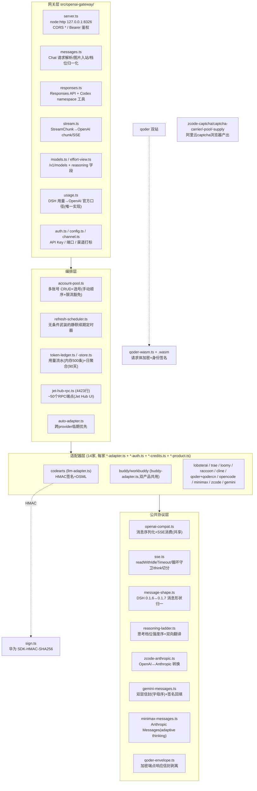
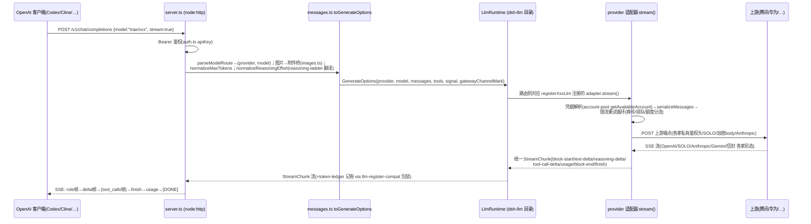

# 参考解读：deepseek-harness-codearts（TS 实现的 14 家 AI 编程服务适配层 + OpenAI 网关）

> 本文档是 TokenMaster（Tauri 2 + Rust(axum) + React）Rust 重写时的**协议对照基准手册**。
> 全部结论来自对源仓库 `E:\Project\TokenHub\deepseek-harness-codearts`（下称 DH）的实际读码
> （`src/` 146 个文件、`README.md` 3749 行、`AGENTS.md` 527 行、`docs/agent-notes/` 十份笔记、
> `tests/unit` 261 个 spec），关键处标注文件路径与行号；未实测/存疑处如实标注。
> DH 最后读码时间：2026-10-06。

---

## 目录

1. [项目概览](#1-项目概览)
2. [架构总览与 Code Graph](#2-架构总览与-code-graph)
3. [公共协议层详解](#3-公共协议层详解)
4. [14 家 Provider 逐家详解](#4-14-家-provider-逐家详解)
5. [编排与网关层](#5-编排与网关层)
6. [对 TokenMaster 的移植映射](#6-对-tokenmaster-的移植映射)
7. [已知坑与注意事项汇总](#7-已知坑与注意事项汇总)

---

## 1. 项目概览

### 1.1 定位

DH 是 **deepseek-harness（DSH，一个类 Claude Code 的 AI 编程宿主）的 cordis 插件**，包名 `dsh-codearts-auth`（`package.json`），MIT 许可（`LICENSE`，Copyright (c) 2026 Jet）。它做两件事：

1. **宿主侧 provider 适配层**：在 DSH 的 `ctx.llm` 上注册 14 家 AI 编程服务的 LLM 路由（codearts / buddy / workbuddy / lobsterai / qoder / qodercn / trae / cline / loomy / raccoon / minimax / zcode / opencode / gemini），外加一个第 15 路「聚合自动」路由 `jet-hub-auto`（`src/auto-adapter.ts`，跨 provider 按积分临期优先选号）。每家含登录/续期、账号池、模型目录、积分余额与每日签到、限流换号。
2. **本机 OpenAI 网关**：`127.0.0.1:8326` 上同时提供 `/v1/chat/completions` 与 `/v1/responses` 两套 OpenAI 协议端点（`src/openai-gateway/`），复用已登录账号与适配器，不把上游凭据复制给客户端。

README.md:41-62 给出网关接口与鉴权（`Authorization: Bearer <网关 API Key>`，优先 `DSH_OPENAI_GATEWAY_API_KEY`，否则 `$DSH_HOME/openai-gateway/api-key` 自动生成 43 位密钥）。模型 ID 形如 `provider/模型名`，按**第一个斜杠**切分，模型名本身可含斜杠（README.md:145-154，如 `cline/anthropic/claude-sonnet-5.5`）。

### 1.2 规模

- `src/` 146 个 TS 文件约 8.6 万行 + 1 个 298KB WASM（`src/qoder-auth-wasm.wasm`）；`plugin-src/client/` 为 Jet Hub 设置页 React bundle（esbuild 打包）。
- `tests/unit/` 261 个 spec（README 提到全量 5448 条单测）；`tests/e2e/` 49 个真机探针脚本（全部带环境变量闸门，默认跳过）。
- `docs/agent-notes/` 十份「事故复盘」笔记约 1.06 万行，是本项目最有价值的踩坑记录（每条都对应真实报障）。

### 1.3 宿主依赖（TokenMaster 需要剥离的部分）

DH 运行在 cordis 插件容器内，宿主服务注入点（`AGENTS.md`「DSH 插件契约」节）：

| 宿主依赖 | 用途 | TokenMaster 剥离方式 |
|---|---|---|
| `@deepseek-ai/cordis`（Context/Service/effect） | 插件生命周期、服务注入 | 全部剥离，改 Rust 的 trait + 直接构造 |
| `@deepseek-ai/dsh-credentials`（`ctx.credentials.set/resolve`） | 凭据 KV 存储（ref → JSON 字符串） | 换本地加密文件/SQLite |
| `@deepseek-ai/dsh-llm`（`ctx.llm.registerAdapter`、`LlmError`、`StreamChunk`、`TokenUsage`、`LlmAdapter` 基类） | LLM 路由注册与 chunk 协议 | 自定义 Rust enum `StreamChunk`（见 §3.1.5） |
| `ctx.settings`（DSH 0.1.7 起 `SettingsForms`） | 持久化；0.1.7 移除 `register()` 后插件改用自有 `$DSH_HOME/jet-hub/state.json`（`src/jet-hub-store.ts`，见 agent-notes/protocol-wire.md:239-298） | 直接文件存储 |
| `ctx.commands` / `ctx.agents` / `ctx.attachments`（图片附件服务） | 早期命令已移除；`ctx.agents` 仅「思考死循环自动续跑」用（README.md:532-557）；附件服务用于网关图片入站（README.md:170-183） | 网关图片直接内存处理；自动续跑属 DSH 会话循环，不需要 |
| `jose` | CodeArts DPoP JWS 签发（README.md:902） | Rust `josekit`/手写 ES256 JWS |

**剥离核心判断**：DH 的 `*-adapter.ts` 各自导出 `registerXxxLlm(ctx, options)` 工厂，但真正的协议逻辑在 `stream()`/`send()`/`consumeSse()` 私有方法与 `*-messages.ts` 纯函数里，与 cordis 只有 `ctx.logger`/`ctx.credentials` 两个接触点——**按「纯函数 + 注入 fetch」的形态照搬即可**（qoder/minimax/gemini 的 `*-messages.ts` 已经是纯函数形态，最接近 Rust 移植目标）。

---

## 2. 架构总览与 Code Graph

### 2.1 模块分层

### 2.2 一次网关请求的调用链（POST /v1/chat/completions，流式）

要点（`src/openai-gateway/server.ts:1-90`、`stream.ts`）：
- 网关**无状态**：不存响应，`GET /v1/responses/{id}` 一律 404（README.md:357）。
- 渠道打标：网关在 `GenerateOptions` 上带 `gatewayChannelMark`，`token-ledger` 读到即记 `gateway`，否则 `direct`（`src/openai-gateway/channel.ts`、`src/token-ledger.ts` 文件头）。
- 填错模型名回 `404 model_not_found`（不是 502），消息附「你是不是想用 X」建议（README.md:194-203，`model-errors.ts`）。
- 流式请求已发 200 后的失败进 SSE 错误帧的 `error.status`/`error.code`；`LlmError` 状态码在 `e.failure.status` 不在顶层（README.md:3723-3728，`stream.ts` 的 `upstreamStatusOrFallback`）。

---

## 3. 公共协议层详解

### 3.1 openai-compat.ts（1196 行）——OpenAI 兼容共享层

服务 qoder/qodercn/loomy/raccoon/cline/opencode 六家（`src/openai-compat.ts:4-16`：buddy/lobsterai 各自内联的历史实现**刻意不迁移**，新 provider 用它）。

| 能力 | 位置 | 要点 |
|---|---|---|
| `contentToText` | :60 | 块数组→纯文本，只取 `type:'text'` |
| `userContentParts` | :85 | 图片必须转 `{type:'image_url',image_url:{url}}`——`{type:'image'}` 或裸 base64 都回 HTTP 500（:76-79）；解析不到字节留 `[image unavailable]` 占位（:109-112）；递归处理 `tool-result` 内层（:115-125） |
| `collectImages` | :131 | 按 `attachmentId` 去重收集图片引用，递归 tool-result |
| `serializeMessages` | :162 | **Rust 移植重点**。流程：①`normalizeHarnessMessages`（0.1.7 形状归一）→②`resolveToolPairing` 剔孤儿工具对→③ assistant：`content` 为空且有 `tool_calls` 时必须为 `null`（OpenAI 规范，:209-210）、`reasoning` 块折叠进 `reasoning_content` 字段、清洗行首 `course`/`课` 泄漏（:182-187）；④ 工具结果内嵌图片**不能**留在 `role:'tool'`（其 content 只能是字符串且必须紧跟 tool_call），提升为其后的独立 user 消息（`TOOL_RESULT_IMAGE_TEXT='Attached image(s) from tool result:'`，:71、:170-177、:237-261） |
| `errorDetail` | :275 | 兼容 `error` 为字符串或嵌套对象（Cline 地域限制 `{"error":"access forbidden…"}`，:278-284） |
| `httpErrorCode` | :299 | 401/403→AUTH、429→RATE_LIMIT、400→INVALID_REQUEST、≥500→SERVER、其余 `HTTP_{n}` |
| `ModelQueuedError` | :331 | code=`'QUEUE'`（不在 harness 可重试集合，:327-330）；`retryAfterMs` 来自 `model-queue.ts` 的 `parseQueueError` 递归穿透 `data/result/message/body` 嵌套（:631-657，**绝不能拿顶层 code 判 10605**——实测顶层是 403、业务码在 message 里再嵌一层） |
| `consumeOpenAiSse` | :411-1196 | **SSE 消费核心**，见下 |

`consumeOpenAiSse` 的实测兼容规则（每条都对应真实缺陷，注释在源码内）：

1. **`data:` 后可无空格**：`line.slice(5).trim()`（:539-540）。
2. **思考字段两个名字**：`delta.reasoning_content`（qoder/buddy）与 `delta.reasoning`（**Cline**，:586-588）用 `??` 合并（:787）。
3. **`typeof x === 'string'` 而非 `!== undefined`**：真实 SSE 另一侧恒为 `null`（:20-23、:735-737）。
4. **工具调用按 `index` 合并**：首片带 id/name，后续只带 arguments 片段（:824-879）；`function.name` 只允许**非空覆盖**（后续空串会清掉已解析名，:834-838）；**名称为空前不发射任何 chunk**（qoder 偶发无名分片→`unknown tool ""`→持久化污染会话→跨 provider 传染 400 code 11133，:841-871）。
5. **错误帧三种形态**都要识别：①OpenAI `{error:{message}}`（:620）；②Qoder 顶层 `{code,message,type}` 无 choices（:626-679，其中额度码 `110`→`QUOTA_EXCEEDED` 不可重试，:658-673）；③网关形态 `{statusCodeValue,stackTrace,message}` 或信封剥离后的 `{message,type:'model_error'}`（:680-724）。
6. **`message.content` 只是兼容回退**，与 delta 互斥（`gotAnyContent` 守卫，:731-741）。
7. **usage 换算**：`inputTokens = prompt_tokens - cachedTokens`（DSH 互斥口径），命中单列 `cacheReadTokens`（:880-898）；缓存字段两处来源 `prompt_tokens_details.cached_tokens ?? prompt_cache_hit_tokens`。
8. **两套死循环守卫独立实例**：思考守卫命中→丢弃增量 + `reader.cancel()` 止损（:900-915）；正文守卫命中→**只截断不中止不改 finish**（实测正文循环后工具调用仍有效，:428-455、:748-777）。
9. **think 标签拆分收尾无条件做**：`splitThinkTaggedContent` 在 block-end 处调用（标签必然跨帧，逐帧探测二分帧 7/11 漏判，:760-773、:971-1005）。
10. **finish 归类**（:1058-1195，全是血泪）：
    - `length`/中途断流（`finishReason===undefined && !streamEnded`，:1113）/参数残缺/被停止串掐断（正文止于未闭合行内代码，:1134-1136）→一律 `max-tokens`（不完整、可重试）；
    - 丢弃无名 tool-call 且无可用调用→`max-tokens`（:1074-1085）；
    - 思考死循环是唯一产出→`error REASONING_LOOP`（有可见产出时报 max-tokens 保内容，:1144-1172）;
    - 零内容块且 stop→`EMPTY_RESPONSE`（`resolveEmptyResponseReason`，sse.ts:132-141）；
    - **「没有任何 data: 帧」**（响应不是 SSE）→抛错带原文片段（:1076-1088）。
11. **「没有任何报错就中断」的根治**：判据是「连接结束的方式」（有无 `[DONE]`/`finish_reason`），不是「有没有工具调用」（README.md:1954-1979、:1090-1113）。

### 3.2 sse.ts（1181 行）——SSE 工具箱

| 函数 | 行号 | 要点 |
|---|---|---|
| `readWithIdleTimeout` | :28-59 | `Promise.race(read, timeout)`；超时取消 reader 抛可重试 `TIMEOUT`；尊重用户 abort 信号。**Rust 对应：tokio `tokio::time::timeout` 包 `reader.read()`** |
| `hasUsableToolName` | :81 | `typeof === 'string' && trim().length>0`；不能用 `String(name).length`（`undefined`→`"undefined"` 非空，:76-80） |
| `resolveEmptyResponseReason` | :132 | 零块 + stop → `EMPTY_RESPONSE`（code 必须用常量，字符串匹配决定重试资格，:118-127） |
| `createBlankReasoningSuppressor` | :159 | 纯空白思考整块压制（转正时补发全部累积文本，O(1) 判单片，:185-194） |
| `resolveToolPairing` | :244-289 | 孤儿 tool_call/tool_result 双向剔除 + **空名字调用剔除**（配对完整也 400 code 11133，:206-235）；一批调用需**全部**有结果才保留（:277-280） |
| `normalizeToolArguments` | :291 | 空串→`{}`；**残缺 JSON 保持原样**（补 `{}` 会伪造合法外观让 harness 报 schema 错而非重试，`isTruncatedArguments` :324 区分两者） |
| `createReasoningLoopDetector` | :481 | 尾部 3000 字符窗口行去重率 <0.35 判循环；`cutAt` 给截断点；环境变量 `DSH_REASONING_LOOP_GUARD`/`_AUTO_RESUME(_MAX)` 控制（README.md:532-557：中止后自动补「继续」重跑，连续上限 2 次） |
| `splitThinkTaggedContent` | :768 | `</think>`（配对/hex/裸三种形态）前的独白→reasoning 块、后→text 块 |
| `stripCourseLeak` / `stripBareThinkCloseTag` | :924/:1117 | 历史清洗（默认关，`DSH_THINK_LEAK_STRIP=1`） |
| `isProseTruncatedByStopString` | :1171 | 反引号奇数且以反引号收尾=被上游停止串掐断 |

### 3.3 message-shape.ts（147 行）——宿主消息形状归一

DSH 0.1.7 把工具结果从「user 消息内 `tool-result` 包裹块」改成「一等 `role:'tool'` 消息」（:4-11）。五个适配器按旧形状写判据，不归一化则工具调用被整体剔除（实测 512 条工具调用保留 0 条，:29-31）。`normalizeHarnessMessages`（:111-146）：`role:'tool'`→降级为 user 内包裹块（`toolCallId` 取顶层，回退 `source.callId`）；`role:'developer'`→丢弃（只承载工具增删元数据）；无需改动时返回原数组引用（零成本）。
**TokenMaster 无宿主，但若 Rust 侧内部消息模型选了 OpenAI 形态（`role:'tool'`），各序列化器要能吃两种输入——或统一在入口归一。**

### 3.4 reasoning-ladder.ts（183 行）——思考档位强度序（唯一权威）

`REASONING_EFFORT_RANK`（:57-71）：`off/none:0, minimal:1, light:2, low:3, medium:4, high:5, on:5, extra_high:6, xhigh:7, max:8, ultra:9`。`CANONICAL_REASONING_EFFORTS`（:79-81）= OpenAI 客户端固定 8 档。

`translateReasoningEffort`（:131-152）三条规则：①精确命中声明 id→exact；②登记过→**同族就近，同距取更强**（rank 0 的 off/none 族与其余互不翻译——「少想一点」绝不能译成「完全不想」，:122-129、:144）；③无同族→`unexpressible`（不下发该参数），完全不认识→`unknown`（400 并列出可用档位）。`canonicalReasoningEffortFor`（:164-182）反查保证往返自洽。

**为什么必须网关翻译**（README.md:205-273、agent-notes/protocol-wire.md:1035-1104）：各 provider 档位 id 是 wire 值（TRAE `light/extra_high`、LobsterAI `off/xhigh`、Cline 顶档 `max`、Raccoon `on/off`），而 CC Switch/Codex 客户端只有那 8 个固定值——照 DSH 界面名填必 400。codearts 例外短路：只有开/关两态，任何名字等价（protocol-wire.md:1077）。

三个查询出口同源：`GET /v1/models` 的 `reasoning` 字段（efforts+canonical+default+openai_efforts）、`GET /v1/reasoning-efforts`（8 个规范名逐一结局 exact/mapped/unexpressible/ignored）、设置页对照表。

### 3.5 zcode-anthropic.ts（843 行）——OpenAI ↔ Anthropic Messages 转换

差异表（文件头 :26-36，与 README.md:3500-3508 一致）：

| 维度 | OpenAI | Anthropic |
|---|---|---|
| system | `messages[0].role='system'` | **顶层 `system` 字段**（块数组） |
| 工具声明 | `tools[].function.{name,parameters}` | **`tools[].{name,input_schema}`**（扁平） |
| 工具调用 | `tool_calls[].function.arguments`（字符串） | `content[].{type:'tool_use',input}`（**对象**） |
| 工具结果 | `{role:'tool',tool_call_id}` | **`{role:'user',content:[{type:'tool_result',tool_use_id}]}`**（连续结果合并进同一条 user，`toAnthropicMessages` :166-174） |
| SSE 结束 | `data: [DONE]` | `message_stop` 事件（无 `[DONE]`） |
| 思考 | `delta.reasoning_content` | `content_block_delta` 的 `thinking_delta` |

细节：`parseToolArguments`（:69-86）残缺参数**不补 `{}`**（返回哨兵对象由调用方报错）；图片 `image/*` 通配 mime 归一 `image/jpeg`（官方兜底，:124-140）；空 assistant 消息直接丢弃（上游 400，:215）；`parseFrame`（:417）解析 `event:`/`data:` 行对。**空响应必须显式抛 `EMPTY_RESPONSE`**——Anthropic SSE 没有 `[DONE]` 锚点（README.md:3512-3514）。

### 3.6 gemini-messages.ts（778 行）——Gemini 双层信封

- **信封结构**（`GeminiEnvelope` :96-109）：`{model, project, request:{contents, systemInstruction, tools, toolConfig, generationConfig, sessionId}, requestId, userAgent}`，**每层键按字母序排列**（Go `encoding/json` 的 map 序列化语义；TS `JSON.stringify` 是 V8 插入序，必须走 `marshalAlphabetical`，`gemini.ts`）。`tests/unit/gemini-payload.spec.ts` 有 353 字节逐字金标准（README.md:3534-3540）。
- role 只有 `user`/`model`（:15）；thinking 块不回传但 `thoughtSignature` 搬到同消息后续 `functionCall` part 上（:16-19，`translateGeminiRequest` :225-237 签名查表回填）；`functionResponse` 的 `name` 必须来自对应 tool_use 的 name（上游按 name 配对，:19-20，先扫全消息建映射 :205-212）。
- `canonicalArgs`（:127-131）：签名键=「tool:名+按键名升序的紧凑 JSON」，两侧必须同一序列化。
- SSE 收尾余量按整行再走一遍（流结束时 buffer 残留末帧必须处理，:22-28）。
- usage：`cachedContentTokenCount` 处理（`readGeminiUsage` :509）。

### 3.7 minimax-messages.ts（642 行）——Anthropic Messages（MiniMax 变体）

`buildMinimaxMessagesPayload`（:77-140）思考决策表（实测，:108-126）：

| 情形 | 请求体 | 实测 |
|---|---|---|
| effort='none'（switchable 模型） | `thinking:{type:'disabled'}` | 0 思考 |
| effort='on' | `thinking:{type:'adaptive'}` | 2785+ 字符 |
| 有档位 effort | `thinking:{type:'adaptive'}`+`output_config.effort` | 档位生效 |
| M3.1（requiresAdaptive） | 必须 adaptive | 否则 **400 (2013)** hard error |
| M2.7 系无档位 | **整个不发 thinking** | 服务端默认思考 |

SSE 事件：`message_start`（usage.input_tokens+cache_read）→`ping`（忽略）→`content_block_start/delta/stop`（thinking/text/tool_use；`signature_delta` **必须忽略**否则往正文注入十六进制）→`message_delta`（stop_reason+output_tokens 含 thinking_tokens 子集，不累加）→`message_stop`（README.md:2929-2943、文件头 :18-47）。图片走 Anthropic `image` 块 + `source.base64` 裸 base64，OpenAI `image_url` 形状被拒（:49-54）。

### 3.8 qoder-envelope.ts（227 行）——加密端点响应信封

每帧 SSE 形如 `data:{"headers":{…},"body":"{\"choices\":[…]}","statusCodeValue":200}`——**内层 body 未加密**（只有请求体要 WASM 加密），只剥信封（:5-16）。分类按 **JSON 结构**不嗅探子串（:54-102）：`choices`/`usage`→chunk；显式 `code/message/error/statusCodeValue/type`→error；`null`/`{}`/空→heartbeat **整帧跳过**（旧实现把心跳判成错误→正常回完报 SERVER 白重试 5 次，issue IKJOZ8）。错误帧**保真转发** `{code,message,type:'model_error'}`——`code` 必须保持独立字段（拼进 message 后缀会让排队识别永不命中，:182-199）。

---

## 4. 14 家 Provider 逐家详解

> 模板：endpoint / 登录刷新 / 请求构造鉴权 / SSE 解析 / 模型表 / 额度签到 / 限流重试 / 已知坑。

### 4.1 codearts（华为云 CodeArts）——`src/llm-adapter.ts`(2349行) + `service.ts` + `oauth.ts` + `codearts-credits.ts` + `models.ts` + `sign.ts`

**endpoint 表**

| 用途 | 端点 |
|---|---|
| 推理 | `POST https://snap-access.cn-north-4.myhuaweicloud.com/api/v2/chat/completions`（`CHAT_API_BASE` llm-adapter.ts:23） |
| 排队状态 | `GET …/api/v1/queue/status`（:313；实际实现为直接重试 chat 而非轮询它） |
| 模型目录 | `gateway/config`（benefit 集合来源，`models.ts` 的 `SNAP_MODEL_BUILTIN_URL` 同域） |
| 积分账户/活动 | `GET/POST {snapEngineUrl}/snap-manager/v1/statistics/plugin`、`/v1/ops/delivery?channel=IDE`、`/v1/ops/claim`、`/v1/ops/confirm`（codearts-credits） |
| OAuth | portal `/authorize` → 本地 `/oauth/callback` → `sts.cn-north-4.myhuaweicloud.com/v1/oauth2/tokens`（PKCE+DPoP，README.md:875-877、:969-981） |

**鉴权**：华为 `SDK-HMAC-SHA256`（`sign.ts:28-68`）。canonical request = `method\n uri(补尾斜杠) \n query \n 排序header行 \n '' \n SignedHeaders \n payloadHash`；签名头固定 `host / x-sdk-date / x-sdk-content-sha256 / x-security-token`（+非 GET 的 `content-type`），Authorization=`SDK-HMAC-SHA256 Access=…,SignedHeaders=…,Signature=…`。**Rust 对应**：`sha2`+`hmac` crate 逐字段照抄即可，无外部依赖。
请求另带 `Chat-Id`/`Session-Id`/`lang:en`（签名后追加，llm-adapter.ts:1205-1208）。

**benefit 头**：`glm-5.3-flash`/`deepseek-v4.1-flash` 等 benefit（免费额度）模型的 `maas_type: benefit` 头**参与签名**（`extraSignedHeaders`，:1183-1190），缺失回 `InferHub.002002009.404 model is not registered`。benefit 集合**动态判定**（gateway/config ∪ 静态兜底，:1165-1168）；命中 `InferHub.4004.200 benefit not found` 时去掉该头重试一次（:26-47、:1271）。

**DSML 模式**（:218-360，本家独有）：deepseek-v4-flash/pro 标准 `tool_calls` 参数一次性打包，SSE 长静默被 APIG 网关 ~60s 掐断；DSML 让工具调用写进 `delta.content`（`<｜DSML｜tool_calls><｜DSML｜invoke name="…"><｜DSML｜parameter …>` 全角分隔符），1000 行 write 最大静默仅 204ms。适配器把工具 schema 注入 system 提示、请求体不发 `tools`，流端用三态状态机（normal/in-thought/in-dsml）解析，`<thought>` 标签→reasoning 通道。参数值做宽松标量还原（`"840"`→840，:709-768）。

**SSE 超时**：`firstTokenTimeout=300s / chunkTimeout=600s`（对齐 IDE 逆向，:316-334；env `DSH_CODEARTS_SSE_*` 可覆盖）。

**排队/额度分流**（:490-560、README.md:835-871）：

| | 排队/TPM（`TM.00001041`、`InferHub.ModelArts.81111.429`） | 额度用尽（`InferHub.4291.200 insufficient quota`） |
|---|---|---|
| 处理 | 10s 间隔重试 chat，上限 180 次=30 分钟 | **立即失败** `QUOTA_EXCEEDED`，标记账号+模型至 UTC+8 当日 24:00（`nextUtc8DayStartMs`），换号 |
| 坑 | `429` 判据必须锚定独立数字 `(^|[^0-9])429([^0-9]|$)`——裸子串会命中 `4291` 前缀→额度被误判排队→30 分钟静默零输出（2026-10-02 真实报障「CodeArts 没反应」） | 额度码另走 `isSseQuotaExhaustedErrorCode`（子串 `4291` 或 `insufficient quota` 文案兜底） |

**模型表**（:48-71）：`GLM-5.2/5.1/5`（GLM-5.2 窗口 202752）、`glm-5.3-flash`（1M）、`openpangu-2.0-flash/pro`、`deepseek-v4-flash/-pro`（1M）、`deepseek-v4.1-flash`（1M，benefit）。输出上限统一收敛 **65536**（131072 反触发空流；网关侧同值见 `openai-gateway/messages.ts:79-88`）。

**积分**（codearts-credits.ts，README.md:1686-1804）：四步——账户类型检测（`package.is_credit_package`）→活动列表（`type==='USER_LOGIN'`）→`claim`→（`id!==null` 时）`confirm`。认证同 HMAC 签名；**`Agent-Type: PromptCenter`/`X-Language: zh-cn` 必须签名后追加**（进签名则 401 APIG.0301，实测 2026-09-18）。坑：`campaignId` 是**数字**、金额字段是 `benefitAmount`、不可领时 `status` 是 `null`（三坑叠加曾致领取恒 0 分）。`refresh_token` 一次性轮换（`STS5.1806`），刷新必须立即回写。

**续期**：IAM OAuth，过期前 1h 静默续期；失败 10 分钟重试（异常网络 1 分钟）；`APIG.0602`/401/403 触发一次静默 refresh 重试（:472-483）。

### 4.2 buddy（腾讯 CodeBuddy 中国版）——`src/buddy-adapter.ts`(2617行) + `buddy-auth.ts` + `buddy-oauth.ts` + `credits.ts` + `product.ts`

**endpoint**：推理 `POST https://copilot.tencent.com/v2/chat/completions`（Bearer `access_token`）；登录 `POST /v2/plugin/auth/state?platform=ide` → 浏览器 `www.codebuddy.cn/login` → 轮询 `GET /v2/plugin/auth/token?state=`（1s 间隔 5 分钟超时；错误码 11217=未就绪继续轮询）→ 轮询 `/v2/plugin/login/account`（12151 同理）；续期 `POST /v2/plugin/auth/token/refresh` + **`X-Refresh-Token` 头**（README.md:989-999）。external-link 轮询式，不起本地端口。

**请求头**（buddy-adapter.ts:1948-1984，`send()`）：`Authorization: Bearer`、`Accept: text/event-stream`、`X-Domain`（**产品优先** `product.apiDomain || credential.domain || ''`，必须 `||` 不能 `??`——domain 空串时 `??` 不生效，protocol-wire.md:671-694）、`X-Product-Code`、`X-Product`、`X-IDE-Name/Type/Version`、`X-Agent-Purpose: conversation`、`User-Agent` 按模型族分档（`resolveUserAgent`，workbuddy 国际版 gpt/gemini/claude 用国际 UA、glm/hy/kimi 用国内 UA，product.ts:480-492）。凭据 ref `BUDDY_ACCESS_TOKEN`（多账号 `BUDDY_ACCOUNT_<UUID_SHORT>`）。

**SSE**：标准 OpenAI（`delta.content`/`reasoning_content`/`tool_calls`）。**流式工具 id 稳定性**：仅首片带真实 id（`chatcmpl-tool-xxx`），按 index 缓存沿用（README.md:1011-1014）。

**模型/倍率**：内置兜底 `product.ts fallbackModels`；远端两个端点（scoped `/console/enterprises/personal/models` 与 `/v3/config`→`data.data.models`）**取并集**（促销只挂其中一侧的 id，如 `hy4-preview-f`）；倍率 `credits:"x0.29"`（x 在前）与促销 `discountedCredits:"0.50x"`（**x 在后**）形态相反；促销须按 `schedule` 判时段、`factor:0`=免费；`/v3/config` 有 UA 校验（UA 不对回 200+code 12403）。`max_tokens` 优先级：options→远端 `maxOutputTokens`→兜底表，三者皆无不发（README.md:1044-1090；实测 v4.1-flash=128000，网关默认 32000 正是截断事故根因）。

**限流/风控**：业务码 `11140`（request illegal，文案说内容审核但**按账号生效**）→归 `PERMISSION_DENIED`（不是 AUTH），被拦账号该模型冷却 30 分钟，三条通道（401/403、首发限流、200+SSE 错误帧）都换号（README.md:1016-1042）。同名模型消歧：公共前缀后追加差异段（`Deepseek-V4.1-Flash · x0.03 SG`，README.md:1176-1199）。

**积分**：余额 `POST /v2/billing/meter/get-user-resource`（body `{}`，响应**双层嵌套** `data.Response.Data.Accounts[]`；总额用 `CapacityRemainPrecise` 相加）；签到两步 `checkin-activity-status`（**不是** checkin-status，后者是占位数据）→ `daily-checkin`；幂等=HTTP 400+code 10001。**不需要** `X-Device-Token`。锁定永久积分：`DeductionEndTime` 距今 <15 天=临时（`CycleEndTime` 会误判月度套餐、`ExpiredTime` 无区分力恒空串、终身口径 `CapacityRemain` 虚增），选号「有临期优先→只剩永久→无/查不到」，锁表存独立 `permanent-locks.json`（`state.json` 是共享文档整体替换语义会被旧版本抹掉，protocol-wire.md:352-405）。分类是时间函数，**缓存原料绝不缓存分类结果**（:406-428）。

**成长任务**（buddy-growth.ts 2750 行，仅中国版）：22 项任务的纯 API 自动化，两个任务端点不同 schema 必须合并读；`code 400` 必须同时看 `msg` 区分「无可领对象」与真失败；claim 成功判据显式 `code===0`。

### 4.3 workbuddy（腾讯 WorkBuddy 国际版）——共用 buddy-adapter，差异收敛在 `product.ts`

endpoint `https://www.workbuddy.ai`、platform `workbuddy-ai`、`X-Product-Code: workbuddy`、`pluginVersion 5.5.2`、登录 URL 附加 `version/loginSessionId`（product.ts:459-492、README.md:1325-1373）。模型池国际版（claude/gpt/gemini/kimi 系）。**无签到接口**（不渲染领取按钮），**有**余额接口。旧凭据启动时按 `apiDomain` 不符自动清理。其余（请求头/流式工具 id/11140 处理/锁定积分）与 buddy 同。

### 4.4 lobsterai（有道 LobsterAI）——`src/lobsterai-adapter.ts`(1738行) + `lobsterai-auth.ts` + `lobsterai-oauth.ts` + `lobsterai-credits.ts` + `lobsterai-product.ts`

**endpoint**：推理 `POST https://lobsterai-server.youdao.com/api/proxy/v1/chat/completions`（LOBSTERAI_API_BASE，lobsterai-product.ts:63）；portal `https://lobsterai.youdao.com`（:77）；`clientVersion` 动态拉自 `api-overmind.youdao.com/.../update`（缓存 12h，失败回退内置值，README.md:1653-1656）。

**登录**：本地回调服务器收 `authCode` 换 token（与腾讯系轮询式不同）；**两个域名**（portal 与 apiBase 分离）。凭据含 `uuid/first_keyfrom/latest_keyfrom` 身份字段（续期请求体必填，丢失=静默续期失败只能重登，README.md:1838-1841）。

**请求头**：仅 `Authorization`/`Content-Type`/`Accept`/`User-Agent`/`X-LobsterAI-Client-Capabilities`/`X-LobsterAI-Client-Version`（不发腾讯系归属头）。`stream` 恒 true（`stream:false` 回 500）。

**已知坑**：图片**不支持**（inputModalities 恒 text）；思考档位 wire 是 `off/high/xhigh`（界面名「关闭/高/Max」——正是档位翻译层的头号案例）；模型倍率 `data[].costMultiplier` 裸数字；余额 `GET /api/user/profile-summary`→`data.totalCreditsRemaining`（**不要**用 `/api/user/quota`，只有 freeCreditsTotal=300）；签到三步 slot→context（读 `claimedToday`/`actions`）→`check_in`（带客户端幂等键 `idempotencyKey`）；终态判定只有 HTTP 401/403 或业务码 40100/40101（网络抖动可重试不误判重登，README.md:1849-1851）。账号展示名是手机号只露末 2 位（`maskLobsteraiPhoneTail` 幂等归一）。28 个内置模型，实测无同名。图片体积边界 ≈13 张（SERVER 500，已接缩放 1MiB）。

### 4.5 qoder（阿里系 Qoder 国际版）——`src/qoder-adapter.ts`(1138行) + `qoder-auth.ts` + `qoder-oauth.ts` + `qoder-wasm.ts`(706行) + `qoder-envelope.ts` + `qoder-credits.ts` + `qoder-product.ts` + `qoder-machine.ts`

**两条推理路径**（qoder-adapter.ts:7-27，**本项目最坑之处**）：

| 路径 | 端点 | 模型名 |
|---|---|---|
| 加密（本插件用） | `https://api2.qoder.sh/algo/api/v2/service/pro/sse/agent_chat_generation?Encode=1` | 目录 key（`qfmodel`/`dmodel`…），含 Qwen3.8 系 |
| 公开 | `https://api2-v2.qoder.sh/model/v1/chat/completions` | 通用名（`qwen-flash`） |

两 host 不同（`api2` vs `api2-v2`），混用 404。公开端点对目录 key 一律 `Unsupported model`（早期真实缺陷：「发消息没回复就终止」=目录 key 发给了公开端点+错误帧被静默吞）。

**登录**：PKCE 设备码轮询——浏览器 `https://qoder.com/device/selectAccounts`，轮询 `openapi.qoder.sh/api/v1/deviceToken/poll`；**404=用户未完成授权，继续轮询**（不是错误，README.md:1876-1887）。续期请求体要带 `machine_id`（插件生成随机 UUID 持久化——**不复制官方硬件指纹**，这是最大未验证假设）。凭据 `security_oauth_token` 与 `access_token` 双写同值（服务端取用前者优先）。

**加密推理**（qoder-wasm.ts）：请求体由客户端内嵌 WASM（wasm-bindgen）加密，签名头**原样透传不能用 Bearer 覆盖**；响应只需剥信封（§3.8）。WASM 调用三个坑（文件头 :27-36）：两个 `getRandomValues` import 签名方向相反；返回值布局两套（字符串类 `ptr/len/valIdx/isErr` vs `ptr/errIdx/isErr`）；`requestresult_url` 参数顺序栈指针在前。`buildQoderInferPayload` 是纯函数（payload 本地不可解，靠单测锁死）。请求体**必须带 `business` 字段**（缺失路由到故障节点，表象像「只有 qfmodel 一个模型坏」，README.md:1996-2002）。

**模型表**（qoder-product.ts:442-456 配置；17 个 key）：`auto/ultimate/performance/efficient`、`smodel/cmodel`、Qwen 系（`qmodel_38max` 免费、**`qfmodel`**、`qmodel_latest`、`qmodel`）、Kimi（`kmodel_latest/kmodel`）、GLM（`gmodel/gfmodel`）、DeepSeek（`dmodel/dfmodel`）、MiniMax（`mmodel`）。静态表不发网络请求（远端目录需签名）；`price_factor:0`=免费（不能用 `>0` 过滤）；错峰折扣按 `windowStart/windowEnd` 本地推算不采信目录快照。每模型带 `efforts:['high','low','max']` 类似声明与 `defaultEffort`。

**积分**：余额 `GET openapi.qoder.sh/sash/api/v2/me/usage`（只需 Bearer+`Cosy-ClientType`；**余额=userQuota+addOnQuota 多包累加**，只读 userQuota 会显示 0）；领取 `GET /sash/api/v1/me/campaigns`（**必需成对 machine 头** `Cosy-MachineToken/Cosy-MachineType`，少了只见 VIEW_DETAILS 看不到可领活动）→`POST …/{campaignId}/claim`（body 空）；幂等判据是响应体 `replayed:true`（HTTP 仍 200）；只领 `CLAIM_BENEFIT+CLAIMABLE`（README.md:2024-2073）。

**限流**：排队码 `10605`（ModelQueuedError 按服务端 `retryAfterMs` 等待，上限 30 分钟）；额度码 `110`（Billing daily count exceeded）→`QUOTA_EXCEEDED` 不可重试。两种下发形态（HTTP 403+JSON 与 HTTP 200+SSE 内嵌）都要认（openai-compat.ts:307-330）。图片体积边界 ≈15 张（TRANSPORT，缩放后 24 张全过）。

### 4.6 qodercn（Qoder 中国版）——共用全套 qoder 实现，差异在 `QODER_CN`（qoder-product.ts:592-604）

| 项 | 国际版 | 中国版 |
|---|---|---|
| 授权/OpenAPI/加密推理 | qoder.com / openapi.qoder.sh / api2.qoder.sh | qoder.cn / openapi.qoder.com.cn / gateway.qoder.com.cn |
| client_id | `e883ade2-…` | `732aef47-9cf2-46a2-95fe-4cebb5d0d1fa` |
| 模型数 | 17 | 14（独有 `q37fmodel`/`gm51model`；无 ultimate/performance/efficient/smodel/cmodel） |
| 凭据 ref | `QODER_*` | `QODERCN_*` |

WASM 同一份（实测可签 CN 请求）。**积分每日领取依赖本机 `runtime-info.exe` 生成设备身份**（`~/.qoder(-cn)/.bin/umid-*/`，任一存在即可）——两者都没有时不带 machine 头，症状「报今日已领但官方能领」（README.md:2097-2139）。

### 4.7 trae（字节跳动 TRAE SOLO）——`src/trae-adapter.ts`(1950行) + `trae.ts`(1917行) + `trae-oauth.ts` + `trae-auth.ts` + `trae-errors.ts` + `trae-cooldown-table.ts` + `trae-credits.ts` + `trae-product.ts`

**endpoint**（trae.ts:13-21）：推理 `POST https://trae-api-cn.mchost.guru/api/agent/v3/llm_utils_chat`；模型列表 `POST /api/ide/v1/batch_get_detail_param`（批量通道）；换 token `POST api.trae.com.cn/cloudide/api/v3/trae/oauth/ExchangeToken`；签到/积分在 `api.trae.cn`。

**鉴权头**（`traeSOLOHeaders` trae.ts:204-237）：`Authorization: Cloud-IDE-JWT <token>` + `X-Cloudide-Token`/`X-Ide-Token`（同 token）+ `X-Uid`/`X-App-Id`/`X-Ide-Version(Version-Code/Version-Type)`/`X-Device-Type: macos`/`X-OS-Version`/`X-Device-Brand`/`Request-Traffic-Type: prod` + `X-Machine-Id`（可轮换派生）+ `X-Device-Id`。签到另用 `traeCheckinHeaders`（约 20 个头，设备身份由 `uid` 确定性派生、**每账号必须互异**——同天两账号共用 device_id 被「该设备已签到」拦截，空则报 9004）。

**请求体**：OpenAI→SOLO 转换（`transformToSOLOBody` trae.ts:1545）：`function:"solo_work_lite"` 类通道名、`config_name`（模型映射，非直接 model）、`tools[].parameters` **序列化为字符串**、`tool_calls.function`→`function_call`。**漏走转换直接拼 body 报 `4001 expr_path=usage missing required parameter`**（不是缺 usage 字段，README.md:2306-2316）。

**响应流**：SOLO 自定义事件（`output`/`token_usage`/`done`/`error`）→转 OpenAI chunk（`parseTraeSSELine`/`buildOpenAIChunk`）。

**登录**：本地回调 `127.0.0.1:18080`（占用自动回退随机端口），回调参数名是 **`auth_callback_url`**；**两套流程都要认**——老流程直接回传 token（`refreshToken/userInfo/userJwt`），新流程 PKCE（`code/authCodeInfo`，识别后给精确报错）；`userInfo` 中文昵称双重编码乱码自动回转。凭据持久化 `machine_id`+`device_id`（32 hex，machine_id 续期绝不可重生成）。展示名用脱敏手机号（`ScreenName` 是按 uid 生成的默认名无法区分多账号）。

**模型/通道**（README.md:2224-2260）：22 个通道里**只有 15 个可调用白名单**（`solo_agent/solo_work_lite/solo_agent_remote/…`，env `DSH_TRAE_CHANNELS` 覆盖整表）；`is_custom_model:true` 剔除、`is_invisible_to_user:true` 硬剔；「剔除（仅见于不可调用通道）」与「纠正通道（也见于白名单）」分开。远端消费 `context_window_tokens.dev`（主流 200000）与 `max_tokens`（32000）；单次输出收敛 64000（`DSH_TRAE_MAX_COMPLETION_TOKENS`）。**历史长度不设本地闸门**（曾有的 50 万字符裁剪抄自别项目且静默丢历史，已整体删除；实测 100 万字符/24.9 万 token 仍 200）。图片逐模型判定 `display_config.multimodal`（用户贴图与工具结果图 `tool_response_multimodal` 是两个独立字段）。

**失败模式**：`4008`（ide_credits 耗尽）与 `1005`（plan 权益不足）→冷却+换号；空响应（200 零事件）重试一次且仅首个模型事件之前。签到：claim 响应只有 `{"code":0}`**不含积分数**——需补查 status 取 `credits`；claim 对已签幂等返回 code:0，**必须开状态预检**；`9074` 人数过多不换设备号（300s 冷却）。余额 `POST /trae/api/v2/pay/ide_user_ent_usage`（body `{"require_usage":true,"req_source":2}`，缺 require_usage 则 usage 恒 0 余额虚高；余额=Σ(credits_limit−credits_amount)）。

### 4.8 cline（cline.bot）——`src/cline-adapter.ts`(994行) + `cline-auth.ts` + `cline-oauth.ts` + `cline-models.ts` + `cline-models-dev.ts` + `cline-rate-limit.ts` + `cline-product.ts`

**endpoint**（cline-product.ts:253-297）：推理 `POST https://api.cline.bot/api/v1/chat/completions`（**标准 OpenAI 兼容**，复用 openai-compat）；登录设备码走 `https://api.workos.com/user_management/authorize/device` + `/authenticate`（`authorization_pending` 继续轮询、`slow_down` 累积退避）→注册 `/api/v1/auth/register`；续期 `/api/v1/auth/refresh`（body `{refreshToken, grantType}`）。

**鉴权**：`Authorization: Bearer workos:<jwt>`——**`workos:` 前缀不可剥**。客户端头 `HTTP-Referer: https://cline.bot`/`X-Title: Cline`/`X-CLIENT-TYPE: cline-sdk` 等。

**思考字段**：`delta.reasoning`（不是 reasoning_content），已由共享 SSE 消费器兼容。档位 None/Low/Medium/High/Extra 五档，默认 **High**（`Extra` 映射上游 `max`；内嵌目录里 `xhigh` 与 `high` 无差异故跳过）；档位数据来自客户端内嵌目录（远端不下发），上游不认识的档位静默忽略不失败。

**免费模型**：远端 `GET /api/v1/ai/cline/recommended-models`（**无需认证**）的 `free` 数组动态下发，名字拼 ` · 免费` 进 `name`（切换菜单只渲染 name）；免费与付费是不同 id 组（`cline-free/mimo-v2.6-flash` vs `xiaomi/mimo-v2.6-flash`），按完整 id 判定不做模糊匹配；兜底表只在远端不可用时整表兜底且丢弃远端已不认识的条目（两次下架事故：gemini-3.8-flash、deepseek-v4.1-flash）。`cline-pass/*` 是订阅通道，403 ENTITLEMENT_ERROR，文案不提它。能力元数据另从 **models.dev**（`cline-models-dev.ts`）取窗口/图片能力。

**限流三分类**（cline-rate-limit.ts、README.md:2373-2437）：

| HTTP | 语义 | 处理 |
|---|---|---|
| 429 `Daily free limit reached` | 当日免费额度（按天+按模型单独计） | 倒计时**用报文人类可读时长**（`Try again in 19h 39m`——实测无 retry-after 头，写死 60 分钟会无限循环） |
| 429 其它 | Rate limit | retry-after 头→报文→绝对时刻→1h 兜底，换号 |
| 402 | Insufficient credits | **不记倒计时**（等不会恢复），换号，全失败报「去 app.cline.bot 充值」 |

每个失败账号都要记标记（含最后一个）；地域限制 403（文案识别，不只看码）跳过无意义续期抛 `PERMISSION_DENIED`。免费额度按「账号×模型」计——一个到顶换同账号另一个 `cline-free/*` 立即可用。

**Gemini 系两个 400**（历史）：`maxOutputTokens` 上限填错（65536 非 131072）与工具 schema `enum` 空串（`sanitizeClineToolParameters` 递归清洗：只删空串、全空丢 enum 键）。无签到接口；余额 `GET /api/v1/users/{accountId}/balance`。

### 4.9 loomy（讯飞办公助手）——`src/loomy-adapter.ts`(785行) + `loomy-auth.ts` + `loomy-credits.ts` + `loomy-balance-*.ts` + `loomy-product.ts` + `loomy-wechat*.ts`

**endpoint**：推理/模型/积分 `https://loomyad.xunfei.cn/api/v1`（LOOMY_API_BASE loomy.ts:30）；讯飞账号 `https://account.xfinfr.com`。

**五个独特点**（README.md:2569-2730）：
1. **短信验证码登录**（唯一）：`account.create` 返回 `loginMode:'sms'`，走 `login.sendSms`/`login.submitSms`（msgid 必须原样带回）。
2. **不能续期**（唯一）：无 refresh 端点，session 是登录时声明 `expire:1209600`（14 天）得来；`refreshAll` 只探测已过期账号，诚实标记。
3. **两套认证头**：chat 只认 `Authorization: Bearer`，`/models`/`/points/*`/`/onboarding/*` 只认 `token: <session>`——带错得 HTTP 200+`code:100002 缺少 token`；`loomyChatHeaders()` 两个都发。
4. **新手任务纯 API 直领**：对 8 个任务 `POST /api/v1/onboarding/tasks/complete`（body 只有 `{"key":…}`）拿满 10000 积分，零 token 消耗；与 onboarding.status/claim 独立端点，不参与每日签到遍历。
5. **积分两池**：永久 `balance`（注册 5000+任务 10000）与每日赠送 `dailyBalance`（每天 5000 不回补）；「一键签到」=`POST /api/v1/points/first-login`（语义是触发每日重置不是 +5000），幂等判据响应体 `alreadyProcessed`；余额查询走只读 `/api/v1/points/records`（避免打开面板就触发签到）。

**推理**：标准 OpenAI+标准 SSE，复用 openai-compat。模型 8 个 chat（`type==='chat'` 过滤，**不能**看 input_modalities——5 个 chat 模型含 image）；倍率在 `name` 字符串里（三种括号风格，`loomyDisplayName` 归一）；档位 5 档默认 **high**（远端 default_reasoning_effort 是 low，本插件自定 high）；`spark-x` 窗口远端 1048576 vs 客户端本地表 262144（先采信远端）。**不因积分耗尽报错**（静默扣永久分）→限流换号机制对它无效，独立选号策略：`dailyBalance>0` → `permanentBalance>0` → 其余（60s 缓存、档内手动顺序）；锁定=只消耗每日额度。无「重测/重置」按钮（无标记可清）。24 张图全过未接缩放。

### 4.10 raccoon（商汤小浣熊 Raccoon Work）——`src/raccoon-adapter.ts`(724行) + `raccoon-auth.ts` + `raccoon-qr.ts` + `raccoon-login-page.ts` + `raccoon-credits.ts` + `raccoon-product.ts`

**endpoint**：`https://xiaohuanxiong.com`（RACCOON_API_BASE raccoon.ts:25）；推理 `POST /api/web/llm/v2/chat/completions`（标准 OpenAI+SSE，复用 openai-compat）。

**登录**：微信扫码 + 短信双路径，本地页承载（`raccoon-login-page.ts`：`/raccoon/sms/send` 提交手机号+阿里云 captcha、`/raccoon/sms/verify` 完成登录）；**手机号 AES-128-CFB 加密**在宿主侧完成。有 `refresh_token` 轮换；JWT `exp` 本地解码判过期。

**六个独特点**（README.md:2738-2833）：每日 300 积分**服务端自动发放**（无签到端点，能力矩阵不登记 dailyCheckin）；一次性登录奖励 `POST /api/web/desktop/v1/login/points/grant`（3000 分，幂等 `granted:false`，**需 `X-Client-Platform: desktop-windows/macos/linux`** 头，猜错被拒）登记为 onboardingTasks；`Raccoon-Auto` 不暴露（i18n 渲染的自动选模入口，直发 404）；**`tags` 里的 `vision` 不是图片能力契约**（model_catalog 无模态字段，实测 6 个可见模型全读图含 tags 无 vision 的——用 `RACCOON_IMAGE_CAPABILITY_OVERRIDES` 白名单）；零客户端依赖（不读 leveldb/auth.json）；模型 6 个 `visible:true`（`sn-sensenova-6-8-flash` 系免费、倍率取 `billing_effective_multiplier` 当前生效价）。请求体 10MB 硬限（图片缩放 512KB 字节目标）。

### 4.11 minimax（MiniMax Code 中国版）——`src/minimax-adapter.ts`(446行) + `minimax-messages.ts` + `minimax-auth.ts` + `minimax-oauth.ts` + `minimax-credits.ts` + `minimax-product.ts`

**endpoint**（minimax-product.ts:154-200）：`account.minimax.cn`（OAuth 设备码 `/oauth2/device/code`→`/oauth-authorize`→`/oauth2/token` 轮询）+ `agent.minimax.cn`（推理 `/mavis/api/v1/llm/v1/messages`、目录 `/mavis/api/v1/models?region=cn&buildEnv=prod`、签到 `/minimax-cloud/api/v1/signin/*`、余额 `/minimax-cloud/api/v1/credit/details`）。`client_id=mcode-public`、`audience=agent-backend`、`scope=agent.default`。

**登录坑**：**`pending` 是 HTTP 200 + `status:"pending"`**（不是 OAuth 标准 400+error），轮询要同时认两种形态（README.md:2846-2852）。设备码两步式（account.create 先返回 loginUrl）。

**推理**：Anthropic Messages 协议（§3.7）。鉴权只要 `Authorization`+`Content-Type`+`Accept: text/event-stream`——**不需要 `anthropic-version` 头**（实测，不照抄官方文档）。四模型：`MiniMax-M3.1-Flash-Preview`（1M 窗口=档位表最大档不是 512K 的 limit.context、六档 effort 默认 default、支持图、**必须 adaptive thinking**）、`M3`（1M、无档位字段、默认思考）、`M2.7-highspeed`/`M2.7`（200K、无档位、不支持图）。图片：目录声明支持但**带图请求未实测**——序列化遇 image 块**显式抛错**不静默丢。

**签到**：`timezone_id` 是 query 必填（放头回 `1406010011 invalid timezone_id` 且 **HTTP 200**）；`points` 是总数、`bonus_points` 是其中额外部分**不得相加**（800+400=800 不是 1200）；业务码在 `base_resp.status_code`；幂等判据响应体 `claim_result`（1=真领 2=已领，重复领取仍 200）；今日已领判据 `is_today && status===3`；7 天契约（days 恰 7 条、is_today 至多一条）。**余额**：平铺响应无 `data` 键（`unwrapEnvelopeData` 兼容）；空明细 `details` 整个缺失是有效结果；余额=Σ`details[].remaining_amount`（`total_count` 是记录条数不是余额——「1 积分」事故）；`remaining_amount` 是字符串须先挡空串（`Number('')===0`）。

### 4.12 zcode（智谱 z.ai 免费额度）——`src/zcode-adapter.ts`(1886行) + `zcode-anthropic.ts` + `zcode-auth.ts`(2188行) + `zcode-login.ts` + `zcode-captcha.ts`(2119行) + `zcode-identity.ts` + `zcode-upstream.ts` + `zcode-product.ts` + captcha-* 家族

**endpoint**（zcode-upstream.ts:33-68、zcode-login.ts:47-54）：

| 端点 | 鉴权 |
|---|---|
| 推理 `POST https://zcode.z.ai/api/v1/zcode-plan/anthropic/v1/messages`（start-plan 通道） | Bearer JWT + 身份块 |
| 推理（coding-plan 订阅通道）`https://api.z.ai/api/anthropic/v1/messages` | Bearer api-key（登录后现换） |
| 登录 `POST /api/v1/oauth/cli/init`（Bearer 自生成 32 字节 hex，body `{provider:"bigmodel"}`）→ `GET /api/v1/oauth/cli/poll/{flow_id}` | 纯 HTTP 无自定义协议回调 |
| 余额 `GET /api/v1/zcode-plan/billing/balance` | **需要** Authorization + `X-Device-Mid`（缺分别 401 / 400 code 3001） |
| preview/claim/event-report/client-configs | 各异（claim 另需 captcha 头） |

**身份头**（`buildZcodeHeaders` zcode-upstream.ts:85-105）：`User-Agent: ZCode/<ver>`、`HTTP-Referer`、`X-ZCode-App-Version`、`X-Release-Channel: stable`、`X-Client-Language: zh-CN`、`X-Client-Timezone: Asia/Shanghai`、`X-Device-Mid`（插件自生成 UUID v4 持久化，值不被绑定校验只需稳定）、`X-Platform: win32`、`X-Os-Category: windows`、`anthropic-version: 2023-06-01`。

**3012 准入**（README.md:3359-3436，2026-10-03 消融实测）：唯一判据是**请求体 system 的官方身份块**（`cliPrefix+stable` 2898 字符，逐字官方文本且在开头）；HTTP 状态 **405 不是 403**；日期块照发但非判据；头/版本/频率/多轮/tools 均非判据。3012 有账号冷却惩罚（30 分钟，24h 内第 3 次起 24h，5 次停用）→映射 PERMISSION 不可重试；3007 映射 RATE_LIMIT 可重试。错误文案带可观测诊断行（`zcode-diagnostics.ts`，不含任何凭据片段）。

**captcha 链**（README.md:3152-3358，zcode 家族 + captcha-carrier/-pool/-supply/-backoff）：
- 3.14.4 起**模型请求不再索要**验证码（实测 6/6 200），**领取路径始终索要**；现行「先探后取」：默认不带头发，被 3007 拒才产出重发，按「账号×模型」记忆 2 分钟。
- 阿里云网页 SDK（`o.alicdn.com/captcha-frontend/aliyunCaptcha/AliyunCaptcha.js`，配置来自 `/api/v1/client/configs`）；**headless 过不了必须 headful**（窗口移屏幕外）；**页面必须真实 https origin**（`about:blank` 的 origin 是 `"null"` 被风控拒）；可复用页面+重置 DOM（稳态 426ms）；降级路径产出的 ~76 字符垃圾 param 在索要窗口必 3007（本地 `validateCaptchaParam` 校验长度≥200 且 securityToken≥50，不合格不发）；param **一次性**每轮重新 mint。
- 桌面内部载体：插件自起 `127.0.0.1:<随机端口>` 小 HTTP 服务回静态载体页（**必须异端口**绕开宿主 `isApplicationHost` 端口判等拦截），经宿主隐藏 webview 执行；降级链：内部槽→外挂 chromium（scoop chromium→Chrome→Edge，常驻复用页面，mint 串行化）；obscura/Lightpanda 均无法跑通（引擎级缺口）。

**模型**：静态白名单只暴露实测可用的 `GLM-5.3`（8/14 正确、撞过 21 次 3009 并发限流）与 `GLM-5.3-Flash`（10/15、0 次）；`GLM-5-Turbo`/`GLM-5.2` 返回空响应故不暴露。显式拒绝图片（`UNSUPPORTED_CONTENT`）。空响应显式抛 EMPTY_RESPONSE（Anthropic 无 [DONE] 锚点）。

**额度/签到**（README.md:3438-3454）：领取=`event/report` 补 `app_launch`+`app_daily_active` 两事件（**不补则 preview 恒空 plans:[]**——「每日随机派发」实为按活跃信号决定）→`billing/preview`→`billing/claim`；`1003`（已领取）是幂等成功；额度单位是 **token**（1 亿/日）。**2026-10-05 起不读本机 ZCode 客户端任何数据**（安全+正确性，防回退回归锁扫源码字面量）；coding-plan 的 api-key 登录后顺手换（三个只读 GET，换不到不报错）。

### 4.13 opencode（OpenCode Zen）——`src/opencode-adapter.ts`(626行) + `opencode.ts` + `opencode-auth.ts` + `opencode-messages.ts` + `opencode-capability.ts` + `opencode-product.ts` + `opencode-rpc.ts` + `opencode-proxy.ts`

**endpoint**（opencode-product.ts:53-81）：`https://opencode.ai/zen`；推理 `/v1/chat/completions`（标准 OpenAI，复用 openai-compat）；目录 `/v1/models`（**只返回 id/object/created/owned_by 四字段无能力信息**）；能力主来源 **models.dev** `https://models.dev/api.json` 的 `opencode` 条目（官方 CLI 同款，TTL 60 分钟）；目录缓存按**槽 id** 分开（不同账号可见性不同），默认 TTL 5 分钟；**按实测可达性过滤**（85 条里剔除唯一端点已 500 的 `ling-3.0-flash-fin-free` 与未实现的 `claude-*` 等）。

**身份模型**（opencode.ts 文件头、opencode-auth.ts 文件头——设计基石）：opencode CLI 发往 Zen 的请求**无机器指纹**（1.18.22 逐行核对），只发五头：`x-opencode-project`/`x-opencode-session`/`x-opencode-request`/`x-opencode-client`/`User-Agent`（**不发** `x-session-affinity`/`X-Session-Id`——那是非 opencode provider 分支的头）。身份=出口 IP+API key+随机会话 id。**session id 形状受 FreeTier 门禁正则校验**：`ses_`+12 位小写 hex（6 字节时间戳）+26 位 base62（`CANONICAL_SESSION_PATTERN`；随机段长=26−12=**14**，搞错则匿名通道全线 403）。project id=40 位小写 hex（`sha1("git-remote:"+remote)` 同形，非 `prj_` 前缀）。

**账号槽 + 匿名槽平权混合池**（opencode-adapter.ts:17-24、opencode-auth.ts）：槽序列=[账号槽（手动顺序）]+[匿名槽（固定末位，`apiKey` 字面量 `public`——官方 CLI 同款）]；免费模型全序列轮换、收费模型只账号槽；每账号可配独立代理（`buildProxyDispatcher` 换出口 IP）。凭据就是 `sk-` API key（手动粘贴，无 OAuth）。

**限流**：错误分类按**响应体错误类型名**（`FreeUsageLimitError`/`GoUsageLimitError`）不按状态码（Zen 额度错误可带 400/401/403/429 任一）；`retry-after` 头解析收敛在 `src/retry-after.ts`。

### 4.14 gemini（Google Cloud Code Assist 免费线）——`src/gemini-adapter.ts`(811行) + `gemini-messages.ts` + `gemini-auth.ts` + `gemini-oauth.ts` + `gemini-credits.ts` + `gemini-project.ts` + `gemini-sigstore.ts`

**endpoint**（gemini.ts:65-90）：推理 `POST {endpoint}/v1internal:streamGenerateContent?alt=sse`；端点 `[daily-cloudcode-pa.googleapis.com, daily-cloudcode-pa.sandbox.googleapis.com]` 轮换（**两端点行为实测一致，换端点零成本无害但不能当 quota 解法**，主救场是换账号）；配额 `/v1internal:retrieveUserQuotaSummary`（**请求体空对象 `{}`** 不带 project）；账号规格 `/v1internal:loadCodeAssist`。OAuth：`accounts.google.com/o/oauth2/v2/auth` + `oauth2.googleapis.com/token`，client 是上游 Cloud Code 客户端的公开 client（`gemini-oauth.ts:36-37`，env `CMDC_PAK_GOOGLE_CLIENT_ID` 可覆盖），六项 scope 逐字照抄（`cloud-platform`+`cclog`+`experimentsandconfigs` 等，:58-66），授权超时 6 分钟（Google 二次验证）。refresh_token 会轮换，刷新后必须立即回写。

**五个身份头恒定**（`geminiHeaders`，README.md:3540-3550）：`User-Agent: antigravity/4.3.0 (cmdc-pak)`、`x-client-name: antigravity`、`x-client-version: 4.3.0`、`x-machine-id: cmdc-pak`、`x-vscode-sessionid: proxy`——后两个看似指纹实为**写死的占位串，别生成随机值**（设备一致性校验风险）。一律不发 `x-goog-api-key`/`x-goog-api-client`；流式请求刻意不带 `Accept`。

**九条移植要点**（README.md:3532-3601）：①双层信封字母序（§3.6）；②thoughtSignature 跨轮状态（落盘 `$DSH_HOME/jet-hub/gemini-sigs.json` 独立文件，按「工具名+规范化参数」回填，miss 时按工具名最近一次兜底，被拒时去签重试一次）；③project 动态探测（`loadCodeAssist` 的 `cloudaicompanionProject`，`aicode-consumers` 只是空兜底；**探测失败≠探测到空，失败时不发推理**）；④sessionId 内容派生+升代自愈（`(project,首条user文本,lane)` 确定性派生；1M 累计超限后该 sessionId 永久 400——按 sessionId 服务端累计，削本地历史没用，唯一出路升代换新 id，一次请求最多一代）；⑤上下文超限句式 `The input token count (N) exceeds…` harness 认不出（无 `context` 字样）——补专属判据归 `CONTEXT_WINDOW_EXCEEDED` 触发自动压缩，处置升级式（先升代再归溢出）；⑥请求体 64MB 上限发送前真检查；⑦模型名是准入键（裸 `gemini-3.8-flash` 404，必须 `-low/-medium/-high/-tiered` 后缀；modelId 严格校验不在静态表抛错）；⑧只暴露主模型名不暴露 4 个带后缀名（档位走思考强度下拉）；⑨配额按 5h/周双窗口百分比显示（单位 `'%'` 不参与积分归一）。图片两跳：插件侧 640,000px 缩放→`inlineData {mimeType,data}`（URL 形态直接跳过防 SSRF）。错误归类表（README.md:3636-3657）：429→RATE_LIMIT 连续 2 次换号冷却 60s；401→AUTH 换号 300s；400 quota→先换端点再换号；切号 `tried` 集合跨重试保留、`activeAccountId` 是 stream() 局部状态。

### 4.15 第 15 路：jet-hub-auto（聚合自动）——`src/auto-adapter.ts`(753行)

一个模型名 `jet-hub-auto/auto` 用整池：请求进来时按「积分最快作废」跨 provider 选号（codearts→UTC+8 当日 24:00、loomy→有今日赠送当日/只剩永久 Infinity、zcode→各桶 expiresAt 最小值、buddy 系→资源包 deductionEndTime 最小值；只有长期的折 Infinity 排最后不剔除；查询失败/无账号折 −1 剔除），结果缓存 60s。**只选 provider 不选账号**（各适配器内部自己换号）。TokenMaster 的「聚合路由」可直接借鉴此设计。

---

## 5. 编排与网关层

### 5.1 account-pool.ts（1416 行）——多账号核心

- **存储**：账号索引（id/provider/credentialRef/enabled/nickname/modelRateLimits/disabledModels）走 `JetHubStore`（DSH≤0.1.6 用 settings namespace；0.1.7+ 用 `$DSH_HOME/jet-hub/state.json` 同步读+原子写 tmp+rename，agent-notes/protocol-wire.md:239-298）；凭据本体存 `ctx.credentials`（ref→JSON 字符串）。
- **选号**（`getAvailableAccount` :1052-1110）：`provider 匹配 && enabled && 不在 exclude && 该模型限流已过期` →**取第一个**（顺序=用户拖拽的手动顺序；早期按限流重置时间排序已删——它让拖拽形同虚设，README.md:1432-1436）→逐个解析凭据跳过损坏条目并记日志。语义是「**手动顺序优先，限流豁免**」。
- **限流标记**（`updateModelRateLimit` :1136）：`modelRateLimits[modelId]=resetAtMs`（按 Provider×模型×账号粒度）；保留更长标记不缩短（:1160）。
- `allAccountsRateLimitedForModel`（:55-100）：把「全部账号因该模型受限」证明出来，报带最早解禁时刻的明确错误（单账号用户不再被误导去重新登录）。
- 目录门控 `providerCatalogVisible`/`hasLoggedInAccount`：无凭据可解析的 provider `listModels` 返回**空数组**（不抛错）让分组从选择器消失；不看 enabled（与续期同一条约定）；`DSH_HIDE_MODELS_WITHOUT_ACCOUNT` 默认开（README.md:1563-1590）。

### 5.2 refresh-scheduler.ts ——续期调度铁律

**无条件武装定时器**（issue IKJOZB 事故）：早期「空池就 return」让登录后账号永远不被续期。三条修法（文件头 :1-56）：①空池也建定时器；②账号入库即补武装（`notifyAccountAdded`）；③空池下轮重试。**判据只有「池里有没有账号」，不看 `refreshable`/`enabled`**——用可能被误标的字段决定要不要修正误标是循环依赖。防重入闸门（一轮没跑完不叠第二轮）。

另一条铁律（README.md:904-921，真实缺陷）：**`refreshAll` 与调度器只按 `refreshable` 过滤，绝不看 `enabled`**——早期按 enabled 过滤导致两个停用 CodeBuddy 账号的 refresh_token 放到失效，用户重新启用拿到死凭据。`refreshAccountCredential(refName, pool, accountId)` 经 RPC 调用时必须传 `pool`+`entry.id` 回写 `expiresAt`（否则 UI 恒显「已过期」，issue IKIRTT，有 spec 逐 case 锁不变式）。

### 5.3 token-ledger.ts（768 行）+ token-ledger-store.ts ——记账

- **记账点**：`llm-register-compat.ts` 的包装注册层（单点覆盖全部 provider，不碰 14 个适配器）；渠道靠网关 `gatewayChannelMark` 打标（direct/gateway 精确区分非差值估算）。
- **两份数据**：实时明细+汇总树=进程内存（上限 500 条淘汰最旧，重启清空）；历史日聚合=`~/.dsh/jet-hub/token-ledger.json`（UTC+8 日界保留 90 天）。维度：渠道→供应商→账号→模型四级树。
- **口径**：计数是 wire 口径（上游 usage 报什么记什么）；`—` 与 0 严格区分（没收到 usage 显示 —）；TTFT=首块（含思考）−发起；tok/s=全部输出/（全程−首块）；父级小计按全部样本 Σ/份数（不是子级均值的均值）。账号归属以「凭据解析起点账号」为准（多账号流内换号为近似，`reportedAccounts` 注释）。
- `record()` **绝不抛错**（在推理关键路径上）。

### 5.4 llm-register-compat.ts（390 行）——注册收敛层（事故注释）

文件头完整记录 2026-09-30 事故：插件 fiber 重启时新 apply 与旧 dispose 在 dsh-llm 的 directory Map 上赛跑→`configurable provider "minimax" is already declared`→整个 Jet Hub RPC 404。修法=try/catch 识别「already declared/registered」语义跳过重复注册（语义等价保留旧注册）；非重复类失败照常抛。**TokenMaster 不存在 cordis 生命周期，但「注册幂等 + 包装 stream 做记账」的形态值得保留**（Rust 侧每 provider 一个 struct 实现统一 trait，记账在 trait wrapper 层）。

### 5.5 openai-gateway/ ——网关设计

| 文件 | 职责 |
|---|---|
| `server.ts`(487行) | node:http 只绑 `127.0.0.1`；`withRequest` 统一取消/错误翻译/CORS(`*`)/SSE 头；body 上限 16MB；端口占用明确记日志不随机换 |
| `auth.ts` | `loadOrCreateApiKey`：env 优先→`$DSH_HOME/openai-gateway/api-key` 43 位随机；密钥文件损坏**明确报错**不静默换（否则全部客户端同时 unauthorized 无从排查，README.md:107-109） |
| `messages.ts`(495行) | `parseModelRoute`（第一个 `/` 切分）；`partsFromContent`（图片入站 data URL→附件→ImageBlock，**唯一实现**两协议共用）；`textFromContent`（纯文本提取；assistant/system 带图仍明确报错）；`convertTools`；`normalizeMaxTokens`（含 codearts 65536 钳制）；`normalizeReasoningEffort`（unknown 仍 400 列出可用档位、unexpressible 不下发记 warning、翻译成功记 info）；腾讯内容指纹改写（`tencent-fingerprint.ts`） |
| `responses.ts`(1278行) | Responses API：`input` item 数组（message/function_call/function_call_output/input_image/reasoning 刻意丢弃）；**Codex namespace 工具摊平** `<namespace>__<child>`（超 64 字符截断+8 位 sha256 后缀）+响应侧还原 `{name,namespace}`（Codex 工具表按 (namespace,name) 索引）；`custom/tool_search/web_search/mcp` 丢弃+记 warning **不 400**；**明确 400**：`previous_response_id`/`background`/`text.format`/非 1 `top_p`/`item_reference`；**接受忽略**：store/include/prompt_cache_key/metadata/user/truncation/service_tier/parallel_tool_calls。判据=「语义会不会变」。两处与 Chat 有意不同（文件头）：文本以 block-end 组装块为权威（死循环截断/泄漏清洗只在 block-end 生效）；失败事件 `error.code` 只放官方枚举（server_error/rate_limit_exceeded），精确码在 `error.dsh_code`、HTTP 状态在 `error.status`。**不发 `data:[DONE]`**（Responses 以 response.completed 结束）。块可并行开启、一个块只收尾一次（`closed` Set 闸门——早期在 block-start 收尾造成并行工具调用同 call_id 两个 function_call，Codex 判「工具与结果不匹配」终止整轮）；`output[]` 按 output_index 排序 |
| `stream.ts` | StreamChunk→OpenAI chunk/SSE；`finishReason` 映射（stop/tool_calls/length/error）；状态码穿透（`e.failure.status` 优先，无则 502 兜底）；`withSuggestion` 纠错建议钩子两协议共用 |
| `models.ts`/`effort-view.ts` | `/v1/models`（带 `reasoning` 字段与 `input` 模态）+`/v1/reasoning-efforts`；`provider`/`model` 由宿主权威拆分（前端不得自己切 id——模型名可含斜杠） |
| `usage.ts` | **唯一实现** `toOpenAiUsage`：DSH 互斥口径→OpenAI 官方口径（`input_tokens=prompt_tokens 含缓存`、`cached_tokens` 是其子集；`inputTokens+cacheReadTokens+cacheWriteTokens`；total 取 `max(上游报的,自己拼的)` 只多算不漏算）；Chat 补发官方 `prompt_tokens_details`/`completion_tokens_details` 并保留私有 `prompt_cache_hit_tokens`（2026-10-04 真实报障：Codex 按 `input_tokens−cached_tokens` saturating_sub 夹 0，上下文显示 0.15% 且自动压缩永不触发） |
| `channel.ts`/`config.ts` | 渠道打标；`DSH_OPENAI_GATEWAY_ENABLED/PORT/API_KEY`（端口非法记错误跳过启动不静默改） |

---

## 6. 对 TokenMaster 的移植映射

### 6.1 Rust 重写对照表

| TS 模块 | 移植方式 | 备注 |
|---|---|---|
| `openai-compat.ts` | **照逻辑重写**（核心） | `serializeMessages`+`consumeOpenAiSse` 是六家共用的主干；SSE 行解析用 `eventsource-stream` 或手写（注意 `data:` 可无空格）；错误帧三形态/usage 减法/finish 归类规则逐条对照 §3.1 |
| `sse.ts` | 照逻辑重写 | `readWithIdleTimeout`→`tokio::time::timeout`；循环守卫（3000 字符窗口行去重率）+两实例分离；`resolveToolPairing` 双向剔除 |
| `message-shape.ts` | **可简化** | TokenMaster 无 DSH 宿主；若内部统一用 OpenAI 形态（`role:'tool'`）则只需一份，但序列化器要容忍历史里 user 内 `tool-result` 包裹块（导入 DH 会话时） |
| `reasoning-ladder.ts` | 照逻辑重写（183 行纯函数，最易） | 强度序表+三条翻译规则+同族约束+同距取强；`/v1/models` 的 reasoning 字段投影 |
| `zcode-anthropic.ts` | 照逻辑重写 | 同时服务 zcode 与 minimax（两家的 SSE 事件同族：message_start/content_block_*/message_delta/message_stop）；`tool_use.input` 是对象、`tool_result` 包 user、`signature_delta` 忽略、无 [DONE] 须显式判空 |
| `gemini-messages.ts` + `gemini.ts`(marshalAlphabetical) | 照逻辑重写 | **字母序序列化是硬要求**：Rust 用 `serde_json::Value` + BTreeMap 或自定义 serializer（`serde_json` 默认保插入序，需 `preserve_order` 关闭或手动排序）；签名回填需本地 KV（sigstore）；sessionId 派生+升代 |
| `minimax-messages.ts` | 照逻辑重写 | thinking 决策表（M3.1 必须 adaptive）+`output_config.effort` |
| `qoder-envelope.ts` | 照逻辑重写 | 结构分类不嗅探子串；错误帧保真转发 code |
| `qoder-wasm.ts` + `qoder-auth-wasm.wasm` | **wasmtime 接线**（wasmtime crate 加载同一 wasm） | wasm-bindgen ABI：两套返回值布局、`requestresult_url` 参数顺序；需要实现 WASM 侧 import（`./qoder_auth_wasm_bg.js` 模块名必须一致、getRandomValues 两个方向）；Rust 宿主写 JS glue 等价物。备选：把 qoder-wasm.ts 的调用序列在 Rust 里重放（导出名与内存布局需按 wasm-bindgen 约定复刻） |
| `sign.ts`（华为 HMAC） | 照逻辑重写（~70 行） | `sha2`+`hmac`+hex；canonical request 七段式；uri 补尾斜杠；`maas_type` 参与签名、`Agent-Type/X-Language/Chat-Id/Session-Id` 签名后追加 |
| `llm-adapter.ts`（codearts） | 照逻辑重写 | DSML 状态机（全角 `｜` 分隔符、`<thought>` 通道、tryParseScalar 宽松还原）是大头；排队 10s×180 与额度 4291 分流的**429 边界锚定**必须保留 |
| `buddy-adapter.ts` + `product.ts` | 照逻辑重写（双产品一份代码） | 产品配置驱动（endpoint/apiDomain/productCode/UA 分档）；`X-Domain` 的 `||` 语义；11140 三通道换号；两目录端点并集+促销时段判定 |
| `lobsterai-*` | 照逻辑重写 | 双域名；`clientVersion` 动态拉取；身份字段进续期体 |
| `trae-*` | 照逻辑重写（最重的协议转换） | `transformToSOLOBody`/`traeSOLOHeaders`/`parseTraeSSELine` 三件套；通道白名单 15 个；`4001` 的 Content-Type 重复头自伤坑；签到设备号 uid 派生互异 |
| `cline-*` | 照逻辑重写 | `workos:` 前缀；`delta.reasoning`；429 三分类与人类可读时长解析（`19h 39m` 形态）；models.dev 能力表 |
| `loomy-*` | 照逻辑重写 | 两套认证头；两积分池+独立选号档；短信登录（TokenMaster GUI 做表单） |
| `raccoon-*` | 照逻辑重写 | AES-128-CFB 手机号加密（Rust `aes`+`cfb` crate）；本地登录页可换 Tauri webview；`X-Client-Platform` |
| `minimax-*` | 照逻辑重写 | 设备码 200+pending 形态；timezone_id query；remaining_amount 字符串 |
| `zcode-*` + captcha 家族 | 照逻辑重写（captcha 是最大难点） | 身份块 2898 字符逐字官方文本（**从 DH 源码 `zcode-identity.ts` 提取**）；captcha 产出需真实浏览器：Tauri 侧可用隐藏 WebView 窗口加载 `https://zcode.z.ai/` origin 的载体页执行 AliyunCaptcha SDK（对应 DH 的「桌面内部载体」方案），外挂 chromium 兜底换系统 Chrome/Edge CDP |
| `opencode-*` | 照逻辑重写 | session id 形状（`ses_`+12hex+14 base62）是 FreeTier 门禁硬约束；models.dev 能力表；匿名槽 `public` key |
| `gemini-*` | 照逻辑重写 | 见 gemini-messages 行；五个恒定身份头照抄不生成随机值 |
| `account-pool.ts` | **可简化+照逻辑** | 选号语义（手动顺序+限流豁免+exclude tried）与 `allAccountsRateLimitedForModel` 照搬；存储换 SQLite/JSON；`state.json` 共享文档整体替换的坑在单进程桌面应用天然消失，但「permanent-locks 独立文件」的教训（避免整体写入抹掉未知字段）仍适用 |
| `refresh-scheduler.ts` | 照逻辑重写 | 无条件武装+入库即武装+只看 refreshable 不看 enabled 三铁律 |
| `token-ledger*.ts` | 可简化 | wire 口径/—与 0 区分/TTFT/Σ÷份数 口径照搬；存储直接 SQLite（DH 第 2 期已做 JSON 日聚合） |
| `openai-gateway/*` | **axum 重写主干** | 见 §6.2 |
| `jet-hub-rpc.ts`(4423行) + `plugin-src/client/`（React UI） | **不需要**（换 TokenMaster 自己的 Tauri GUI） | RPC 端点清单（account.list/create/update/delete/reorder/refresh、login.poll/sendSms/submitSms、credits.*、model.*、provider.*、gateway.*、usage.*、backup.*、captcha.*）可作为 GUI 功能清单参考 |
| `auto-adapter.ts` | 建议 | TokenMaster「聚合路由」直接借鉴：每 provider 折算最早失效时刻升序取最小 |
| `image-budget.ts` | 照逻辑重写 | 像素预算 640,000px/张 + 各家字节目标（raccoon 512KB、qoder/lobsterai/cline 1MiB、buddy 2MiB）——**别合并成一个常量**；「拿不到阈值就不定值」（trae/loomy 未接） |
| `captcha-carrier-server.ts` 等 zcode 载体 | 换 Tauri WebView | 原方案（独立随机端口 HTTP 静态页+宿主隐藏 webview）是绕 DSH `isApplicationHost` 端口判等的；Tauri 下直接开隐藏 window 加载真实 https origin |
| `dead-model-store.ts`/`model-gate.ts`/`remote-catalog-gate.ts`/`ttl-cache.ts`/`retry-after.ts`/`serial-queue.ts`/`loop-recovery.ts`/`expiry-sync.ts` | 照逻辑或按需 | `retry-after.ts`（人类可读时长解析）必搬；loop-recovery 依赖 DSH agent 循环不需要 |

### 6.2 网关移植要点（axum）

1. **路由**：`GET /v1/models`、`GET /v1/reasoning-efforts`（可选）、`POST /v1/chat/completions`、`POST /v1/responses`；TokenMaster 另有 `/v1/messages`（Anthropic 面，DH 没有——DH 的 Anthropic 知识在 zcode-anthropic/minimax-messages 里，反向输出即可）。
2. **鉴权**：Bearer 网关密钥；env 优先、文件兜底、损坏报错不静默换；只绑 127.0.0.1；CORS `*`（README 警告：不要把密钥配进浏览器端工具）。
3. **模型路由**：`provider/model` 第一个斜杠切分；404+model_not_found+拼写建议（不是 502）；**不用目录做白名单拦截**（有些 provider 支持目录外模型）。
4. **共享层唯一实现原则**：图片入站/文本提取/工具校验/输出钳制/档位归一/用量转换/取消与错误翻译——凡两协议共有的只写一份（agent-notes/protocol-wire.md:710-725 的表格），这是 DH 反复强调的架构铁律（usage 口径事故正是两端各写一份且都错）。
5. **SSE**：axum `axum::response::sse` 或手写 `Body::from_stream`；Chat 以 `data: [DONE]` 收尾，Responses 以 `response.completed` 收尾不发 [DONE]。
6. **取消**：透传客户端 abort 到上游（只 cancel reader 不 abort 调用方信号的语义在 Rust 里 naturally 对应 drop）。

---

## 7. 已知坑与注意事项汇总

> 来源：README 各 provider 章、`docs/agent-notes/*.md`、源码文件头事故注释。按主题归类，标注出处。

### 7.1 协议层通坑（跨 provider）

1. **「没有任何报错就中断」家族**（AGENTS/protocol-wire 反复出现）：判据必须是「连接结束的方式」（有无 `[DONE]`/`finish_reason`），不是「有没有工具调用」；响应根本不是 SSE（无 data 帧）要带原文片段抛错；错误帧三种形态（OpenAI error / Qoder 顶层 code / 网关 statusCodeValue）都要识别。
2. **静默丢弃是最大敌人**：图片静默丢（用户以为模型看到了）、工具静默丢（模型臆造 XML 调用→harness 认不出→任务终止，qoder 与 trae 都踩过）、无名 tool_call 静默落盘（跨 provider 传染 400 11133 会话报废）、残缺参数补 `{}`（伪造合法外观）。原则：**不确定就明确报错**。
3. **工具配对**：孤儿 tool_call/tool_result 双向剔除；一批调用需全部有结果才保留；`role:'tool'` 必须紧跟其 assistant 的 tool_call（图片挂其后的独立 user 消息）。
4. **流式工具调用 id**：仅首片带 id，按 index 缓存沿用（buddy `chatcmpl-tool-xxx`）；名称为空前不发任何 chunk。
5. **思考档位两套词汇表**：客户端 8 规范名 vs 各家私有 id，必须网关翻译（同族就近、同距取强、off 族不互通、不认识仍 400）。
6. **usage 口径**：OpenAI `input_tokens` 含缓存、`cached_tokens` 是子集；网关是唯一换算点；「trae 正常」只因它不报缓存。
7. **`max_tokens` 必须下发且钳制**：远端 `maxOutputTokens` 是权威；DSH/客户端可能注入超大值，直连路径的适配器是最后一道防线（各家上限：codearts 65536、trae 64000、cline gemini 系 65536）。
8. **图片预算**：腾讯系是像素 token 预算（≈617px/token，15 张撞 100k）；其余是请求体字节（raccoon 10MB/lobsterai≈50MiB/qoder≈57MiB/cline≈122MiB）；旋钮不同别统一常量。
9. **`String(undefined)`/空串语义**：`??` 对空串不生效（X-Domain 事故）；`Number('')===0`（minimax 余额）；`String(undefined)` 非空（工具名）。
10. **两套同义判据必然漂移**：一文件两套实现要合并（PR !62 教训）；展示与选号判据用对账用例锁。

### 7.2 编排层铁律

1. **续期只看 `refreshable` 不看 `enabled`**；调度器无条件武装；`refreshAccountCredential` 必须回写 `expiresAt`。
2. **选号=手动顺序优先+限流豁免**（不按重置时间重排）；「全部限流」与「没有账号」报不同错误。
3. **限流标记每个失败账号都要记**（含最后一个）；「限额重置」徽章承载限流与策略拦截两种原因。
4. **共享文档+整体替换语义=未协商字段会被抹掉**（permanent-locks 独立文件事故）——TokenMaster 单进程风险低，但 SQLite 迁移时同理。
5. **RPC/命令失败不得包成成功**（issue IKJOZA：`ok:true+value.success:false` 让外部工具 17/18 误报成功）；`catch` 里的终态失败必须 `ok:false`。
6. **`account.create` 两步式**：授权完成前返回 loginUrl 让前端在 transient activation 窗口内 `window.open`（浏览器安全模型硬约束，阻塞式会被弹窗拦截）。TokenMaster Tauri 侧等价物：立即返回并异步等回调。
7. **每个失败的账号标记限流**、`tried` 集合跨重试保留（防两账号无限来回）、全部受限如实抛错不无限切。

### 7.3 各家专属坑速查

| provider | 头号坑 |
|---|---|
| codearts | `maas_type:benefit` 参与签名（benefit 模型判定须动态）；`429` 判据锚定独立数字（`4291` 是额度码）；DSML 全角分隔符；refresh_token 一次性轮换；`Agent-Type/X-Language` 签名后追加 |
| buddy/workbuddy | `X-Domain` 产品优先+`||`；11140 按账号生效冷却 30 分钟；两目录端点取并集；促销 `discountedCredits` x 在后；`DeductionEndTime` 才是永久/临时判据（`CycleEndTime` 误判、`ExpiredTime` 恒空）；分类是时间函数绝不缓存结果 |
| lobsterai | 双域名；`clientVersion` 动态；身份三字段进续期体；`off/xhigh` 档位 id |
| qoder/qodercn | 两条推理路径两套模型名两套 host；404=未授权继续轮询；`business` 字段；排队 10605 vs 额度 110 分流；machine 头成对才见可领活动；`replayed` 幂等；CN 版 runtime-info.exe |
| trae | SOLO 载荷必须转换（漏走报 4001 expr_path=usage）；通道白名单 15 个；`Cloud-IDE-JWT`+十余身份头；两套回调流程都认；device_id 每账号互异；签到 claim 不含积分数须补查；历史不设本地闸门 |
| cline | `workos:` 前缀；`delta.reasoning`；429 三分类+人类可读倒计时（无 retry-after 头）；免费按账号×模型计；402 不记倒计时；工具 enum 空串清洗 |
| loomy | 唯一短信登录、唯一不可续期；两套认证头（Bearer vs `token:`）；两积分池静默降级（不报错→独立选号策略）；type==='chat' 过滤而非模态 |
| raccoon | 每日积分无签到端点；登录奖励需 `X-Client-Platform`；`tags.vision` 非图片契约；AES-128-CFB 手机号；10MB 请求体硬限 |
| minimax | 设备码 200+pending；M3.1 必须 adaptive（disabled 硬 400）；timezone_id 必须在 query；points 与 bonus_points 不相加；余额=Σremaining_amount（字符串）非 total_count |
| zcode | 身份块 2898 字符是唯一 3012 判据（HTTP 405）；captcha 先探后取+一次性+headful+真实 origin；领取前必须补两条活跃事件；不读客户端数据；单位是 token |
| opencode | session id 形状 FreeTier 门禁（`ses_`+12hex+14base62）；无机器指纹（身份=key+IP+session）；能力来自 models.dev 非 /v1/models；按错误类型名分类不按状态码 |
| gemini | 信封字母序；thoughtSignature 跨轮回填；sessionId 内容派生+1M 升代自愈；project 动态探测失败不发推理；五个恒定占位身份头别随机化；模型名必须带档位后缀 |

### 7.4 方法论（DH 反复强调、TokenMaster 移植时同样适用）

1. **「某次实测没看到」不能推广成「不存在」**（Qoder 无签到误判、trae 4001 误判均此型）——引用否定性结论必须带时间/账号/形态。
2. **拿不到阈值就不定值**（trae/loomy 图片预算）。
3. **回退型兜底会掩盖接线错误**——兜底旁必须有「兜底是否被触发」的可观测证据。
4. **纯函数级单测测不出「调用点是否正确使用」**（`++` 双加号事故、徽标节标题事故）——关键调用点要有源码级/集成断言。
5. **共享判断只留一份**，两个消费者各写一份必然漂移，且漂移症状极难归因。
6. **探测前先跑 0 张/无图基线**，把「账号不可用」与「链路问题」分开。
7. **每个 provider 的错误语义先分类再处理**：可重试（排队/限流/传输）与确定性失败（额度/权益/风控）必须分流——把确定性失败当可重试会白耗 15.5s×5 次，反之用户被误导。

---

## 附：DH 关键文件索引（速查）

| 文件 | 行数 | 内容 |
|---|---|---|
| `src/openai-compat.ts` | 1196 | OpenAI 共享层（§3.1） |
| `src/sse.ts` | 1181 | SSE 工具箱（§3.2） |
| `src/reasoning-ladder.ts` | 183 | 档位强度序（§3.4） |
| `src/zcode-anthropic.ts` | 843 | Anthropic 转换（§3.5） |
| `src/gemini-messages.ts` | 778 | Gemini 信封（§3.6） |
| `src/minimax-messages.ts` | 642 | MiniMax Anthropic（§3.7） |
| `src/qoder-envelope.ts` | 227 | Qoder 信封（§3.8） |
| `src/message-shape.ts` | 147 | 消息形状归一（§3.3） |
| `src/sign.ts` | 68 | 华为 HMAC（§4.1） |
| `src/llm-adapter.ts` | 2349 | codearts 适配器（§4.1） |
| `src/buddy-adapter.ts` | 2617 | buddy/workbuddy（§4.2-4.3） |
| `src/trae-adapter.ts` / `trae.ts` | 1950/1917 | TRAE（§4.7） |
| `src/zcode-adapter.ts` / `zcode-auth.ts` / `zcode-captcha.ts` | 1886/2188/2119 | ZCode（§4.12） |
| `src/qoder-wasm.ts` | 706 | Qoder WASM 桥（§4.5） |
| `src/account-pool.ts` | 1416 | 账号池（§5.1） |
| `src/refresh-scheduler.ts` | ~150 | 续期调度（§5.2） |
| `src/token-ledger.ts` | 768 | 记账（§5.3） |
| `src/llm-register-compat.ts` | 390 | 注册收敛（§5.4） |
| `src/openai-gateway/*.ts` | 14 文件 | 网关（§5.5） |
| `src/jet-hub-rpc.ts` | 4423 | UI RPC（功能清单参考） |
| `src/auto-adapter.ts` | 753 | 聚合自动路由（§4.15） |
| `src/image-budget.ts` | ~200 | 图片预算 |
| `docs/agent-notes/protocol-wire.md` | 2006 | 协议/网关/积分事故史（**移植前必读**） |
| `docs/agent-notes/providers-*.md` | 9 份 | 各 provider 事故史 |
| `README.md` | 3749 | 全量使用说明+实测记录 |
| `AGENTS.md` | 527 | 项目指令+笔记索引 |
