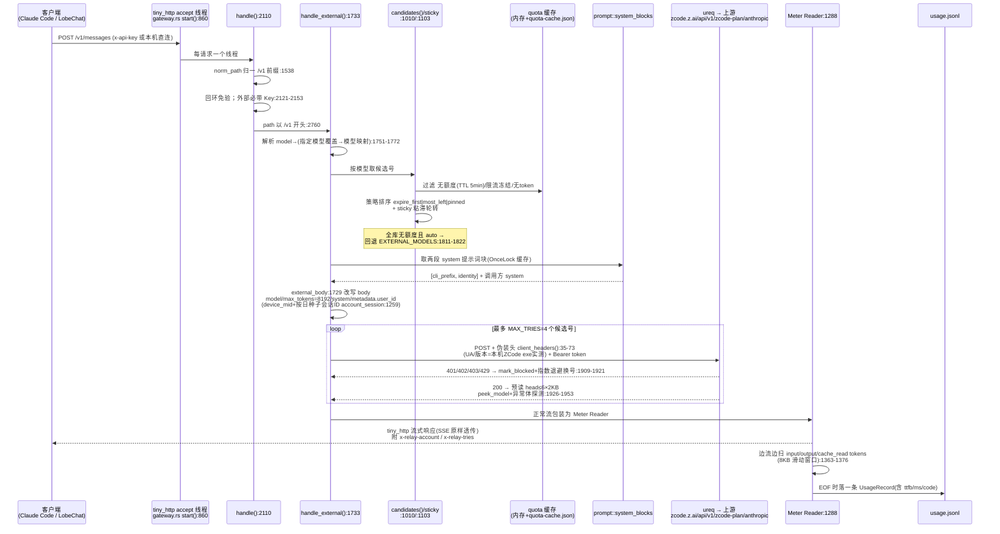

# zcode-pool 源码解读（TokenMaster 参考手册）

> 考察对象：`E:\Project\TokenHub\zcode-pool`（Z·POOL v0.2.3，MIT 许可）。
> 本文档所有结论均来自实际读码，标注了来源文件与行号（行号以当前工作区版本为准）。
> 文中相对路径一律以 `E:\Project\TokenHub\zcode-pool` 为根。

---

## 1. 项目概览

**定位**：Tauri 2 桌面工具，把 ZCode / Z.ai 的多账号登录身份、Outlook 邮箱池、各账号额度集中管理，并在本地起一个带 Web 管理台的 **Anthropic 协议反代网关**（`http://127.0.0.1:8899/v1/messages`），让第三方客户端直接消耗号池额度（`README.md`）。

**许可与致谢**：MIT（`LICENSE`、`Cargo.toml:5`、`package.json:22`）。README 致谢了两个 MIT 参考项目：`zcode-switch`（账号切换思路）与 `OutlookEmail`（Outlook 取信思路）。**对 TokenMaster 而言这意味着 zcode-pool 的代码可以合法地直接复用。**

**规模**（`wc -l` 实测）：

| 目录/组 | 文件数 | 行数 | 说明 |
| --- | --- | --- | --- |
| `src-tauri/src/*.rs` | 16 | 12,843 | Rust 后端（不含内嵌 JS） |
| `src-tauri/src/driver/zpool-driver.js` | 1 | 1,081 | 登录窗口注入的自动化驱动（`include_str!` 内嵌） |
| `src-tauri/assets/{proxy,chat,mint}.html` | 3 | 2,957 | 网关自带的 Web 管理台/对话页/取码页（`include_str!` 内嵌） |
| `src/*.{js,css}` + `src/locales` | 10 | 4,570 | 桌面面板前端（原生 JS，无框架） |
| `captcha.html` / `index.html` | 2 | 42 | 两个 Vite 入口 |
| 合计（含根目录杂项） | — | 21,493 | |

单个大文件：`gateway.rs` 2,769 行（网关）、`prompt.rs` 1,785 行（其中约 1,400 行是自制迷你 JS 解释器）、`lib.rs` 1,689 行、`quota.rs` 1,601 行、`store.rs` 1,520 行、`main.js` 1,613 行、`proxy.html` 2,497 行。

**运行形态**（`tauri.conf.json`、`lib.rs:1562-1688`）：

- 主窗口 `main`：960×620 暗色（`visible: false` 启动隐藏，由托盘/单实例唤出，`tauri.conf.json:20`）。
- 托盘常驻（菜单：显示/保存登录/启动 ZCode/关闭 ZCode/退出，`lib.rs:64-115`）。
- 子窗口：`login`（OAuth 登录 WebView2 窗口，独立 data 目录 + 可选代理）、`captcha`（阿里云验证码小窗，380×320）。
- 本地 HTTP 网关：`tiny_http`（不是 Tauri 的内置端口），默认端口 8899，`Gateway` 单例（`lib.rs:1522-1526` 的 `OnceLock`）。同时服务：`/`（对话测试页）、`/proxy`（Web 管理台）、`/v1/messages`（Anthropic 协议反代）、`/proxy/*`（约 40 个管理 JSON API）。
- CLI 模式：`zcode-pool.exe --cli state|list|capture|switch|quota|claim-preview|...`（`main.rs:38-53`、`cli.rs`），Windows 下会 `AttachConsole` 到父进程控制台（`main.rs:4-36`）。

**构建**（`README.md:88-105`、`package.json`、`scripts/dist.mjs`）：

- 环境：Node 18+、Rust stable；**Windows 要求 GNU 工具链** `stable-x86_64-pc-windows-gnu`。
- `npm install && npm run build` → `cargo +stable-x86_64-pc-windows-gnu build --release --features tauri/custom-protocol`，产物为裸 exe（便携版可用）。
- `npm run dist`：校验 `package.json`/`tauri.conf.json`/`Cargo.toml` 三处版本一致 → `tauri build` → 拷贝便携版 exe + NSIS 安装包到 `release/`（NSIS `installMode: currentUser`）。
- CI（`.github/workflows/release.yml`）：Windows(NSIS)/macOS(universal DMG)/Ubuntu(deb+AppImage)，用 `tauri-apps/tauri-action@v0`。
- `npm run check:i18n`：校验中英词条键一致（zh/en 各 424 条）。

**依赖**（`Cargo.toml:15-41`）：`tauri 2`(tray-icon)、`tauri-plugin-dialog/autostart/single-instance`、`ureq 2`(同步 HTTP，**不是 reqwest**)、`tiny_http 0.12`、`aes-gcm`、`sha2`、`base64`、`pbkdf2`(已引入但 zcrypto 未用)、`uuid`(v4/v7)、`chrono`、`sys-locale`；Windows 侧 `windows-sys`（控制台/版本资源）；前端仅 `@tauri-apps/api`，构建用 Vite 5。

---

## 2. 代码结构解读

### 2.1 目录树

```
zcode-pool/
├── index.html                  # 主窗口入口（加载 src/main.js）
├── captcha.html                # 验证码窗口入口（加载 src/captcha.js）
├── vite.config.js              # 双入口打包，target chrome105
├── src/                        # 桌面面板前端（原生 JS）
│   ├── main.js                 # 主逻辑：状态、tab 渲染、事件接线（1613 行）
│   ├── mbox.js                 # 邮箱池页：列表/筛选/批量验证调度
│   ├── reg.js                  # OAuth 登录抽屉：步骤条、日志流、取链接
│   ├── captcha.js              # 验证码窗口逻辑（阿里云 SDK）
│   ├── ui.js                   # toast/确认框/事件委托/防开发者工具
│   ├── i18n.js                 # 前端 i18n（zh/en 表 + {k} 插值）
│   ├── icons.js                # 内联 SVG 图标
│   ├── locales/{zh,en}.js      # 词条（各 424 条）
│   └── styles.css              # 暗色主题 + 全部桌面样式（757 行）
├── src-tauri/
│   ├── src/
│   │   ├── main.rs             # 入口：--cli 分派 / GUI run()
│   │   ├── lib.rs              # Tauri Builder、全部 command、托盘、OAuth 编排、网关单例
│   │   ├── store.rs            # 账号库/设置/官方 ~/.zcode 读写/ZCode 进程管理
│   │   ├── gateway.rs          # 反代网关（tiny_http）+ Web 管理台 API + 用量统计
│   │   ├── oauth.rs            # OAuth 流程 HTTP 层 + 凭据组装 + 供应商 config 生成
│   │   ├── quota.rs            # 额度查询（双通道）+ 客户端指纹头 + 版本探测
│   │   ├── claim.rs            # 套餐领取（preview/claim/激活事件上报）
│   │   ├── prompt.rs           # 从 zcode.cjs 抽取系统提示词（内含迷你 JS 解释器）
│   │   ├── pool.rs             # 邮箱池（mail.json）+ ---- 四段式解析（含单测）
│   │   ├── graph.rs            # Microsoft Graph 取信/提取链接/设备码重授权（含单测）
│   │   ├── usage.rs            # usage.jsonl 记录/统计
│   │   ├── flowlog.rs          # 按 flow 打标签的运行日志（256KB 滚动）
│   │   ├── zcrypto.rs          # 官方 enc:v1 解密 + 身份提取
│   │   ├── i18n.rs             # Rust 侧 i18n（静态表 + RwLock）
│   │   ├── driver.rs           # 登录窗口驱动消息协议（含单测）
│   │   ├── cli.rs              # --cli 子命令
│   │   └── driver/zpool-driver.js  # 注入到登录窗口的自动化脚本
│   ├── assets/                 # 网关 Web 页面（include_str 内嵌，也支持磁盘热载）
│   │   ├── proxy.html          # Web 管理台（仪表盘/渠道/使用/账号/邮箱/设置/日志）
│   │   ├── chat.html           # 对话自测页（SSE 流式 + 思考折叠）
│   │   └── mint.html           # 取码页（2026-09-30 后已闲置，见 §7）
│   ├── capabilities/           # default.json(main+settings) / captcha.json(仅 core)
│   └── tauri.conf.json         # 窗口、CSP、additionalBrowserArgs、NSIS
└── scripts/{dist.mjs, check-i18n-keys.mjs}
```

### 2.2 Rust 模块职责表

| 文件 | 职责 | 关键点（行号） |
| --- | --- | --- |
| `main.rs` (53) | 入口。`--cli` 时接管父控制台输出 JSON；否则 `run()` 进 GUI | `windows_subsystem="windows"`(:1)；`AttachConsole` 补丁(:4-36) |
| `lib.rs` (1689) | 应用骨架：54 个 `#[tauri::command]`、托盘菜单与重建、OAuth 窗口编排（deeplink+轮询双通道）、验证码窗口接线、网关单例 `RELAY`、插件装配 | `oauth_begin`(:431-585)、`persist_oauth_account`(:1024-1145)、`spawn_poll_loop`(:1163-1226)、`open_captcha_window`(:1228-1268)、`run()`(:1562-1688) |
| `store.rs` (1520) | 数据层：`Account`/`Settings` 结构、`~/.zcode-pool` 全部落盘、`~/.zcode/v2/*` 官方文件读写、capture/切换全流程、ZCode 进程探测/杀/启动、arms uid 多目录写、导入导出 | `Paths`(:41-75)、`canonical_hash`(:220-237)、`atomic_write`(:250-258)、`load_settings` 重试(:463-492)、`capture_current`(:619-652)、`switch_to`(:833-923)、`rematerialize_wiped_builtins`(:766-831) |
| `gateway.rs` (2769) | 反代网关全部：tiny_http 线程池、鉴权（回环免验/外部必须 Key）、选号（策略+粘滞+冻结）、换号重试退避、伪装请求头、SSE 透传、`Meter` 流式计量、额度内存+磁盘缓存、Web 管理台约 40 个路由 | 常量(:10-33)、`candidates`(:1010-1101)、`handle_external`(:1733-2063)、`handle`(:2110-2769)、`Meter`(:1288-1385) |
| `oauth.rs` (712) | OAuth HTTP 层：`/oauth/cli/init`+轮询+`/oauth/token` 兑换、回调解析、userinfo 拉取、z.ai 业务 token 兑换、BigModel/z.ai API Key 自动创建、`assemble_credentials`/`assemble_config` | `init_flow`(:54-125)、`poll_flow_once`(:133-186)、`parse_callback`(:202-230)、`parse_proxy_url`(:275-308)、`resolve_biz_api_key`(:549-594)、`assemble_config`(:655-712) |
| `quota.rs` (1601) | 额度查询：Monitor 通道（open.bigmodel.cn）与 ZaiBilling 通道（zcode.z.ai）双源归并；客户端指纹头（UA/平台/时区/OS 版本）；ZCode 版本三级探测（exe PE 资源→注册表→常量） | `zcode_app_version`(:174-213)、`zai_headers_with_version`(:258-279)、`candidate_tokens`(:382-415)、`pick_channels`(:612-655)、`merge_parts`(:741-795) |
| `claim.rs` (465) | 套餐：`billing/preview` 可领套餐、`billing/claim` 提交（带阿里云验证码头）、激活事件上报（让账号"活跃"解锁领取资格）、错误码翻译 | `report_activation_events`(:190-238)、`preview_plans`(:240-293)、`submit_claim`(:295-336)、`fetch_captcha_config`(:338-360)、`failure_message`(:444-465) |
| `prompt.rs` (1785) | 系统提示词：优先读 `~/.zcode-pool/system_prompt.json` 覆盖文件；否则定位本机 ZCode 安装的 `resources/glm/zcode.cjs`，用自制 JS 解释器执行并抽出 `cli_prefix`+`identity` 两段；严格 validate 后缓存 | 设计注释(:11-19)、`system_blocks`(:22-54)、`validate`(:63-112)、解释器(:170 之后) |
| `pool.rs` (212) | 邮箱池：`mail.json` 读写、`email----password----client_id----refresh_token` 解析（BOM/注释/畸形行容错）、按 email 去重导入 | `parse_lines`(:110-133)、单测(:168-212) |
| `graph.rs` (695) | Microsoft Graph：refresh_token 换 access_token（scope 三级回退）、拉邮件/抽验证链接、设备码重授权流水线 | 端点(:4-13)、`exchange_token`(:86-105)、`is_credential_error`(:107-113)、`fetch_links`(:265)、单测(:640) |
| `usage.rs` (182) | `usage.jsonl` 追加（32MB 滚动）、全量读取、按模型/账号/Key/日期聚合统计 | `UsageRecord`(:15-54)、`stats`(:93-175) |
| `flowlog.rs` (63) | 运行日志：`时间 [flow前8位] event detail` 单行格式，256KB 滚动为 `.old`，支持分页 tail | `log`(:33-47)、`append`(:49-63) |
| `zcrypto.rs` (176) | 官方 `enc:v1:` AES-256-GCM 解密（密钥=SHA256(平台+home+用户名串)）、JWT payload 解码、账号身份（username/email/user_id）提取 | `default_secret`(:45-59)、`derive_key`(:61-66)、`decrypt_with_secret`(:72-92)、`identity_with_secret`(:129-172) |
| `i18n.rs` (452) | Rust 侧双语：`static RwLock<Lang>` + 两张 `&[(key, &str)]` 常量表；`tr`/`trf`（`{k}` 插值）/`coded`（`code:msg` 前缀，供前端 `stripErr` 还原） | `resolve`(:45-55)、尾部 `tr/trf/coded/code_of` |
| `driver.rs` (198) | 登录窗口驱动协议：`zpool-driver://msg?...` 哨兵导航解析、kind/字段白名单、超长截断；含 8 个单测 | `SENTINEL_SCHEME`(:5)、`parse_message`(:36-66)、单测(:127-198) |
| `cli.rs` (271) | CLI 子命令 → 复用 store/claim 函数，输出 JSON + 退出码 | `run`(:33-271) |

### 2.3 前端文件职责表

| 文件 | 职责 | 关键点 |
| --- | --- | --- |
| `main.js` (1613) | 桌面面板全部状态与渲染：mailbox/accounts/proxy/settings 四个 tab、账号卡片+额度环、切换确认、添加账号模态（选 bigmodel/zai）、自动领取循环、托盘/状态/领取结果事件监听 | 自动领取参数(:36-47)；`switch_to` 调用(:294)；`oauth_begin`(:530)；事件监听块(:1452-1523)；取码 iframe 已停用注释(:27-30) |
| `mbox.js` (435) | 邮箱池 tab：列表渲染、筛选、多选、批量"自动验证"队列（逐个 `oauth_begin` 注册流）、结果汇总 | `M.batch` 队列状态 |
| `reg.js` (486) | 登录抽屉：register/login 两种步骤条、驱动事件渲染、验证邮件链接轮询拉取（`reg_fetch_link`）、批量注册进度 | `STEPS`(:7-14)、`LINK_POLL_*` 常量(:28-30) |
| `captcha.js` (134) | 验证码窗口：拉配置→动态加载阿里云 SDK→`startTracelessVerification` 无感验证→8 秒超时转人工→成功后 `claim_captcha_submit` | CSP 违规监听(:22-24)、`notifyStuck`→`captcha://interactive`(:26) |
| `ui.js` (201) | `esc` HTML 转义、toast、确认模态、`[click]` 属性事件委托；屏蔽右键/F12/Ctrl+U/S(:5-11) | 所有 innerHTML 均经 `esc` |
| `i18n.js` (45) | 前端 i18n：`t(key,{k:v})` 插值、缺 key 警告并回退 zh、`stripErr` 去掉 Rust `code:` 前缀 | |
| `icons.js` (51) | 内联 SVG 图标字典 | |
| `locales/{zh,en}.js` (各424) | 扁平 `"a.b": "文案"` 词条 | |
| `styles.css` (757) | `:root` 暗色 CSS 变量令牌 + 全部组件样式 | 变量块(:1-49) |

---

## 3. Code Graph

### 3.1 Rust 模块依赖图（按 `use` 实测）

```mermaid
graph TB
    main["main.rs<br/>入口 --cli / GUI"]
    lib["lib.rs<br/>commands·托盘·OAuth编排·网关单例"]
    cli["cli.rs"]
    gw["gateway.rs<br/>tiny_http 网关"]
    store["store.rs<br/>账号库·~/.zcode"]
    oauth["oauth.rs<br/>OAuth HTTP"]
    quota["quota.rs<br/>额度·指纹头"]
    claim["claim.rs<br/>套餐领取"]
    prompt["prompt.rs<br/>系统提示词"]
    pool["pool.rs<br/>邮箱池"]
    graph["graph.rs<br/>MS Graph 取信"]
    usage["usage.rs<br/>usage.jsonl"]
    flowlog["flowlog.rs<br/>运行日志"]
    zcrypto["zcrypto.rs<br/>enc:v1 解密"]
    i18n["i18n.rs"]
    driver["driver.rs<br/>登录驱动协议"]

    main --> lib
    lib --> cli
    lib --> gw
    lib --> store
    lib --> oauth
    lib --> claim
    lib --> pool
    lib --> graph
    lib --> flowlog
    lib --> i18n
    lib --> driver
    lib --> usage

    cli --> store
    cli --> claim

    gw --> store
    gw --> quota
    gw --> usage
    gw --> flowlog
    gw --> prompt
    gw --> claim

    store --> quota
    store --> zcrypto
    store --> i18n
    oauth --> quota
    quota --> zcrypto
    quota --> store
    claim --> quota
    claim --> zcrypto
    prompt --> store
    pool --> i18n
    graph --> i18n

    style zcrypto fill:#2b3a55
    style gw fill:#3a2b2b
    style store fill:#2b3a2b
```

要点：`zcrypto`/`flowlog`/`usage`/`driver` 是零内部依赖的叶子模块（最易搬运）；`gateway` 是最重的汇聚点；`store ↔ quota` 存在相互引用（store 的额度入口调 quota，quota 的 `device_mid`/版本探测回调 store 的路径函数）。

### 3.2 一次反代请求的调用链（SSE 流式）



失败兜底：所有候选耗尽 → 502 `overloaded_error`；全部"响应不像模型流" → 回放最后一个 abnormal 响应体（`gateway.rs:2029-2054`）。

---

## 4. 关键流程详解

### 4.1 OAuth 登录窗口流程（`lib.rs:431-585` + `oauth.rs`）

双通道设计：**deeplink 拦截**与**服务端轮询**同时跑，谁先成功谁生效，另一路用 flow id 判"被取代"丢弃。

1. `oauth_begin(provider, mode, batch)`：校验 provider（`bigmodel`/`zai`，`oauth.rs:16-19`）→ 关旧 login 窗 → 生成 `flow` UUID 与虚拟设备 `mid` UUID → `flowlog` 记 begin。
2. `oauth::init_flow`（`oauth.rs:54-125`）：`POST https://zcode.z.ai/api/v1/oauth/cli/init`，body `{provider}`，头带 `zai_oauth_headers_with_mid(poll_token, mid)`（poll_token 为本地 32 字节随机 hex）。返回 `authorize_url / state / flow_id / poll_token / expires_at / poll_interval_sec`，并做合法性校验（https、有效期、轮询间隔）。
3. 建 `login` WebView2 窗口：`WebviewUrl::External(authorize_url)`、UA 固定 Edge Chrome 131（`oauth.rs:8`）、`initialization_script` = `driver::bootstrap_script`（注入 `window.__ZPOOL_CFG` + 1081 行驱动 JS，`driver.rs:31-34`）、`data_directory` 每 flow 独立 profile（7 天后清扫，`lib.rs:914-923`）、可选 `proxy_url`（登录走代理而不动系统代理）。
4. `on_navigation`（`lib.rs:534-559`）三分支：
   - `zpool-driver://` 哨兵：`driver::parse_message` 白名单解析（kind ∈ ready/log/phase/note/ask/page，字段白名单+截断，`driver.rs:12-16,36-66`）→ emit `reg://event` 给前端抽屉，返回 false 拦截。
   - `zcode://`：OAuth 回调，spawn `finish_oauth` → `parse_callback` 取 `authCode|code`+`state`（`channel_id/utm_*` 判归因链接直接忽略，`oauth.rs:202-230`）→ `exchange_token`（`POST /oauth/token`，`redirect_uri` = 官方桥 `https://zcode.z.ai/app/oauth/login?redirect=zcode%3A%2F%2Foauth%2Fcallback&app_version=...`）→ `persist_oauth_account`。
   - 其他：放行（记录 nav 日志前 170 字符）。
5. 同时 `spawn_poll_loop`（`lib.rs:1163-1226`）：每 `poll_interval_ms` GET `poll_url`，status `ready` 即用轮询数据走同一个 `persist_oauth_account`（`poll_ready=true` 分支用 `data.user` 而非再拉 userinfo）。code 3004 = 过期。
6. `persist_oauth_account`（`lib.rs:1024-1145`）：
   - 取 JWT（`/data/token`）；z.ai 额外把 access_token 兑换成业务 token（`POST https://api.z.ai/api/auth/z/login {token}`，`oauth.rs:596-653`）。
   - userinfo：轮询数据 → `fetch_userinfo`（bigmodel `getCustomerInfo` / zai `oauth/userinfo`）兜底。
   - `assemble_credentials_with_token`（`oauth.rs:440-460`）产出键：`zcodejwttoken`、`oauth:active_provider`、`oauth:{p}:access_token`、`oauth:{p}:refresh_token`（仅 bigmodel）、`oauth:{p}:user_info`（JSON 字符串）。
   - `assemble_config`（`oauth.rs:655-712`）产出 `config.json` 的 `provider` 表：`builtin:{provider}[-coding-plan|-start-plan]`，`kind: "anthropic"`，apiKey 取 JWT 或自动创建的 API Key（`resolve_biz_api_key`：查/建名为 `zcode-api-key` 的 Key 并取 `{key}.{secret}`）。
   - 去重：先 `canonical_hash`（对 credentials 去掉 `web-remote-control:` 前缀键后 SHA-256，`store.rs:220-237`），再身份匹配（`zcrypto::account_identity` 的 user_id/email/username，`store.rs:954-978`）。重复则更新原账号，否则 `unique_name` 新建。
   - 全程用 `flow_still_ours()` 防"被新登录取代后仍写盘"。
7. 结果 emit `oauth://done`；窗口用户关闭 → emit `reg://event {kind:"closed"}`（`lib.rs:570-582`）。

### 4.2 账号 capture / 切换（写 ~/.zcode 官方文件）

**capture**（`store.rs:619-652`）：读 `~/.zcode/v2/credentials.json` → `is_logged_in`（存在 `oauth:*:access_token` 或非空 `zcodejwttoken`，:239-248）→ hash/身份去重 → `read_live_config` 一并存档 → 从 `telemetry-state.json` 收养 `deviceMid`、从 `%APPDATA%\{ZCode,zcode,ZCode Preview,ZCode Dev}\rum-electron-store\*.json` 收养 `_arms_uid`（没被别的账号占用才收，`store.rs:1284-1301`），否则新建。

**switch_to**（`store.rs:833-923`）固定动作序列：

1. 已是该账号（hash 或身份匹配）→ 只同步 deviceMid/armsUid 后返回 `already_active`。
2. ZCode 在跑：非 force 报错；force 则 `taskkill /F /IM ZCode.exe`（Windows）/`pkill`→`pkill -9`（Unix），轮询 8s/4s 确认死亡，杀不掉就中止切换防登录态损坏（:326-378）。
3. `sync_live_back_to_source`：把**当前 live 较新**的凭据回写到对应存档账号（:706-737）。
4. `auto_preserve`：当前登录若与目标不同且未存档 → 自动存为 `Auto MM-DD HHMM`（:667-695）——**切换永不丢号**的保证。
5. 写官方文件：
   - `credentials.json`：目标 credentials + **注入**原 live 的 `web-remote-control:external-relay:pass_hash` 键（保留 ZCode 自己的中继密码，:925-952），`atomic_write`（tmp+rename）。
   - `config.json`：目标 config（若存档有）。
   - 删除 `coding-plan-cache.json`（防旧套餐缓存，:739-746）。
   - `setting.json`：`providerFamilyDomain` = 目标 provider + 更新时间戳（:748-764）。
   - `rematerialize_wiped_builtins`：live config 中 `builtin:*` 的 apiKey 若被官方客户端清空/禁用（`systemDisabledReason: oauth_provider_inactive`），用存档凭据重新物化（含 z.ai 业务 token 重兑，:766-831）。
   - `telemetry-state.json` 的 `deviceMid` 写回账号专属 mid（每账号固定虚拟设备，防风控关联，:1077-1090）；`rum-electron-store/*.json` 写 `_arms_uid` 并删 `_arms_session`（多目录全写，:1238-1278）。
6. 可选 `restart` 拉起 ZCode（detached：Windows `DETACHED_PROCESS|CREATE_NEW_PROCESS_GROUP`，:26-39）。

### 4.3 网关选号 / 换号重试 / 伪装请求头

- **选号** `candidates()`（`gateway.rs:1010-1101`）：遍历账号 → pinned 策略只留指定号 → 过滤 `(账号,模型)` 维度的"无额度"标记（TTL 5min）与全局限流冻结 → 从额度缓存取该模型剩余量（`model_key` 归一化：小写、去 `-_ `、去 `glm` 前缀，:1234-1245）→ 取可用 token（`quota::candidate_tokens`：config 里 coding-plan apiKey 优先，其次 JWT，再 access_token）→ 按 `expire_first`（早过期先用，默认）/`most_left`（剩余多先用）/`pinned` 排序。`sticky_order`（:1103-1120）把上次成功号轮转到队首（粘滞），成功后 `set_sticky`。
- **换号重试**：`for c in cands.iter().take(MAX_TRIES=4)`。网络错误或 401/402/403/429（`SWITCH_STATUS`，:12）→ `mark_blocked`（429 冻 5min）+ `backoff_ms`（2s 起 ×2^attempt，封顶 60s，±20% 抖动，:1252-1257）→ 下一个号。200 但响应"不像模型流"（非 event-stream、含 `"error"`/`"code"`、抓不到模型名）→ 记为 abnormal 继续换，全部失败后回放 abnormal（:1926-1954, 2029-2054）。
- **伪装请求头** `client_headers()`（`gateway.rs:35-73`）：17 个头冒充 ZCode Electron 客户端——`anthropic-version: 2023-06-01`、`http-referer: https://zcode.z.ai`、`user-agent: ZCode/{ver} ai-sdk/provider-utils/4.0.27 runtime/node.js/24`、`x-os-category/x-os-version/x-platform/x-release-channel/x-title/x-zcode-agent/x-zcode-app-version` 等；**版本号动态取本机 ZCode exe 的 PE 版本资源**（写死 3.14.3 曾被上游按旧版本拦截，注释 :57-59）。另加每请求随机 `x-query-id`(UUIDv7)/`x-request-id`/`x-session-id`/`x-zcode-trace-id` 与 `authorization` + `x-api-key` 双写（:1880-1888）。鉴权走 `authorization`/`x-api-key` 头（`auth_token`，:1512-1524）。
- **body 改写** `external_body()`（:1697-1731）：注入 model、默认 `max_tokens: 8192`、`system` 替换为「两段官方提示词块 + 调用方 system」、`metadata.user_id` = `{device_id: mid, account_uuid:"", session_id}`（session_id 为账号+日期种子的确定性 UUID，一天一换，:1259-1275）。
- **模型策略**：`auto`（请求模型全库无额度 → 依序回退 `EXTERNAL_MODELS = ["GLM-5.3-Flash","GLM-5.3"]`）/ `pinned`（锁死）；`model_map` 任意改名（官方下线模型时客户端不用改，:622-641）。

### 4.4 套餐领取 + 验证码窗口

- `claim_preview` → `GET /api/v1/zcode-plan/billing/preview?app_version&platform`（带 mid 头），解析 `data.plans[].entitlements` 中 `meter=model_usage && unit_type=token` 的条目（`claim.rs:240-293,374-424`）。
- `claim_refresh` 先 `report_activation_events`：向 `/api/v1/event/report` 补报 `app_launch/app_daily_active/app_login_success` 三个激活事件（携带 user_id、device_mid、屏幕分辨率 2560x1440 等指纹），让"不活跃"账号恢复领取资格（`claim.rs:129-238`）。
- `claim_start`（`lib.rs:271-298`）：静态 `PENDING_CLAIM` 暂存账号+套餐 → `open_captcha_window`：
  - 复用已开窗口则 `location.reload()`；新建时 `WebviewUrl::App("captcha.html")`、暗色、**`visible(false)`，仅当非 auto 模式才 show**（自动领取静默尝试无感验证）、`additional_browser_args` 禁 Edge 弹窗/SmartScreen/后台节流 + `--no-proxy-server`（:1242）、相对主窗居中（`center_over_main`，:1342-1350）。
- `captcha.js`：`claim_captcha_config` 拉 `{enabled, region, prefix, sceneId}`（`GET /api/v1/client/configs`，`claim.rs:338-360`）→ 动态加载 `o.alicdn.com/.../AliyunCaptcha.js` → `initAliyunCaptcha` popup 模式 → `startTracelessVerification()` 无感验证，**8 秒超时转人工**：emit `captcha://interactive` → 主窗 `captcha_show` 把窗口亮出来，用户拖滑块。
- 成功回调 → `claim_captcha_submit {param, region}`（`lib.rs:334-388`）→ `POST /billing/claim {plan_id}` + 头 `X-Aliyun-Captcha-Verify-Param/-Region`（`claim.rs:295-336`）→ 记录 `LAST_CLAIM`（**同时给字符串 `at` 和数值 `atMs`**，见 §7 的 NaN 坑）→ emit `claim://result` → 关窗。错误码 1005 会带 `next_at`（data.plan.ends_at）供前端冷却。
- 自动领取（`main.js:36-47`）：启动 2min 后首轮，之后每 10min 一轮；每号等待 45s、单号每轮上限 5 次、号间隔 5s、中止等待 90s。

### 4.5 额度查询与缓存

- 双通道（`quota.rs:612-655`）：`Monitor`（config 里 coding-plan 的 apiKey → `open.bigmodel.cn/api/monitor/usage/quota/limit` + `/api/biz/subscription/list`）与 `ZaiBilling`（JWT/start-plan key → `zcode.z.ai/api/v1/zcode-plan/billing/balance?app_version=`，带 `X-Device-Mid` 头）。启用项优先；结果 `merge_parts` 去重归并成 `QuotaOverview{plans[].items[]}`（:741-795）。全通道"无套餐"时返回 `is_empty` 空视图而非报错（:657-664）。
- HTTP 容错（:417-482）：429 按 500/1500/4000ms 退避重试；业务 code 401 → 明确"token 失效"；HTTP 401/403 → 过期。全 token 失败且都是 401 → 睡 1.5s 重试首个一次。
- 缓存三层：内存 `HashMap<id,(at,overview)>`（TTL 5min，`refresh_quota` 每 5min 后台刷 + 手动强刷，:934-1008）→ 磁盘 `~/.zcode-pool/quota-cache.json`（TTL 10min，写 tmp+rename，启动 `restore_persisted` 恢复免冷启动，:87-156,589-620）→ `warm_quota` 多 pass 补齐（每 pass 间 900ms，失败账号记 `last_failed`）。
- 健康探测：每 90s 随机抖动后探一个最久未测账号（真实额度请求测延迟），维护 `Health{ok,fail,streak,history[24]}` 供渠道页画迷你图（:504-561,77-79）。

### 4.6 托盘 / 单实例 / 自启接线（`lib.rs:1562-1688`）

- **单实例**：`tauri_plugin_single_instance::init` → 回调 `show_main`（show+unminimize+focus）。
- **自启**：`tauri_plugin_autostart`（macOS 用 LaunchAgent），命令 `autostart_status/autostart_set` 包 `AutoLaunchManager`。
- **托盘**：`TrayIconBuilder::with_id("main")`；菜单项按实时状态启用（capture 需已登录、launch 需路径有效且未跑、kill 需在跑）；左键单击显示主窗；`rebuild_tray` 在每次账号操作后 `run_on_main_thread` 刷新 tooltip（"Z·POOL · 当前账号名"）与菜单（:88-115）。
- **关窗行为**：主窗 CloseRequested 且 `close_to_tray`（默认 true）→ `prevent_close()` + hide；captcha 窗关闭 → 清 `PENDING_CLAIM`（:1627-1640）。
- **启动恢复**：`setup` 里 i18n 初始化 → flowlog 目录 → 网关 `set_app` + `restore_persisted` → **settings 只读一次**（见 §7 双读坑）→ `relay_external` 为真则拉起监听 → 建托盘。任何账号写操作前先拿全局 `STORE_LOCK`（粗粒度互斥，配合各写盘函数的 tmp+rename）。

---

## 5. 数据格式

### 5.1 `~/.zcode-pool/`（`Paths::store_dir`，`store.rs:62`；可用环境变量 `ZCODE_POOL_HOME` 重定向用于测试）

**settings.json**（`Settings`，`store.rs:93-135`，全部字段 `Option` 稀疏落盘）：

```json
{
  "zcode_path": "C:\...\ZCode.exe",
  "launch_after_switch": true, "close_to_tray": true, "auto_claim": false,
  "auth_proxy_on": false, "auth_proxy_url": "http://127.0.0.1:7890",
  "language": "zh",
  "relay_external": true, "relay_bind": "127.0.0.1", "relay_port": 8899,
  "relay_keys": ["zp-xxxxxxxxxxxxxxxxxxxxxxxx"],
  "relay_model_mode": "auto", "relay_model_pinned": null,
  "model_map": { "GLM-5.3": "GLM-5.3-Air" },
  "relay_proxy": ""
}
```

**accounts/{uuid}.json**（`Account`，`store.rs:77-91`）：

```json
{
  "id": "0b9e...uuid...",
  "name": "me@z.ai",
  "created_at": "2026-10-01 12:30", "updated_at": "2026-10-06 09:00",
  "hash": "sha256(canonical credentials)",
  "credentials": {
    "zcodejwttoken": "eyJhbGci...",
    "oauth:active_provider": "zai",
    "oauth:zai:access_token": "eyJ...",
    "oauth:bigmodel:refresh_token": "....(仅bigmodel)",
    "oauth:zai:user_info": "{\"id\":\"..\",\"username\":\"..\",\"displayName\":\"..\",\"email\":\"..\"}",
    "web-remote-control:external-relay:pass_hash": { ... }
  },
  "config": { "provider": { "builtin:zai-start-plan": {
      "name": "Z.ai - Coding Plan", "kind": "anthropic",
      "options": { "apiKey": "...", "baseURL": "https://zcode.z.ai/api/v1/zcode-plan/anthropic" },
      "enabled": true, "source": "custom" } } },
  "virtual_device_mid": "uuid4",
  "virtual_arms_uid": "uid_0123abcdef..."
}
```

注意：zcode-pool 自己存的 credentials 是**明文**；它读官方 live 文件时才遇到 enc:v1（读取两兼容，见 5.3）。

**mail.json**（`pool.rs:73-85`）：

```json
{ "format": "zpool-mail-pool", "version": 1,
  "accounts": [ { "email": "a@b.com", "password": "明文", "client_id": "uuid",
    "refresh_token": "M.C...", "status": "new|verified|failed|invalid",
    "verified_at": null, "note": null, "created_at": "2026-10-01 12:30" } ] }
```

**usage.jsonl**（`UsageRecord`，`usage.rs:15-54`；32MB 滚动为 `usage.jsonl.old`）：

```json
{"t":1759700000000,"acct":"me@z.ai","model":"GLM-5.3","up":"GLM-5.3-Air","in":1200,"out":800,"cache":300,"ttfb":420,"ms":5200,"bytes":98000,"status":200,"code":"","tries":1,"stream":true,"mapped":"GLM-5.3-Air","key":"zp-xxxx(前8位)"}
```

**quota-cache.json**：`{"entries": {"<accountId>": {"at": ms, "ov": QuotaOverview}}, "lastRefresh": "...", "total": n}`（`gateway.rs:108-129`）。
**system_prompt.json**：两段 system 块的覆盖/缓存文件（`prompt.rs:20-54`）。
日志与 WebView profile 在 `%LOCALAPPDATA%\com.zpool.app\`：`logs/oauth.log`（flowlog，256KB 滚动）、`login-webview/{flow}/`（7 天清扫）。

### 5.2 `~/.zcode` 官方文件（`store.rs:65-69`）

| 文件 | 内容 | zcode-pool 的操作 |
| --- | --- | --- |
| `v2/credentials.json` | 当前登录凭据（敏感值可为 `enc:v1:` 加密或明文） | 读（capture/同步）、写（切换，tmp+rename） |
| `v2/config.json` | `provider` 供应商表（apiKey/baseURL） | 随账号切换整体覆写/重物化 |
| `v2/telemetry-state.json` | `{"deviceMid": "..."}` | 切换时写账号专属 mid |
| `v2/setting.json` | 客户端设置 | 切换时注入 `providerFamilyDomain(+UpdatedAt)` |
| `v2/coding-plan-cache.json` | 套餐缓存 | 切换时删除 |

另有 arms 标识在 `%APPDATA%/{ZCode,zcode,ZCode Preview,ZCode Dev}/rum-electron-store/*.json`（键 `_arms_uid`/`_arms_session`，默认文件名 `ZGVmYXVsdA.json`，即 base64("default")，`store.rs:1106`）。

### 5.3 `enc:v1:` 加密格式与密钥派生（`zcrypto.rs`）——TokenMaster 导入功能的核心

**密文格式**（`zcrypto.rs:9,72-92`）：

```
enc:v1:<urlsafe_b64(nonce 12B)>.<urlsafe_b64(tag 16B)>.<urlsafe_b64(ciphertext)>
```

三段以 `.` 分隔，base64 为 URL-safe 无 padding；解密时 `ciphertext||tag` 拼接交给 AES-256-GCM。

**密钥派生**（`zcrypto.rs:41-66`）——单层 SHA-256，**无盐、无 KDF 迭代**（Cargo 里的 pbkdf2 依赖并未用于此）：

```rust
secret = env("ZCODE_CREDENTIAL_SECRET")
      ?? format!("zcode-credential-fallback:{platform}:{home}:{username}",
                 platform = node_os(),        // "win32"|"darwin"|"linux"（node_platform_for :11-17）
                 home     = home 目录字符串,   // Paths::detect 的 home.display()
                 username = Windows: env USERNAME
                            Unix: `id -un` → env USER → env LOGNAME → "unknown"（:23-59）)
key = SHA256(secret)   // 32 字节直接作 AES-256-GCM key（derive_key :61-66）
```

这是对官方 ZCode 客户端自身方案的复刻（致谢 zcode-switch）。**对 TokenMaster 的直接意义**：导入一台机器上官方 `~/.zcode/v2/credentials.json` 时，按同样公式（Windows = `win32` + 用户 home + `USERNAME` 环境变量）拼出 secret 即可解出明文 token；同时要兼容明文值（`is_encrypted` 判前缀即可，`store.rs:697-704` 的 `cred_plain` 是标准写法）。

**身份提取**（`zcrypto.rs:129-176`）：provider 取 `oauth:active_provider`（可能是密文）→ `oauth:{p}:user_info` 解密后为 JSON `{username, displayName, email, rawProfile.email, id}` → 无 id 时解 JWT payload 取 `user_id|sub`。

---

## 6. 对 TokenMaster 的复用映射

TokenMaster = Tauri 2 + Rust(axum) + React，聚合 15 家服务为 OpenAI 协议网关。以下按"直接拷贝 / 需适配剥离 / 仅参考设计"分三类。

### 6.1 直接拷贝（改动 ≤ 改路径/改命名）

| 件 | 来源 | 移植建议 |
| --- | --- | --- |
| **zcrypto.rs 整文件** | `src-tauri/src/zcrypto.rs`（176 行，仅依赖 aes-gcm/sha2/base64/serde_json） | 原样拷贝。TokenMaster 的"导入 ZCode 官方登录"功能直接靠它解 `enc:v1:`；`default_secret` 公式必须逐字节保持一致（§5.3），否则解不开官方凭据 |
| **flowlog.rs 整文件** | `src-tauri/src/flowlog.rs`（63 行，零内部依赖） | 原样拷贝。flow 打标签 + 256KB 滚动 + 分页 tail，任何模块都能用；把 `init` 目录参数换成 TokenMaster 的 app_local_data_dir |
| **usage.rs 整文件** | `src-tauri/src/usage.rs`（182 行） | 原样拷贝。usage.jsonl 追加/读取/聚合；字段 `acct` 语义换成"渠道"，`key` 截前 8 位的做法保留 |
| **atomic_write + load_settings 重试** | `store.rs:250-258, 463-492` | 原样拷贝这两个函数。tmp+rename 落盘 + 读冲突 40ms 重试 + 失败必须写日志（eprintln 在 release 不可见），是 Windows 下多进程写 JSON 的标准姿势 |
| **i18n 方案（前端）** | `src/i18n.js` + `src/locales/{zh,en}.js` + `scripts/check-i18n-keys.mjs` | 拷贝模式到 React（`t(key,{k:v})` 插值 + zh 兜底 + 缺 key 警告 + CI 键一致性校验脚本）；Rust 侧 `i18n.rs` 的静态表 + RwLock + `tr/trf/coded` 也值得照抄，`coded("code:msg")` ↔ 前端 `stripErr` 的错误码透传很顺手 |
| **暗色 CSS 变量令牌** | `src/styles.css:1-49`（`:root` 块） | 直接搬变量名与色值（--bg/--card/--fill/--label 四级文本/--accent/--r 圆角/--sans/--mono），TokenMaster 界面可与其视觉同族；proxy.html 的亮/暗双主题变量（`assets/proxy.html:11-22`）亦可参考 |
| **邮箱池四段式解析** | `pool.rs:110-166` + 3 个单测 | 若 TokenMaster 保留 Outlook 邮箱池功能，`parse_lines`（BOM/注释/畸形容错 + email 去重不覆盖）连测试一起搬 |
| **parse_proxy_url 严格校验** | `oauth.rs:275-308` | 原样拷贝：仅 http/socks5、不带认证、不带路径、端口数值校验，错误信息走 i18n |
| **pool.rs 的 mail.json 读写骨架** | `pool.rs:55-108` | 带版本头的 JSON 集合文件模式（load 容错旧格式数组、save 全量写） |

### 6.2 需适配剥离（核心逻辑可留，外壳要换）

| 件 | 来源 | 剥离要点 |
| --- | --- | --- |
| **gateway.rs 选号/重试内核** | `gateway.rs`：`candidates`(:1010)、`sticky_order`(:1103)、`model_key/model_same`(:1234)、`backoff_ms`(:1252)、`account_session/day_seed`(:1259)、`no_quota/blocked` 双表 | HTTP 层从 tiny_http 换成 **axum**：`Inner` 状态结构、冻结/解冻 TTL、粘滞、指数退避换号全部服务无关，直接平移；`(账号,模型)` 二维无额度标记的设计对 15 家聚合尤其重要 |
| **Meter 流式计量** | `gateway.rs:1288-1385` + `scan_u64_key/scan_u64_after`(:1410-1466) | `io::Read` 装饰器对 SSE 边流边扫 token（8KB 滑窗、词边界匹配防 `usage_tokens` 误配）、EOF 落 usage 记录。axum 用 `Body::from_stream` 包一个 `AsyncRead`/Stream 适配即可复用扫描函数；TokenMaster 走 OpenAI 协议时同样适用（字段名换成 `prompt_tokens/completion_tokens`） |
| **鉴权模型** | `gateway.rs:2110-2158` | "回环免验 / 非回环必须 API Key / 绑非回环前强制建 Key / 局域网模式禁删最后一个 Key / 非回环响应 mask_json 脱敏(:1624-1685)"——整套安全策略照搬，只需在 axum middleware 里实现 |
| **OAuth 编排骨架** | `lib.rs:431-625` + `oauth.rs` init/poll/exchange | 双通道（deeplink 拦截 + 轮询）+ `PENDING_OAUTH` flow-id 防取代 + 独立 WebView profile + 7 天清扫——这套窗口编排对 TokenMaster 接各家 OAuth（GLM、Kimi、Qwen 等）通用；替换 `zcode.z.ai/oauth/cli/*` 端点与 headers 即可 |
| **登录窗口驱动协议** | `driver.rs` + `driver/zpool-driver.js` | `initialization_script` 注入 + `zpool-driver://msg` 哨兵导航回传 + 白名单 kind/字段解析 + 超长截断——任何"WebView 自动辅助登录"场景可复用；js 部分要按目标站点重写选择器 |
| **claim + 验证码窗口接线** | `lib.rs:262-401,1228-1268`、`captcha.html`+`src/captcha.js`、`claim.rs` | `PENDING_CLAIM` 静态暂存 → 隐藏式验证码窗（auto 模式 `visible(false)`，无感失败才亮窗）→ `captcha://interactive` 事件链路通用；阿里云 SDK + preview/claim 端点是 ZCode 专属。**`record_claim_result` 的 at+atMs 双字段教训必须带走（§7）** |
| **quota.rs 指纹与版本探测** | `quota.rs:113-279` | `version_from_exe`（PE 版本资源，注释解释了为何不信任注册表）、`zai_headers_with_version`（UA/平台/时区/OS 全套客户端指纹）、OnceLock 缓存——TokenMaster 冒充各官方客户端时同样需要；按各家客户端改字段 |
| **store.rs 账号去重** | `store.rs:220-237,654-665,954-978` | `canonical_hash`（哈希前剔除易变键前缀）+ 身份三级匹配（user_id>email>provider+username）——多渠道账号库通用 |
| **Web 管理台热载机制** | `gateway.rs:1550-1578` | `ZPOOL_WEB_DIR` → exe 同级 `web/` → 源码 assets 的三级查找 + include_str 兜底：改管理台页面不用重编译。TokenMaster 的 axum 静态页可沿用 |

### 6.3 仅参考设计（不宜直接搬）

| 件 | 来源 | 参考价值 |
| --- | --- | --- |
| **proxy.html Web 管理台** | `src-tauri/assets/proxy.html`（2497 行单文件，暗/亮双主题、仪表盘/渠道健康/使用统计/日志流） | TokenMaster React 管理台的信息架构与图表选型蓝本（近 60 次采样曲线、探测延迟分布、成功率迷你图、按模型/账号/Key 分组） |
| **chat.html 对话自测页** | `assets/chat.html`（321 行） | 网关自带连通性验证页（SSE 流式 + 思考过程折叠 + `/client-log` 回传）的思路 |
| **prompt.rs 迷你 JS 解释器** | `prompt.rs:170-1785` | 为从打包后的 `zcode.cjs` 抽系统提示词而写的解释器，ZCode 专属；但 `validate()` 的防御性校验思路（污染特征 `"undefined"/"[object"/"${"/",,"` 检测、长度区间、前缀逐字节校验）值得借鉴 |
| **切换写官方文件的细节** | `store.rs:748-831,925-952` | `providerFamilyDomain` 对齐、relay pass_hash 注入、`rematerialize_wiped_builtins`、arms uid 多目录写——全是 ZCode 生态逆向结论，TokenMaster 若不写 `~/.zcode` 就不需要 |
| **托盘/单实例/关窗到托盘接线** | `lib.rs:64-156,1562-1688` | 代码不长，建议对照重写一遍而非拷贝（TokenMaster 用 React，事件接线不同）；**状态驱动菜单项 enabled + 每次操作后 rebuild_tray 的模式要保留** |
| **额度双通道归并** | `quota.rs:573-795` | 同一账号多套餐来源 `merge_parts` 去重 + tier 排序取主套餐的模型，可供多套餐服务商参考 |
| **蒸馏出来的教训注释** | 全仓库 ⚠ 注释 | 见 §7 |

---

## 7. 已知坑与注意事项（从代码注释/测试/README 挖掘）

1. **Windows 原子替换的读共享冲突 + 40ms 重试**（`store.rs:463-492`）：settings.json 用 tmp+rename 原子替换，另一进程恰在替换瞬间读会撞共享冲突；**读失败不能静默回默认值**——默认 `relay_port=None` 会被 `unwrap_or(DEFAULT_PORT)` 悄悄变成 8899（"踩过两次，查了很久"）。解法：读两次，间隔 40ms。且 release 是 `windows_subsystem="windows"`，**eprintln 没人看得见**，必须同时 flowlog。
2. **启动时 settings 只能读一次**（`lib.rs:1652-1654`）：旧代码先读判断开关再读取端口，两读之间文件被替换 → 端口漂移。现在 `load_settings` 结果复用。
3. **领取结果时间比较 NaN**（`lib.rs:313-321`）：`at` 是给人看的字符串，前端拿它和 unix 秒相减恒为 NaN，导致"领取成功了却一直转圈"。修复是另给数值 `atMs`。任何"给前端比时间"的字段都要数值化。
4. **客户端版本号写死会被上游按旧版本拦截**（`gateway.rs:57-59`）：曾写死 `3.14.3`，官方升 3.14.4 后即被挡。现在从本机 ZCode exe 的 PE 版本资源动态读（`quota.rs:113-156`，注册表对便携版不可靠）。TokenMaster 冒充任何客户端时同理：版本要跟随真实客户端。
5. **上游验证码策略会变**（`gateway.rs:1845-1857`、`main.js:27-30`）：2026-09-30 实测上游关闭了模型请求验证码校验，`take_param`/取码 iframe 停用但**有意保留代码**（注释写明恢复方法）；而**领取套餐是另一套验证码**（captcha.html 独立窗），"别一起删"。设计上要区分"死代码"与"保险丝"。
6. **CSP 必须放行验证码 CDN**（`tauri.conf.json:29-34`）：script/style/font/frame/connect-src 全要放行 `*.alicdn.com / *.aliyuncs.com / ynuf.aliapp.org`，否则 SDK 静默加载失败。`captcha.js:22-24` 监听 `securitypolicyviolation` 把被挡资源显式报出来——值得抄。另有 `dangerousDisableAssetCspModification: ["style-src"]` 的例外。
7. **additionalBrowserArgs**（`tauri.conf.json:25`、`lib.rs:1242`）：主窗与验证码窗都带 `--disable-features=msWebOOUI,msPdfOOUI,msSmartScreenProtection --no-proxy-server --disable-background-timer-throttling --disable-renderer-backgrounding --disable-backgrounding-occluded-windows`——防 Edge WebView2 的下载弹窗/SmartScreen/后台节流；`--no-proxy-server` 保证验证码窗不走代理。
8. **ureq 不读系统代理**（`store.rs:128-134` 注释）：反代出站一向直连，出口 IP 被风控（3012）时只能全局 TUN。因此专门加 `relay_proxy` 设置让**仅反代走代理**。TokenMaster 的出站 HTTP 客户端要一开始就带每服务出站代理配置。
9. **构建时 exe 被锁**（`scripts/dist.mjs`）：`os error 32 / 拒绝访问` 多半是程序还在运行锁住 exe；版本号三处（package.json/tauri.conf/Cargo.toml）不一致直接 fail。
10. **Windows 构建要 GNU 工具链**（`README.md:90`）：`stable-x86_64-pc-windows-gnu`，与默认 MSVC 不同。
11. **进程操作细节**（`store.rs:14-39,296-392`）：所有子进程带 `CREATE_NO_WINDOW(0x08000000)` 防 cmd 闪窗；启动 ZCode 用 detached（`DETACHED_PROCESS|CREATE_NEW_PROCESS_GROUP`）；杀进程后必须轮询确认死亡（8s/4s），杀不掉就**中止切换**防登录态写坏。`ZCODE_POOL_HOME` 存在时（测试沙箱）kill/launch/open 全部短路为 no-op。
12. **网关实际绑 0.0.0.0，"仅本机"是逻辑判断**（`gateway.rs:843` 绑 `0.0.0.0:port`；`2126-2133` 非回环且 bind 以 `127.` 开头时回 404 伪装不存在）。好处是切监听模式不用重绑 socket；TokenMaster 用 axum 时可选择真正按 bind 地址监听，但"回环免验"判定要保留 `remote_addr().ip().is_loopback()`。
13. **换端口的坑**（`gateway.rs:703-738`）：tiny_http 旧端口可能停不掉（线程卡在请求上），代码先 `TcpStream::connect` 探测旧端口 12×150ms，停不掉就放弃切换并提示"重启后生效"，起不来新端口则回滚旧端口——端口热切换要有完整的回滚链。
14. **usage 记录的 Key 只存前 8 位**（`gateway.rs:2155-2158`）；所有非回环 JSON 响应过 `mask_json`（password/token/api_key 等 12 个键名模式，前 4 位 + `***`，:1624-1685）——密钥不落日志不回传局域网。
15. **`norm_path` 归一**（`gateway.rs:1538-1548`）：客户端常发 `/v1/v1/messages` 或漏 `/v1`，循环去重 `v1` 前缀并补齐——TokenMaster 做 OpenAI 协议时同样要做 `/v1/chat/completions` 的路径容错。
16. **`open_url` 白名单**（`store.rs:394-425`）：仅 https 或本机回环可打开，防自定义协议注入。
17. **UI 层**（`ui.js:5-11`）：屏蔽右键/F12/Ctrl+Shift+I/J/C/Ctrl+U/S；所有 innerHTML 过 `esc()`；`[click]` 属性事件委托避免重复绑监听。React 下 `esc` 与委托可省，但"面板是本地特权页面"的防误触意识可留。
18. **i18n 纪律**：缺 key 时前端 console.warn + 回退 zh（`src/i18n.js:17-21`）、Rust eprintln + 回退 ZH 表；`npm run check:i18n` 保中英 424 键对齐。
19. **遗留不一致**：`i18n.rs` 的 `cli.usage.export`/`err.import.not_sealed` 等词条仍提到加密 `.zpb` 捆绑包与 `--password`，但现行 `cli.rs:196-246`/`store.rs:1357-1455` 已是**明文 JSON bundle v2**（`format: "zcode-accounts-bundle"`）。搬运时以代码为准，别照抄这些过期文案。
20. **导出脱敏边界**（`store.rs:1303-1355`）：导出 credentials 只留 `zcodejwttoken`/`oauth:*`/`account-provider:*` 键，config 只留 z.ai/bigmodel 域名供应商——"导出白名单"而非"导出黑名单"的思路值得沿用。

---

## 附：本文档引用的主要文件清单

`README.md`、`LICENSE`、`package.json`、`vite.config.js`、`scripts/dist.mjs`、`scripts/check-i18n-keys.mjs`、`.github/workflows/release.yml`、`index.html`、`captcha.html`、`src/{main,mbox,reg,captcha,ui,i18n,icons}.js`、`src/locales/{zh,en}.js`、`src/styles.css`、`src-tauri/tauri.conf.json`、`src-tauri/Cargo.toml`、`src-tauri/capabilities/{default,captcha}.json`、`src-tauri/assets/{proxy,chat,mint}.html`、`src-tauri/src/{main,lib,store,gateway,oauth,quota,claim,prompt,pool,graph,usage,flowlog,zcrypto,i18n,driver,cli}.rs`、`src-tauri/src/driver/zpool-driver.js`
